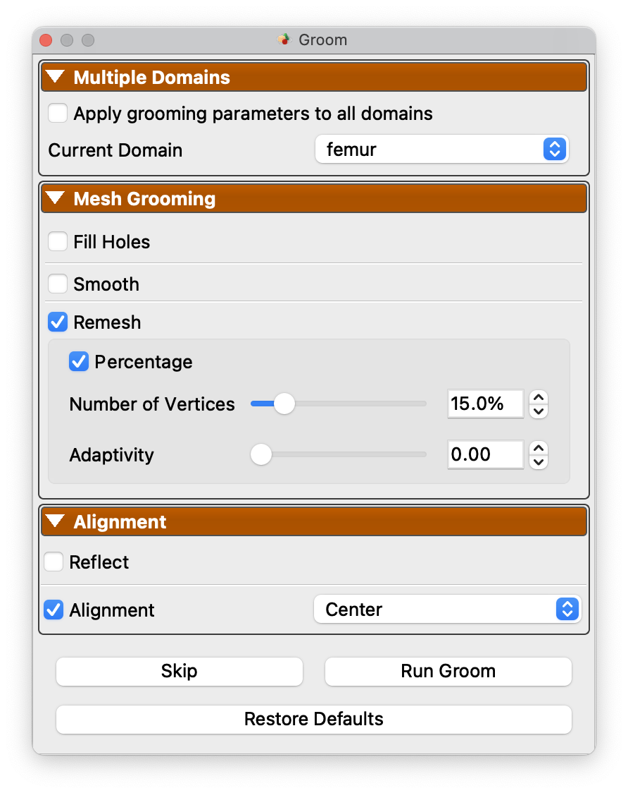

# Multiple Domains SSM

ShapeWorks Studio supports grooming, optimization and analysis for multiple domains/anatomies within a project.  To set up a project with multiple domains per subject, simply add additional `shape` columns to a ShapeWorks Project Spreadsheet:

{: width="300" }

## Importing Data for Multiple Domains

In this example, we have defined two domains, `left_atrium` and `appendage`.  The multiple domains are shown in the Data panel when importing a ShapeWorks Project Spreadsheet file with more than one column with the `shape` prefix. When we open this in Studio, we will see:

{: width="600" }

 

## Grooming Multiple Domains

When multiple domains are present, grooming options will be available on a per-domain basis with a combobox at the top of the grooming panel.  This allows for different grooming options depending on the anatomy type.  You may also apply the same grooming to all domains using the `Apply grooming parameters to all domains` checkbox.

{: width="300" }

## Optimizing Multi-Domain SSM

For optimization, each domain can be given a different number of particles, but all other parameters are global to the optimization process.

{: width="300" }

## Analyzing Multi-Domain SSM

Analysis options are similar for multiple domains as for single domain usage.  Each domain will be reconstructed separated and shown as a mesh with a different color.

{: width="600" }

*Here is an illustration for the full multi-domain workflow.*

<video src="https://sci.utah.edu/~shapeworks/doc-resources/mp4s/multiple-domains-LA.mp4" autoplay muted loop controls style="width:100%">

## Mixed-type Domains 

Multiple domains in ShapeWorks are implemented in a domain-type agnostic, where shapes models can be groomed, optimized, and analyzed for cohorts of mixed-types such as meshes and binary segmentations. Here is an example of grooming, optimizing, and analyzing a multi-domain model with the pelvis given as a surface mesh and the femur given as a binary segmentation.

<video src="https://sci.utah.edu/~shapeworks/doc-resources/mp4s/multiple-domains-mixed-types.mp4" autoplay muted loop controls style="width:100%">

## Multiple Domain Alignments

In the presence of multiple anatomies, there are multiple alignment strategies that can be employed.  These strategies can be explored as part of the Analysis module.  The correspondence model can be aligned based on any particular reference domain, a global alignment, or with all articulation removed (local alignment).

Below is an example of these four options with a pelvis and femur model.

<video src="https://sci.utah.edu/~shapeworks/doc-resources/mp4s/multiple-domains-mixed-types.mp4" autoplay muted loop controls style="width:100%">

