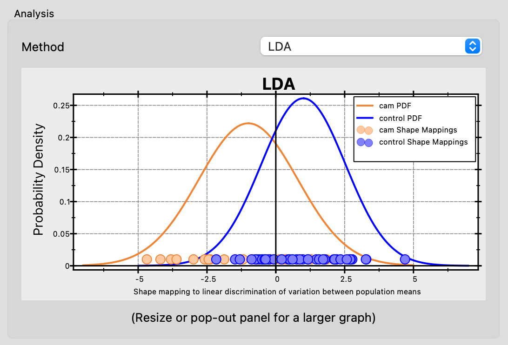
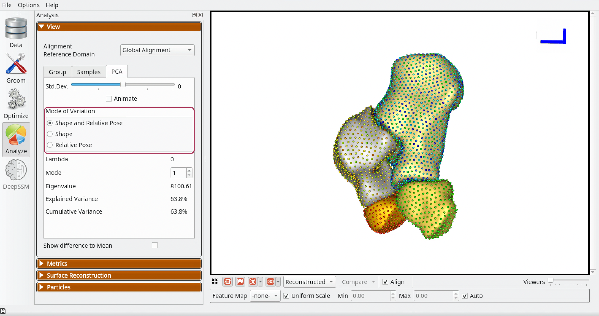
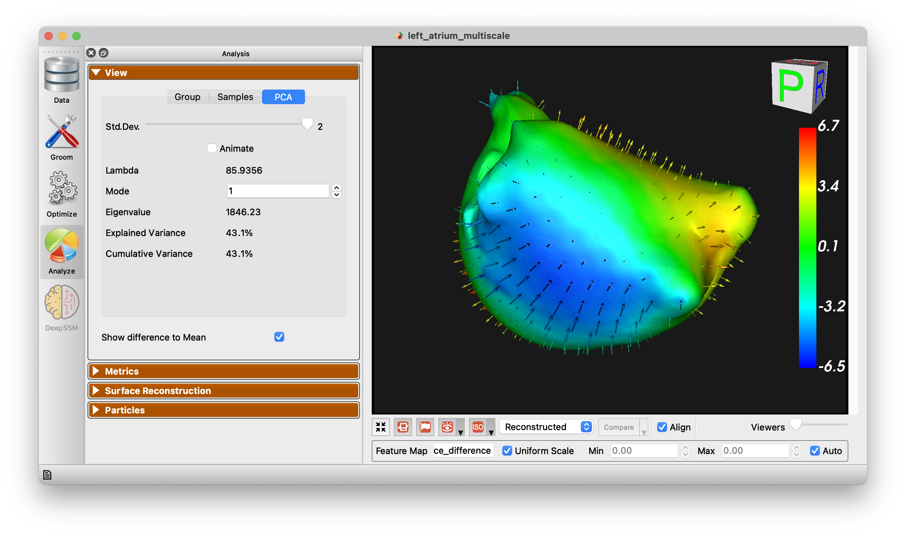
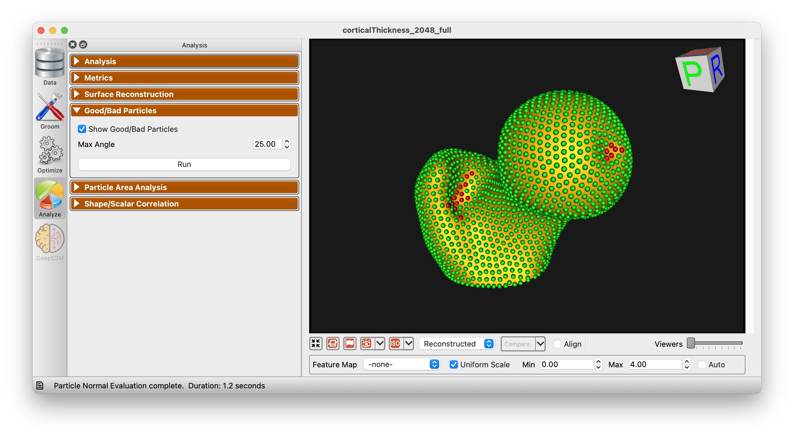

# ShapeWorks Studio Analyze Module

After optimization is complete, you may analyze the data in Studio using the Analysis module.  There are several panels available in the Analysis Module.

## View Panel

The View panel contains all of the options for controlling the analyis viewer options.

### Group

The Group mode allows for group comparison to quantify and visualize population-level differences.  Each `group_<value>` column from the project can be selected and the differences between any two values (i.e., group identifiers) in the groups can be displayed by selecting the group values in the left and right dropdown boxes.  A group difference display showing vectors and a colormap of distance can be shown using the "Diff -->" button.

Additionally an LDA chart is generated for group differences:

{: width="300" }

### Samples

The Samples tab of the view panel allows you to view all of the samples in your cohort, view a single sample by index, or view the median sample.

### PCA

The PCA tab of the View panel shows reconstructed shapes (surface meshes) along PCA modes of variation. Modes of variations are shape parameters learned/discovered from your data that describes shape variations. You can control the location along the PCA mode with the Standard Deviation slider.  The extent of this slider is configurable in [Preferences](#preferences).  Values displayed:

`Lambda` - This shows the PCA loading of current position of the slider.  The middle of the slider, at the mean value, will be 0.  The extent of lambda is defined by the number of standard deviations of the slider as described above.  At standard deviation of 1.0, it will be the square root of the mode's eigenvalue.

`Eigenvalue` - This shows the eigenvalue of the currently selected mode.  This is a unitless measure of how much variance is explained by this mode.  The modes are sorted in decreasing order of eigenvalue, corresponding to the most variance explained first.

The PCA tab of the View panel shows options to select modes of variation in different subspaces when a multiple domain shape model is loaded:

`Shape and Relative Pose` - Selecting this option shows reconstructed shapes and it's eigenvalue and lambda, along ordinary PCA modes of variation. PCA is done in the shared space of the multi-object shape structure and thus  the shsape and pose variations are entangled here.

`Shape` - Selecting this option shows reconstructed shapes and it's eigenvalue and lambda, along only morphological modes of variation. Multi-Level Component Analysis is done in the shape subspace (within-object) of the multi-object shape structure. Shape and pose variations are disentangled here and we only see morphological changes of each object in the shape structure.

`Relative Pose` - Selecting this option shows reconstructed shapes and it's eigenvalue and lambda, along only relative pose modes of variation. Multi-Level Component Analysis is done in the relative pose subspace (between-objects) of the multi-object shape structure. Shape and pose variations are disentangled here and we only see alignment changes between the objects in the multi-object shape structure.

### Show Difference to Mean

This checkbox allows for visualization from any surface to the mean.  Arrow glyphs can be shown to display the difference as well.

## Metrics Panel

The Metrics panel shows the Compactness, Specificity, and Generalization charts.  These are interactive charts with hover menus and the ability to zoom, pan, etc.

See [Shape Model Evaluation](../new/ssm-eval.md) for more information about shape evaluation.

## Surface Reconstruction Panel

The surface reconstruction panel provides options for the surface reconstruction method.  There are three surface reconstruction methods available depending on the data you supply.

`Legacy` - If an older XML file with only particle files is supplied, then only this option is available.  This is the fallback option since it requires only the particles.

`Mesh Warping Based` - Mesh warping based method that utilizes the mean mesh.  You must have either meshes supplied or image based (distance transforms).

`Distance Transform Based` - Surface reconstruction based on distance transforms.  Project must have distance transforms.

Below is an example of the difference in using this option.

## Particles Panel ##

The *Particles Panel* enabled the display of "good/bad particles" in ShapeWorks Studio.  A *maximum angle* parameter is given (default 45 degrees).  When a particle's surface normal across subjects (averaged) exceeds this angle, the particle will be marked "bad" and shown in red.  Good particles are shown in green.  This can help in identifying problems with correspondence as it is typically expected that surface normals for given particles should be similar across subjects.