# ShapeWorks Studio Analyze Module

After optimization is complete, you may analyze the data in Studio using the Analysis module.  There are several panels available in the Analysis Module.

## View Panel

The View panel contains all of the options for controlling the analyis viewer options.

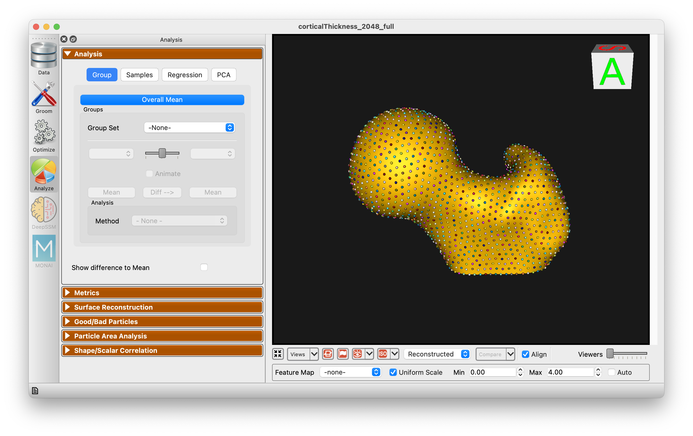

### Group

The Group mode allows for group comparison to quantify and visualize population-level differences.  Each `group_<value>` column from the project can be selected and the differences between any two values (i.e., group identifiers) in the groups can be displayed by selecting the group values in the left and right dropdown boxes.  A group difference display showing vectors and a colormap of distance can be shown using the "Diff -->" button.

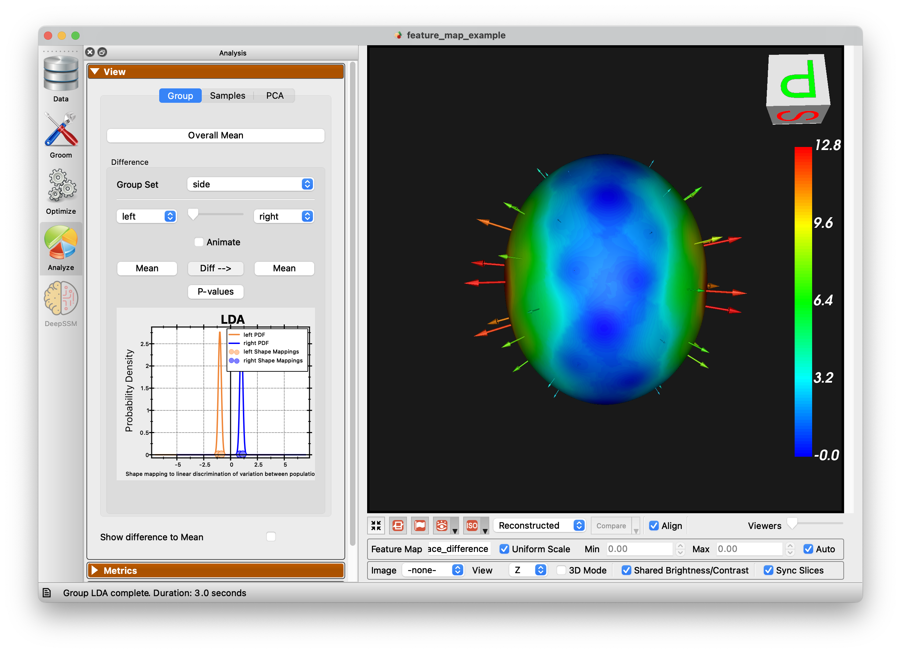

There are four different group analysis options available:

* **LDA** — Linear Discriminant Analysis finds the direction that best separates two groups by maximizing between-group variance relative to within-group variance.
* **DWD** — Distance Weighted Discrimination is a robust alternative to LDA that performs better in high-dimensional, small-sample settings common in shape modeling.
* **Group Particle P-Values** — Computes per-particle p-values between groups, highlighting regions of statistically significant shape difference.
* **Network Analysis** — Uses cluster-based statistical methods to identify spatially connected regions of significant group differences on the shape surface.

Both LDA and DWD produce a chart showing probability density functions (PDFs) for each group projected onto the discriminant direction, along with individual shape mappings as scatter points. This visualization helps assess how well the shape model distinguishes between populations.

### LDA

Linear Discriminant Analysis (LDA) finds the linear direction in PCA space that best separates two groups by maximizing between-group variance relative to within-group variance.

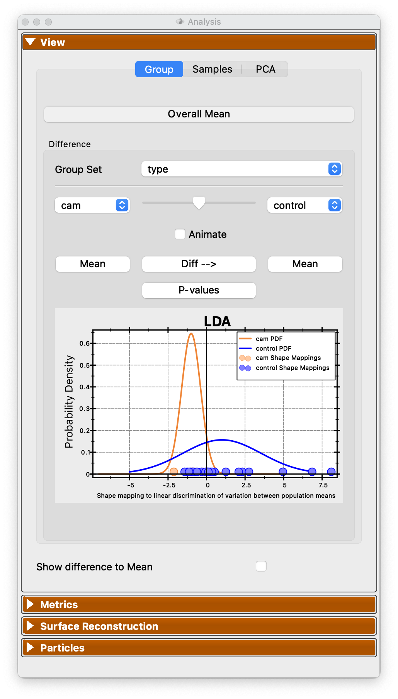{: width="300" }

### DWD

Distance Weighted Discrimination (DWD) finds a separating hyperplane that maximizes the average inverse distance of each sample to the boundary. This makes DWD more robust than LDA in high-dimensional, small-sample settings — a common scenario in shape modeling where the number of PCA modes can exceed the number of subjects. Each group requires at least 2 samples.

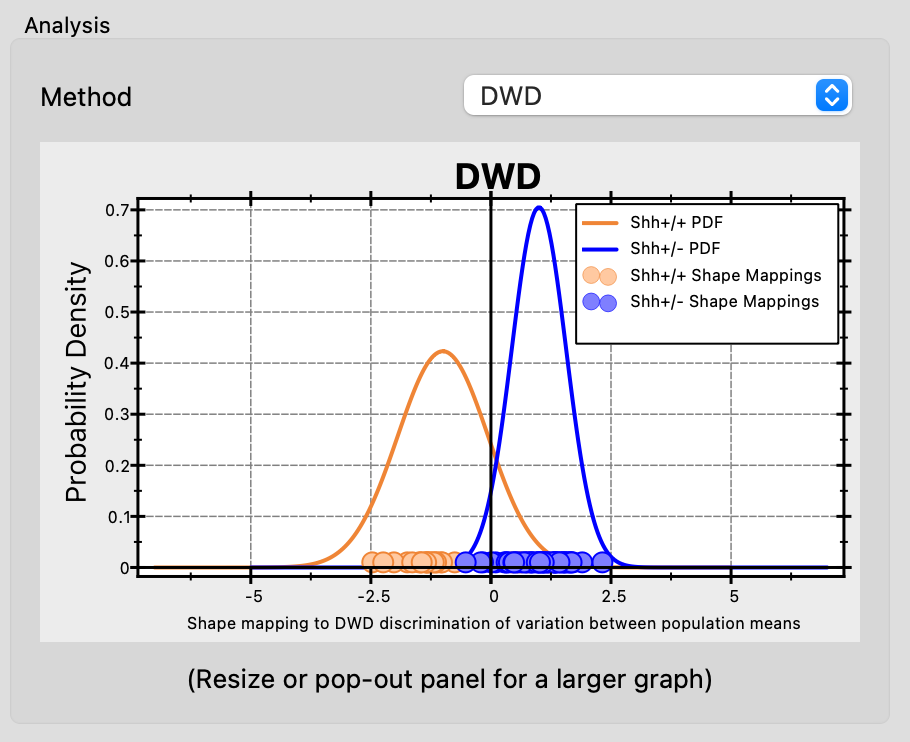{: width="300" }

### Group Particle P-Values

Computes a p-value for each correspondence particle to identify where two groups differ significantly in shape. For each particle, a Hotelling T-squared test compares the 3D positions across subjects in both groups. The test is repeated over multiple random subsamples (permutations) and the resulting p-values are corrected for multiple comparisons using false discovery rate (FDR) correction. Particles with low p-values indicate regions where the two groups have statistically significant shape differences. The p-values are displayed as a colormap on the shape surface.

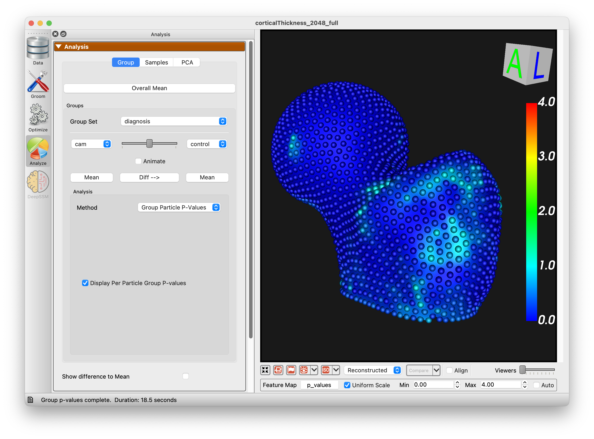{: width="300" }

### Network Analysis

The Network Analysis tool provides a method to statistically analyze data captured in feature maps. Two implementations have been included: Network Analysis and SPM1D. Statistical parametric mapping (SPM, https://www.fil.ion.ucl.ac.uk/spm/) was introduced for the analysis of brain imaging data and has since been used in statistical analysis of surface-based group differences. The SPM1D option uses this technique without consideration of the connectivity and spatial relationship of the input data. The Network Analysis method uses the relative size of the network of connected correspondence particles to identify significant differences amongst groups, as originally described by Forman and colleagues (Forman SD, et al. Magnetic Resonance in Medicine33:636-647, 1995). Our publication on the specifics of this method and example applications is in review and will be referenced here when available.

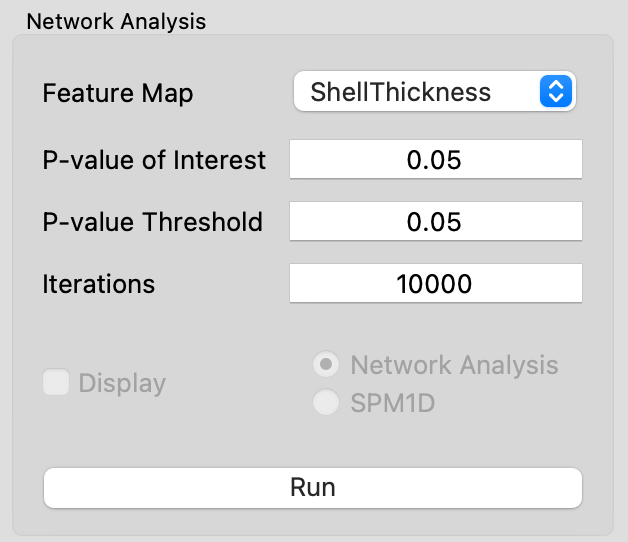{: width="300" }

| Option            | Description                                                                                                                                                      |
|-------------------|------------------------------------------------------------------------------------------------------------------------------------------------------------------|
| Feature Map       | Choose which feature to operate on.                                                                                                                              |
| P-value Threshold | The initial p-value used to threshold particles as an initial step to the evaluation of cluster size. Only modify from 0.05 for adjusted statistical assumptions.|
| Cluster P-value   | The cluster p-value defines the p-value used to identify significant clusters for the group. Traditional statistics would assume a p-value of 0.05.              |
| Permutations      | This is the number of permutations used in the analysis. The maximum value is driven by the sample size, however 10,000 is generally considered acceptably large.|
| Display           | Choose to display Network Analysis output or SPM1D                                                                                                               |

After running the Network Analysis, you can enable the display of values with the "Display" checkbox:

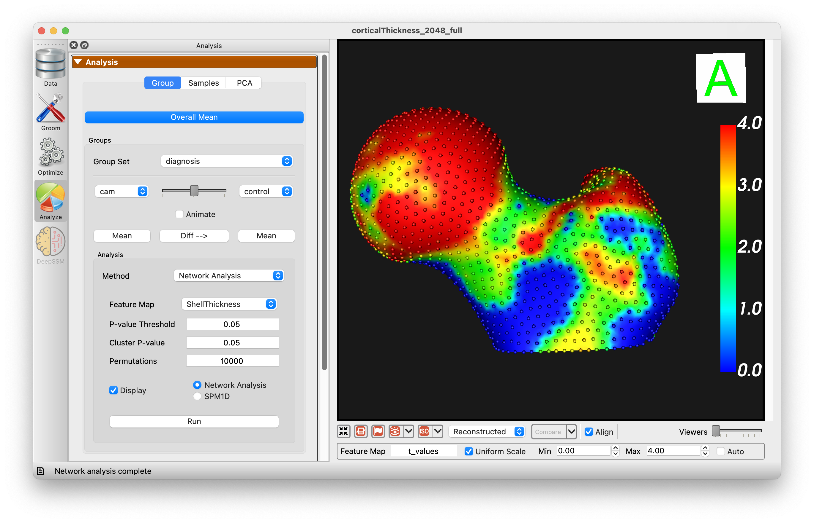

### Samples

The Samples tab of the view panel allows you to view all of the samples in your cohort, view a single sample by index, or view the median sample.

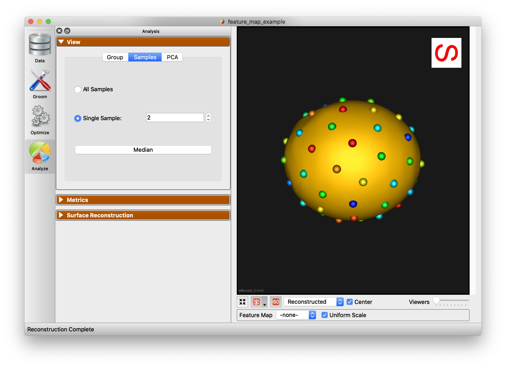

### PCA

The PCA tab of the View panel shows reconstructed shapes (surface meshes) along PCA modes of variation. Modes of variations are shape parameters learned/discovered from your data that describes shape variations. You can control the location along the PCA mode with the Standard Deviation slider.  The extent of this slider is configurable in [Preferences](#preferences).  Values displayed:

`Lambda` - This shows the PCA loading of current position of the slider.  The middle of the slider, at the mean value, will be 0.  The extent of lambda is defined by the number of standard deviations of the slider as described above.  At standard deviation of 1.0, it will be the square root of the mode's eigenvalue.

`Eigenvalue` - This shows the eigenvalue of the currently selected mode.  This is a unitless measure of how much variance is explained by this mode.  The modes are sorted in decreasing order of eigenvalue, corresponding to the most variance explained first.

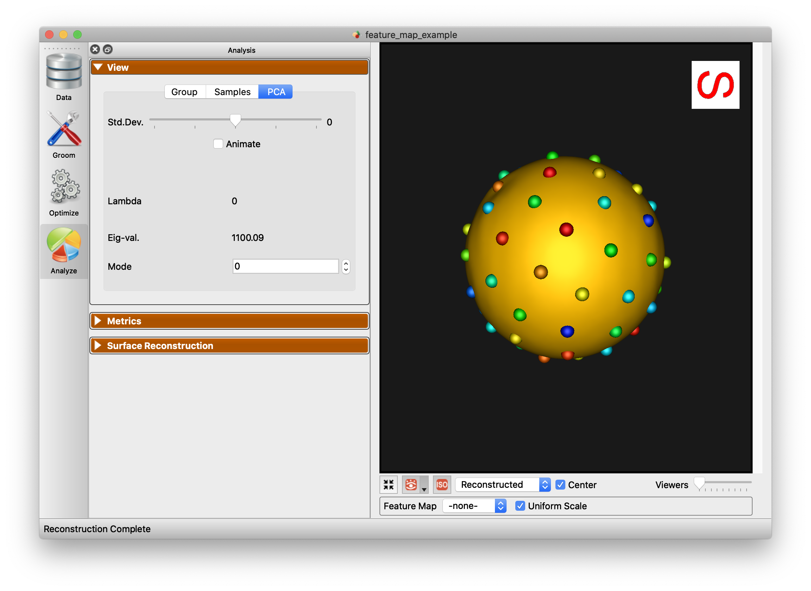

### Regression

The Regression tab fits shape against a numeric per-subject explanatory variable and shows the predicted shape at any value of it.  This is useful for variables that vary continuously across the cohort, such as age or time.

Choose the variable from the **Explanatory Variable** dropdown, which lists the numeric per-subject columns in the project spreadsheet.  The slider then moves the predicted shape across the observed range of that variable, with the current value shown beneath it and the range end points labeled at either side.  The **Animate** checkbox sweeps the slider continuously.

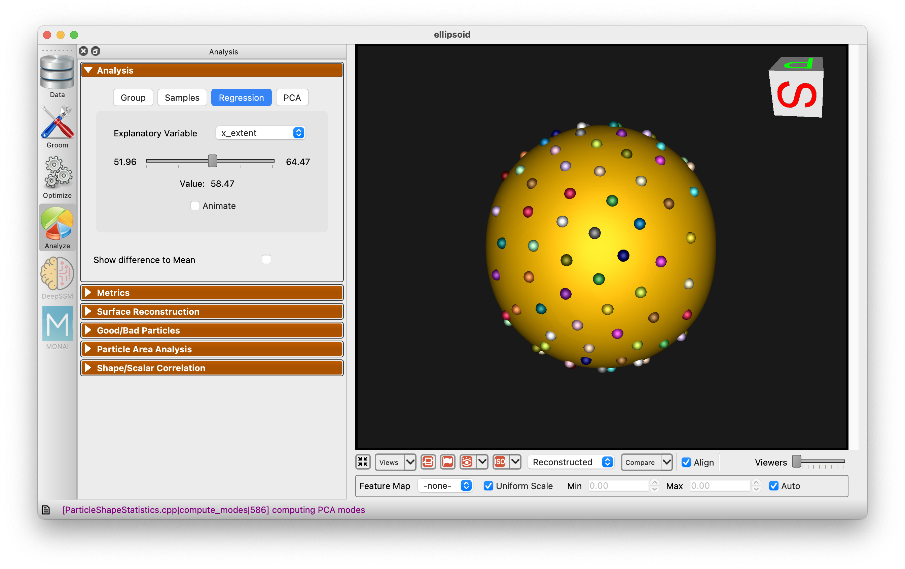

The tab requires a numeric column with at least two subjects holding differing values.  If the project has no numeric per-subject columns, or the selected column is constant, the tab explains what is missing instead of displaying a shape — add a numeric column (e.g. age or time) to the project spreadsheet.

### Multi-Level PCA

The PCA tab of the View panel shows options to select modes of variation in different subspaces when a multiple domain shape model is loaded:
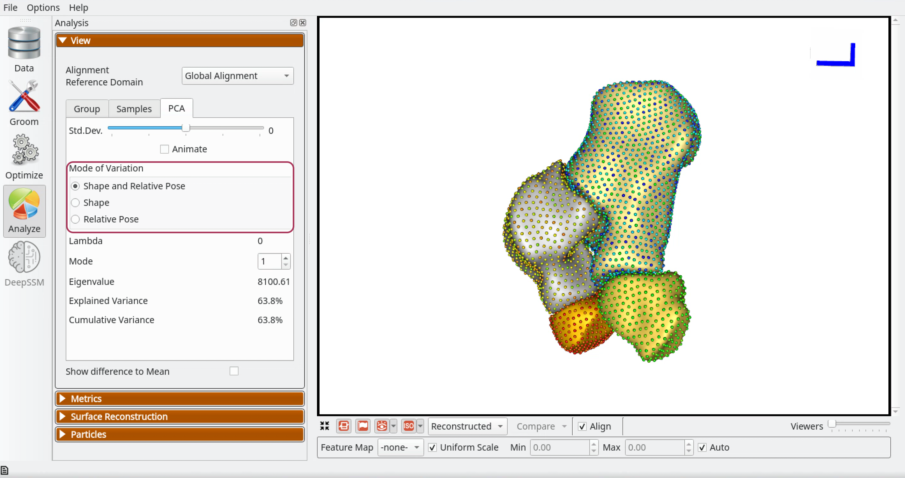

`Shape and Relative Pose` - Selecting this option shows reconstructed shapes and its eigenvalue and lambda along ordinary PCA modes of variation. PCA is done in the shared space of the multi-object shape structure and thus shape and pose variations are entangled here.

`Shape` - Selecting this option shows reconstructed shapes and its eigenvalue and lambda along morphological modes of variation. Multi-Level Component Analysis subtracts each domain's centroid per subject, removing translational pose differences. Note that rotational pose differences remain in the shape component.

`Relative Pose` - Selecting this option shows reconstructed shapes and its eigenvalue and lambda along relative pose modes of variation. Multi-Level Component Analysis keeps only per-domain centroids, showing translational relationships between domains. Note that rotational pose is not captured by this mode.

For a detailed explanation of these modes, their limitations, and how they interact with alignment settings, see [Multi-Domain Reference Frames](multi-domain-analysis-reference-frames.md).

### Show Difference to Mean

This checkbox allows for visualization from any surface to the mean.  Arrow glyphs can be shown to display the difference as well.

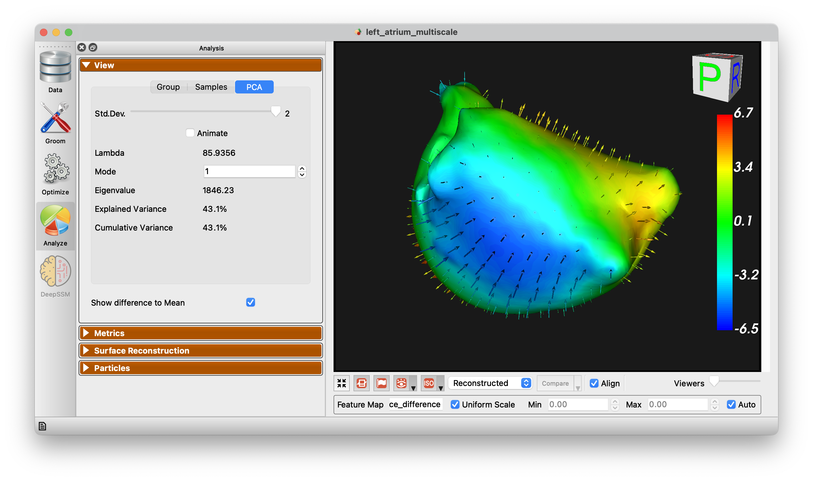

## Metrics Panel

The Metrics panel shows the Compactness, Specificity, and Generalization charts.  These are interactive charts with hover menus and the ability to zoom, pan, etc.

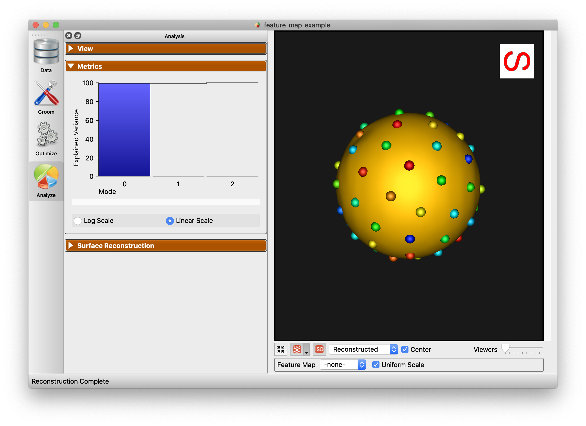

### Distance Calculation Options

1. **Particle to Particle** (Default): Calculates the distance directly between particles when evaluating the metrics.

2. **Particle to Surface**: Calculates the distance between particles and the actual shape surface. This method enhances accuracy by measuring generalization as the distance between reconstructed particles and the true shape surface. Specificity is determined by the distance between sampled particles and the surface, ensuring generated shapes accurately reflect the true shape population and providing reliable and consistent metrics.

See [Shape Model Evaluation](../new/ssm-eval.md) for more information about shape evaluation.

## Surface Reconstruction Panel

See the [Surface Reconstruction](surface-reconstruction.md) page for details on reconstruction methods, warp method options, and examples.

## Good/Bad Particles Panel ##

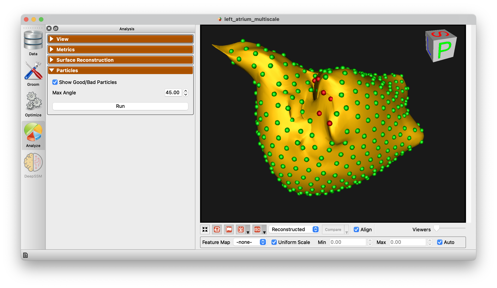

The *Good/Bad Particles Panel* enabled the display of "good/bad particles" in ShapeWorks Studio.  A *maximum angle* parameter is given (default 45 degrees).  When a particle's surface normal across subjects (averaged) exceeds this angle, the particle will be marked "bad" and shown in red.  Good particles are shown in green.  This can help in identifying problems with correspondence as it is typically expected that surface normals for given particles should be similar across subjects.

## Particle Area Analysis ##

The *Particle Area Analysis* panel allows for the visualization of the area of each particle in the shape model.  This can be useful for identifying areas that are not being captured well by the modell.  There are two options for visualization, mean and standard deviation.

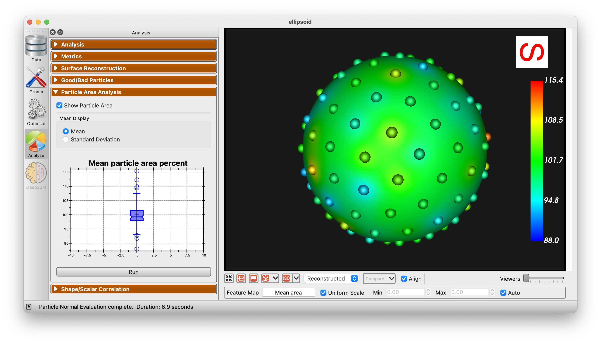

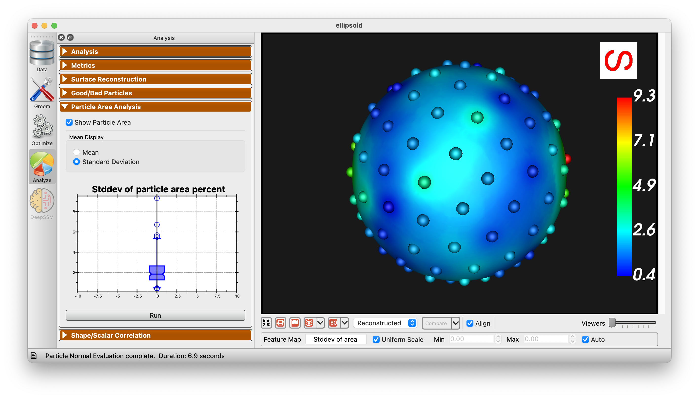

## Correspondence Quality ##

The *Correspondence Quality* panel scores every sample by how well its particles describe its own surface.  Each sample is reconstructed from its local particles through the mesh warper configured in the [Surface Reconstruction](surface-reconstruction.md) panel — the same reconstruction shown in the viewer, using your chosen template and warp method — and the distance from that reconstruction back to the sample's groomed mesh is measured.  A sample whose particles no longer follow its own surface (a failed split, a bad initialization, an outlier shape the model does not cover) shows a large distance.

Note that this measures the correspondence model against the *groomed* meshes, so it reflects both optimization quality and any grooming problems upstream of it.

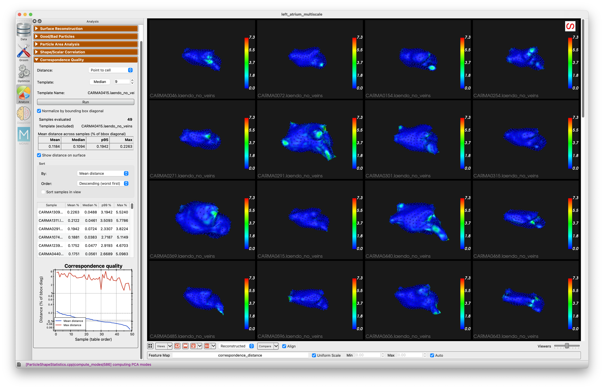

The results are shown on the samples, so running the analysis switches you to the *Samples* tab (if you are not already on a sample view) and to the reconstructed surfaces.

*Template* selects the sample everything is warped from.  It is the same template the [Surface Reconstruction](surface-reconstruction.md) panel uses, so changing it here changes it there as well, and pressing *Run* rebuilds the reconstructions before measuring.  *Median* picks the cohort median.  Changing the template discards any results already on screen, since they were measured against the previous one.

### Reading the results

Press *Run* to compute.  Distances are reported per sample as mean, median, p99 and max over the reconstruction's vertices.  The p99 column is the worst part of the surface without the sensitivity to a single stray vertex that max has.  With *Normalize by bounding box diagonal* checked (the default), each distance is divided by that sample's groomed bounding box diagonal and shown as a percentage, which makes samples of different size comparable.  Normalization applies to the summary, the table, the chart and the sort together.

The chart plots the samples in the same order as the table, on a log axis with the median and p95 marked.  It draws two lines: the metric you are sorting by, and the tail of the distribution beside it — the max distance normally, p99 when sorting by *Localized* so the chart matches the ranking, and the mean when sorting by max.  Two lines rather than one, because a single-line chart hides the most common failure: when a few correspondence points get swapped, only a small patch of the surface is wrong, so the mean barely moves while the tail spikes.  The gap between the lines is how localized the damage is — close together means a diffusely poor reconstruction, a wide gap means a small bad region on an otherwise good one.

For the same reason *Sort by* offers **Localized (p99 / mean)**, which ranks by how concentrated each sample's error is rather than how large it is, bringing swapped-particle cases to the top even when their mean distance looks healthy. A high ratio means most of the surface is fine and a small patch is badly wrong; a low one means the error is spread evenly and the reconstruction is uniformly mediocre. p99 rather than max, so one stray vertex cannot push a sample up the ranking, and the ratio is already scale-free, so the normalize option does not change it.

The template sample is marked in the table and excluded from the summary statistics and the chart, since it is warped from itself and its reconstruction is near-identity.

Click a row to show that sample on its own in the viewer, which is the quickest way to work down the ranking; click the same row again to return to all samples. Right-click the table to copy it to the clipboard as CSV, in the order it is currently sorted.

### Finding the challenging shapes

Use *Sort by* to rank the table by mean, median, p99 or max distance, by how localized the error is, or by name, in descending order (worst first) or ascending (best first).  Checking *Sort samples in view* applies the same ranking to the *All Samples* view, so the most challenging shapes appear first in the grid.  For a multi-domain project a sample is ranked by its worst domain.  Unchecking it restores the original order.

### Seeing where it breaks down

*Show distance on surface* colors each sample by its per-vertex distance to the groomed surface, switching the view to the reconstructed surfaces where that field lives.  This shows *where* correspondence breaks down, not just which samples are worst.

The particles are colored by the average distance over the part of the surface nearest to each one, rather than by the distance at the particle itself.  The reconstruction is warped through the particles and the particles lie on the surface, so the distance at a particle is zero whatever the state of the model; the error to look for is always in the gaps between them.

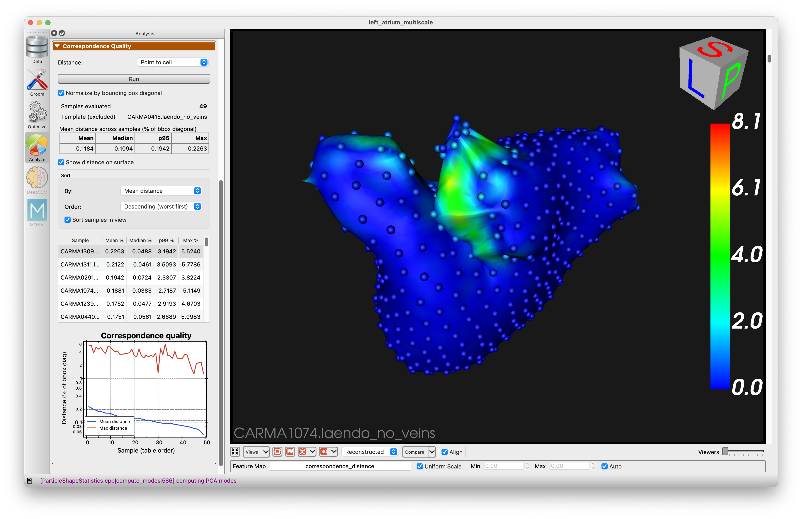

The same metric is available outside Studio via the `shapeworks correspondence-quality` command and the Python API — see [Correspondence Quality](../workflow/analyze.md#correspondence-quality).  Studio reconstructs through its own warper, so its numbers can differ slightly from the command line's if you have changed the template sample or the warp method.

## Shape/Scalar Correlation ##

The *Shape/Scalar Correlation* panel uses 2 block PLS regression to identify the relationship between shape and scalar data. 

To use this panel, you must have scalar values (feature map).  Choose the desired feature map from the dropdown menu.

Use the "Determine number of components" option to show the mean squared error for each number of components:

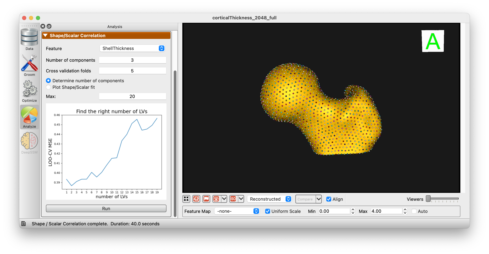

After choosing the desired number of components, you can plot the relationship between shape and scalar data:

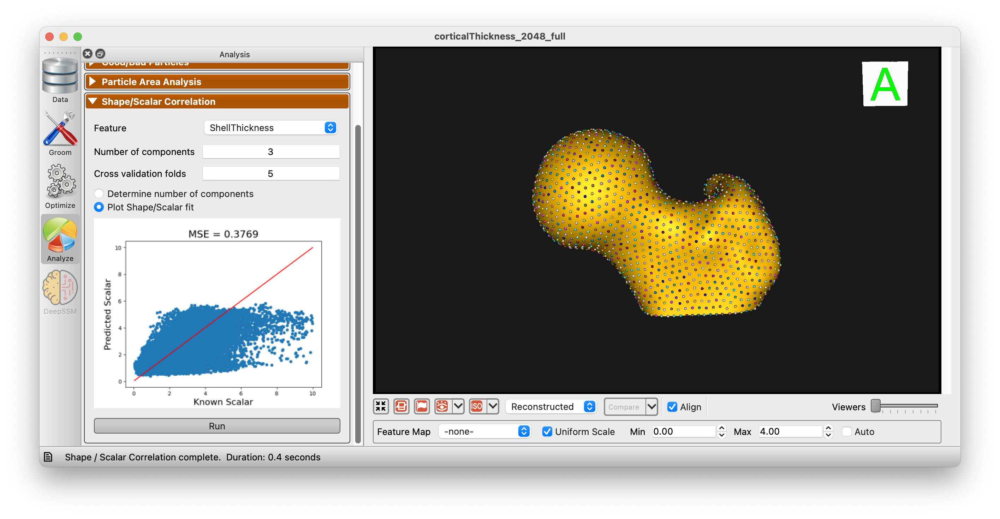

Additionally, you can use the 2 Block PLS regression to predict the scalar value from the shape data and vice versa:

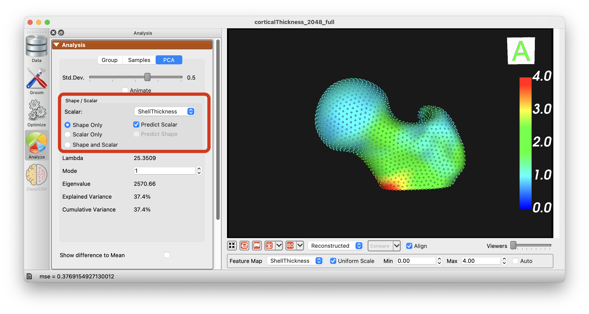

The options "Shape Only", "Scalar Only", and "Shape and Scalar" are available to choose from and the PCA will be performed accordingly.