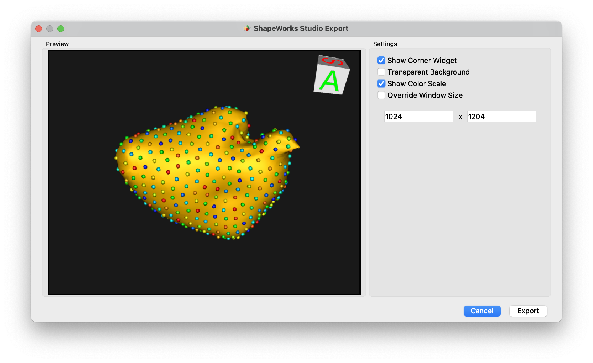

# ShapeWorks Studio Export Options

The File -> Export menu is shown below.

{: width="200" }

* Export Current Mesh - Export the current mesh as a VTK mesh file
* Export Current Particles - Export the currently display particles as an "X Y Z" particles file
* Export Current Particle Scalars - Export the currently displayed particle scalars as a CSV file
* Export Current Mesh Scalars - Export the currently displayed mesh scalars as a CSV file
* Export All Subjects Particle Scalars - Export the particle scalars for all subjects
* Export Eigenvectors - Export the PCA eigenvectors
* Export Eigenvalues - Export the PCA eigenvalues
* Export PCA Component Scores - Export the raw PCA component scores for each subject as a CSV file
* Export PCA Mode Particles - Export the PCA mode particles at each step of the PCA slider
* Export PCA Montage - Launch export dialog for exporting montage of PCA images
* Export Screenshot - Launch export dialog for exporting current display

### Export Screenshot Dialog

{: width="600" }

The Export Screenshot dialog allows you to export the currently displayed image using a variety of options

| Option | Description |
| --- | ----------- |
| Show Corner Widget | Show or hide the orientation widget |
| Transparent Background | Enables transparent background in image export |
| Show Color Scale | Show or hide color scale, when applicable |
| Override Window Size | Override the window size and choose a resolution for export |

### Export PCA Montage

{: width="600" }

The PCA Montage exporter allows you to create a multi-image montage across PCA modes. Options are similar to the screenshot export with the addition of controls:

| Option | Description |
| --- | ----------- |
| PCA Modes | Comma separated list of modes or ranges to include |
| PCA Images | Number of images to export on either side of the mean |
| PCA Range | Standard deviation range of PCA export |

### Creating Videos

The best way to create videos from ShapeWorks Studio is to use a dedicated stand-alone screen video recording tool.  This gives full control over changes in camera angle, display options (e.g. PCA modes, slider animation), compression levels, video formats, etc.  We recommend the following tools:

* [MacOS built in screen recording ](https://support.apple.com/en-us/HT208721)

* [OBS Studio for Windows, MacOS and Linux](https://obsproject.com)
