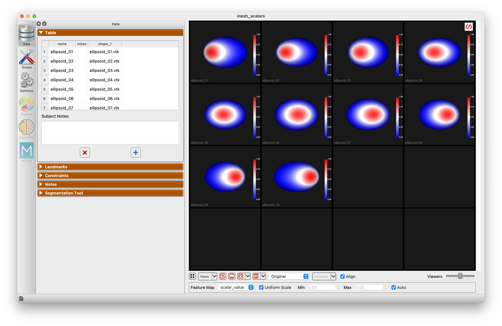
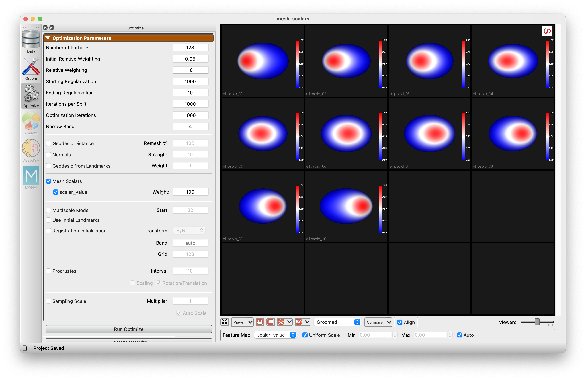
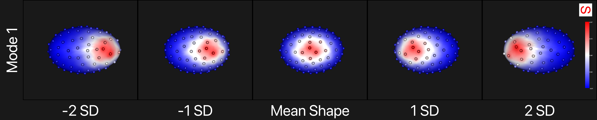

# Mesh Scalars as Correspondence Attributes in Studio

Meshes often carry a per-vertex scalar field: thickness, curvature, a parametric coordinate, a measurement of your own.  ShapeWorks Studio can use such a field as a correspondence attribute, so that particles line up on the field as well as on the geometry.  This helps when the shape alone does not say where a feature is.  See also [Mesh Scalar Attributes](../workflow/optimize.md#mesh-scalar-attributes).

## Example Data

The example data for this tutorial is provided in the ``Examples/Studio/MeshScalars`` directory.

To open the project, start ShapeWorks Studio, and open the project file ``Examples/Studio/MeshScalars/mesh_scalars.swproj``.

The data is ten ellipsoids of nearly the same shape.  Each carries a field named `scalar_value`: a patch near the top of the ellipsoid whose position along the long axis differs from subject to subject.  Nothing in the geometry marks where the patch is.  The script `make_example.py` in the same directory regenerates the data.

Choose `scalar_value` as the Feature Map below the viewer to see the patch on each subject.

{: width="600" }

## Grooming

The meshes are already clean and aligned, so the grooming steps are turned off.  Run Groom to pass them through.  When grooming steps such as remeshing are used, scalar fields are carried onto the groomed meshes, which is where optimization reads them.

## Optimization

The Optimize panel has a Mesh Scalars section with a row for each field found on the meshes.  In this project Mesh Scalars is checked, and `scalar_value` under it is checked with a Weight of 100.  The weight scales the field relative to XYZ: the field here ranges from 0 to 1 while the ellipsoids are tens of units across, so it needs a large weight to count.

{: width="600" }

Run Optimize.  To see what the field contributes, uncheck `scalar_value`, run Optimize again, and compare.

## Analysis

The first PCA mode, from -2 to +2 standard deviations, with the field shown on the surface.  The particles move with the patch.

{: width="800" }

Compared with a model optimized without the field:

| | Without the field | With the field |
| --- | --- | --- |
| First PCA mode | the small differences in size | the patch moving along the ellipsoid, 97% of the variance |
| Particles in the Samples view, colored by the feature map | a given particle's color changes from subject to subject | each particle has the same color in every subject |

With the field in use, each particle sits at the same place relative to the patch in every subject, and the first mode of variation is the movement of the patch, which a model built from geometry alone cannot see.
