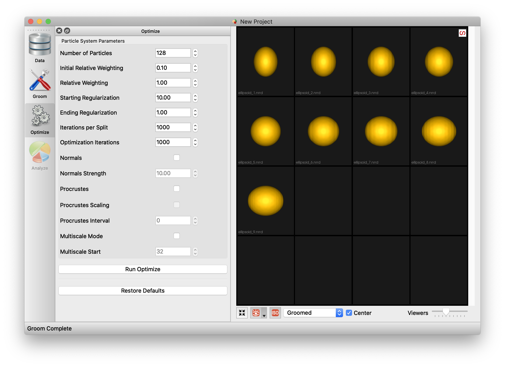

# ShapeWorks Studio Optimize Module

The Optimize module provides options for the particle-based optimization.  After selecting options and clicking "Run Optimize", you can monitor the process of the optimization in real-time.  Particle positions will be displayed on individual shapes as they progress where color encodes surface correspondences across different shapes in your cohort.

{: width="300" }

Optimization Parameters

| Parameter | Description |
| --- | ----------- |
| Number of Particles | The desired number of particles to be placed. ShapeWorks will produce the smallest power-of-2 number of particles greater than or equal to the given value |
| Initial Relative Weighting | The relative weight of the correspondence term in the initialization steps to make sure that optimization steps start with evenly spaced particle distributions that cover the entire surfaces (usually in the order of ~0.1 or 0.01) |
| Relative Weighting | The relative weight of the correspondence term in the optimization steps. |
| Starting Regularization | Sets the starting regularization value.  See details about regularization [here](../workflow/optimize.md#starting-and-ending-regularization) |
| Ending Regularization | Sets the ending regularization value. See details about regularization [here](../workflow/optimize.md#starting-and-ending-regularization)  |
| Iterations per Split | The number of iterations in the initialization step for each split (i.e., scale) |
| Optimization Iterations | Number of iterations for each optimization step. |
| Geodesic Distance | Enable the use of geodesic distance for particle to particle interactions.  This is much slower, but can help with some complex structures/ |
| Normals | Enable the use of surface normals as a correspondence feature |
| Normals Strength | Amount to scale surface normals feature to give it enough weight relative to XYZ. |
| Procrustes | Enable use of procrustes registration as part of optimization |
| Procrustes Scaling | Enable scaling as part of procrustes to remove overall scale from the model |
| Procrustes Rotation/Translation| Enable procrustes rotation/translation to remove translation/rotation from the model |
| Procrustes Interval | Interval of iterations to run procrustes |
| Multiscale Mode | Enable multiscale optimization where each particle split level after the multiscale start number runs in both initialization and optimization modes |
| Multiscale Start | Number of particles to begin multscale mode |
| Use Initial Landmarks | Enable the use of landmarks as starting particles |
| Narrow Band | Number of voxels surrounding zero level for distance transform based optimizations.  Normally a value of 4 is sufficient |