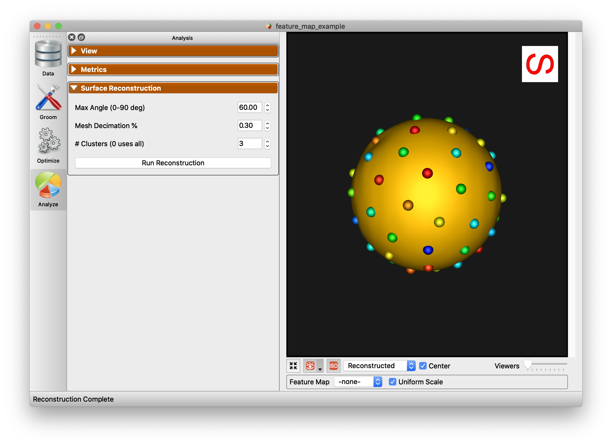
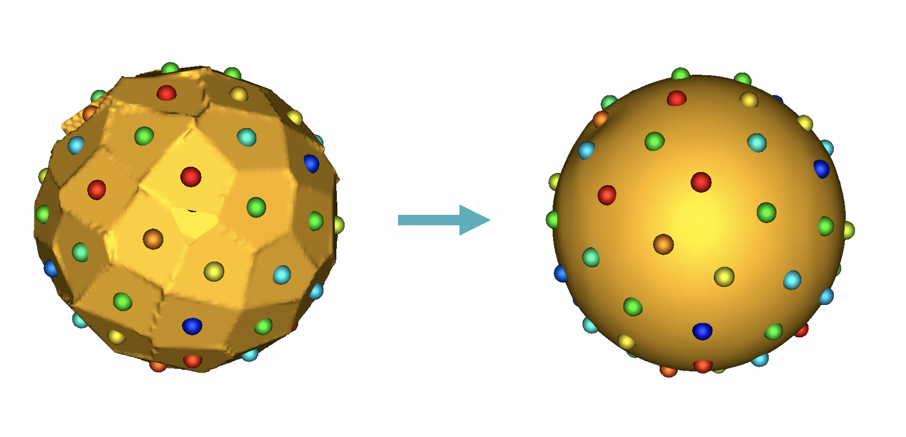
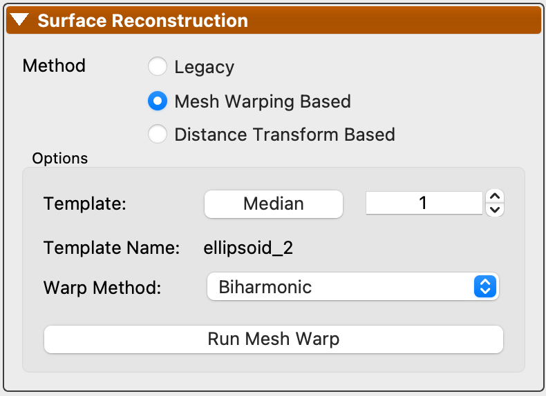
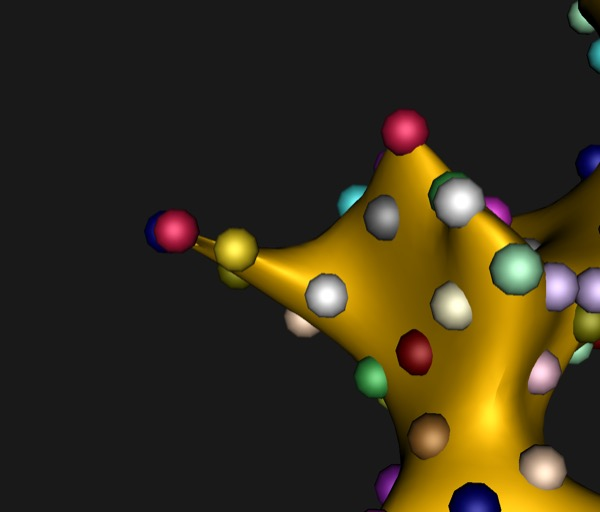
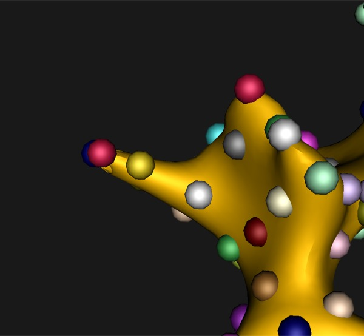

# Surface Reconstruction

ShapeWorks reconstructs dense surface meshes from sparse correspondence particles. Since correspondence particles are placed sparsely across the surface, a dense mesh must be generated for visualization and downstream analysis. ShapeWorks does this by deforming a reference (template) mesh to match each shape's particle positions.

## Reconstruction Methods

Three surface reconstruction methods are available in the Analysis module, depending on your data:

| Method | Requirements | Description |
|--------|-------------|-------------|
| **Mesh Warping** | Meshes or distance transforms | Deforms a template mesh using correspondence particles as control points. Recommended for most workflows. |
| **Distance Transform** | Distance transforms | Reconstructs surfaces from distance transforms. Requires groomed distance transforms in the project. |
| **Legacy** | Particles only | Fallback method for older XML projects that only contain particle files. |

The reconstruction method can be selected from the radio buttons in the Surface Reconstruction panel.



Below is an example of the difference between reconstruction methods.



## Mesh Warping

Mesh warping is the default and recommended reconstruction method. It works by:

1. Selecting a **template shape** (typically the median) from the population.
2. **Embedding** the template's correspondence particles as vertices in its mesh (splitting triangles as needed).
3. **Deforming** the enriched template mesh so that the embedded particle vertices move to each target shape's particle positions, dragging the rest of the mesh along smoothly.

This produces a dense mesh for every shape in the population that shares the same connectivity (triangle topology), which is useful for computing point-to-point correspondences across the full surface.

### Template Selection

The template shape serves as the reference mesh that gets deformed to reconstruct all other shapes. You can choose the template using the options in the Mesh Warp panel:

- **Median** -- Automatically selects the shape closest to the population median. This is the default and generally works well.
- **Template Sample** -- Manually select a specific shape index to use as the template.

After changing the template or warp method, click **Run Mesh Warp** to regenerate the reconstructions.

{: width="400" }

### Warp Methods

Two warp methods are available for deforming the template mesh. The method can be selected from the **Warp Method** dropdown in the Mesh Warp options. The warp method is saved per project. The default for new projects can be changed in **Edit > Preferences** under the Mesh Optimization section.

#### Biharmonic (Default)

Biharmonic deformation computes a weight matrix that expresses every mesh vertex as a weighted combination of the particle positions. Once computed, each per-shape warp is a single matrix multiplication. This is the default and works well for most cases.

#### Laplacian

Laplacian surface deformation preserves the local curvature of the reference mesh during warping. Vertices far from any particle maintain their original surface shape, which can reduce artificial thinning in regions with sparse particle coverage.

Both methods use [libigl](https://libigl.github.io/) for the underlying geometry processing (biharmonic weights and cotangent Laplacian respectively).

**Laplacian** may produce better results when particles are unevenly distributed or on thin structures. **Biharmonic** is a good default for most datasets.

| Biharmonic | Laplacian |
|:---:|:---:|
|  |  |

### Python API

The warp method can also be set programmatically using the Python API:

```python
import shapeworks

warper = shapeworks.MeshWarper()

# Set warp method (default is Biharmonic)
warper.setWarpMethod(shapeworks.WarpMethod.Laplacian)
# or
warper.setWarpMethod(shapeworks.WarpMethod.Biharmonic)

# Set up and run warping
warper.generateWarp(reference_mesh, reference_particles)
warped_mesh = warper.buildMesh(target_particles)
```
