# Using Constraints in Studio

ShapeWorks Studio supports grooming, optimization and analysis of shapes with constraints, i.e. explicit inclusion and exclusion areas of the surfaces. These constraints can be defined in Studio as cutting-plane or free-form constraints. In other words, when you define a constraint, particles will be limited to the allowed area and will not cross into the disallowed region.

<!-- Image of sliced femurs -->

## Defining Cutting-Plane Constraints

Follow the steps below to define cutting planes on an existing project:

1. Make sure you are on the Data tab.
2. Click the Constraints drop-down menu.  
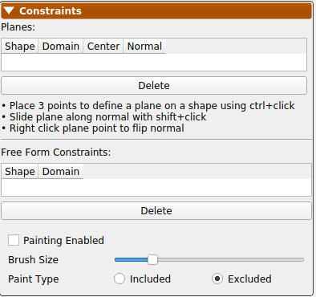{: width="300" }
3. ctrl+click 3 points on a shape surface to define a plane.  
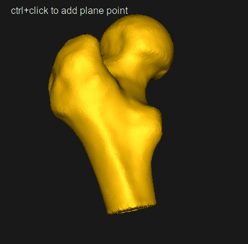{: width="300" }
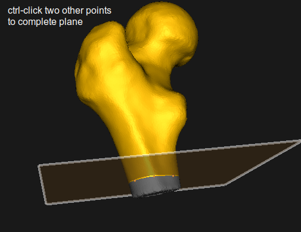{: width="300" }
  1. Slide plane along the normal with shift+click.  
  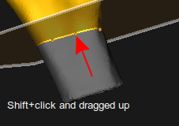{: width="300" }
  2. Right click plane point to flip, delete or **copy plane to other shapes**.  
  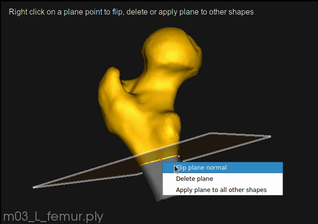{: width="300" }
4. Now the newly defined cutting-plane constraint is active for the desired domain on the desired shape. This will show on the constraints panel. Now particles will not spread to the grayed out area.  
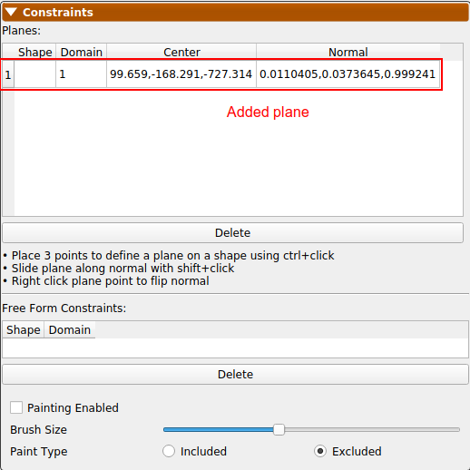{: width="300" }

## Defining Free-Form Constraints

Follow the steps below to define free-form constraints on an existing project:

1. Make sure you are on the Data tab.
2. Click the Constraints drop-down menu.  
{: width="300" }
3. Click the "Painting Enabled" toggle to checked.  

  1. Select brush size using slider if different from default.  
  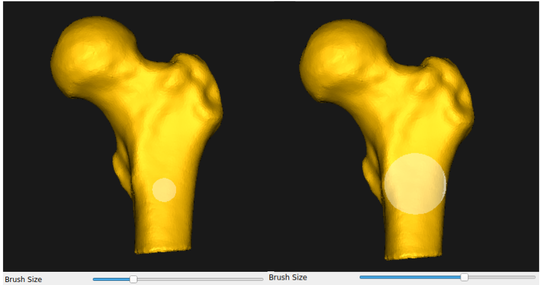{: width="300" }
  2. Select whether to paint included or excluded area.  
  {: width="300" }
4. Paint on the shape you would like to define the free-form constraint on.  
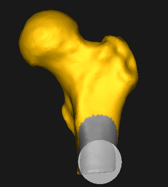{: width="300" }
5. Now the newly-defined free form constraint is active for the desired domain on the desired shape. This will show on the constraints panel. Now particles will not spread to the grayed out area.  
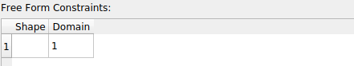{: width="300" }

## Removing a Constraint

To remove a constraint:

1. Make sure you are on the Data tab with the constraints drop-down menu open.
2. The planes and free-form constraints previously defined will be listed. For cutting planes, you can also right click a plane point for the same effect.  
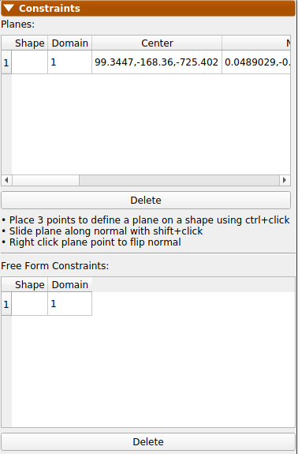{: width="300" }
3. To delete, select the one to delete and click delete.  
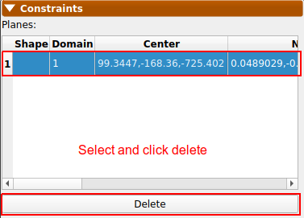{: width="300" }
