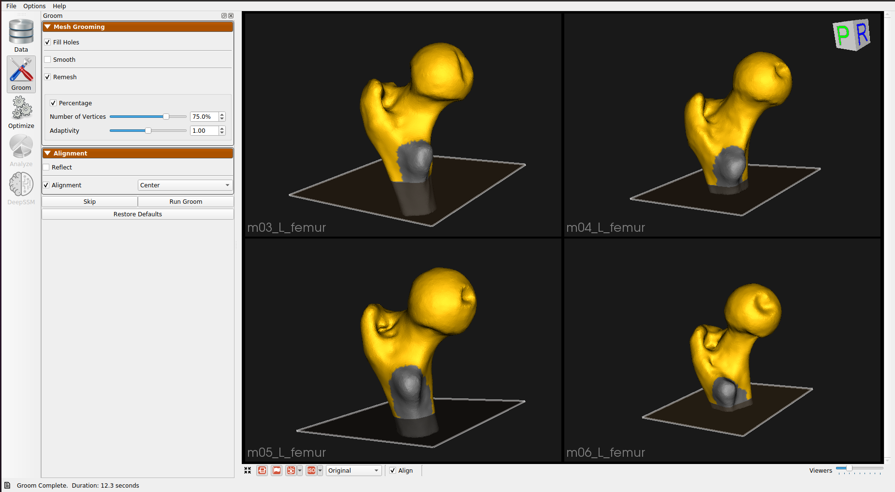
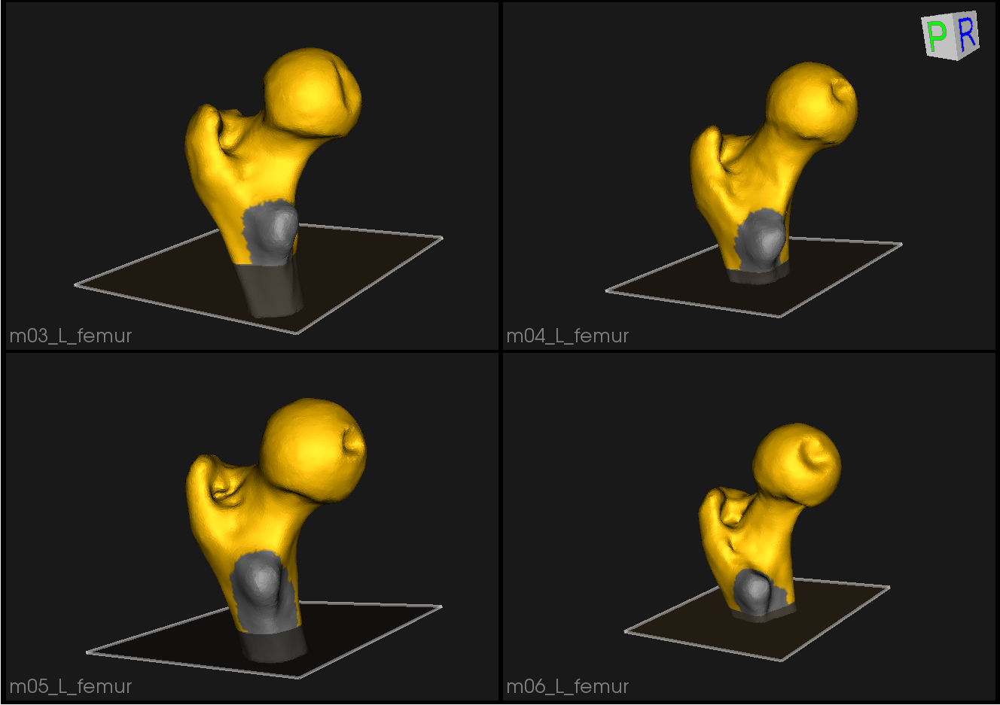
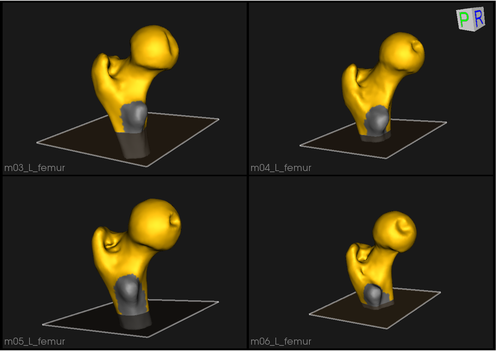
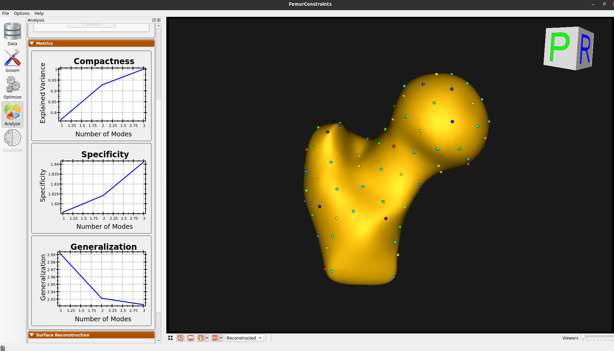
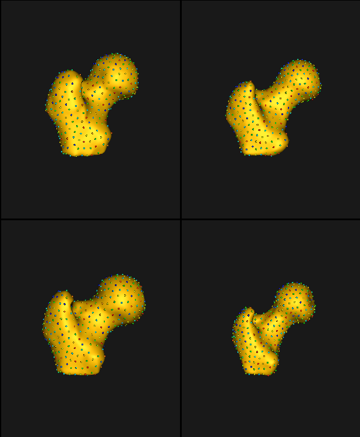

# Studio Femur: Shape Model from Meshes with Cutting Planes Using Studio (WIP)

## What is the Use Case?

The `femur` use case demonstrates using the shape modeling workflow on a real-world femur dataset. The femur shapes are represented as triangular surface meshes and the dataset also contains corresponding imaging data (e.g., CT).

This is a tutorial on how to use this in Studio. The files will be available in Shapeworks/Examples/Studio/FemurConstraints for you to follow along or see the results.

## Starting a New Project with Constraints

Follow these instructions to start a new project and define constraints on your shapes:

1. Open ShapeWorks Studio and click "Start New Project" from the Splash Screen. If you just want to explore and not follow, you can just load Shapeworks/Examples/Studio/FemurConstraints/FemurConstraints.xlsx.
2. Drag-and-drop or import the femurs in Shapeworks/Examples/Studio/FemurConstraints.
3. Follow [the instructions for using constraints](../../studio/using-constraints.md) to define constraints. Here we define a cutting plane and a free-form constraint to each of four femurs.

## Grooming Steps

You can select the grooming parameters in the Groom tab and click "Run Groom". The default parameters work for this use case, but you can experiment with tuning them.

Here is what the femur meshes look like before grooming:

The femur mesh grooming steps are:

1. [**Reflect Meshes**](../../workflow/groom.md#reflect-meshes): In this use case, we have both right and left femur surface meshes. To align all the femurs, we choose one side to reflect.
2. [**Smoothing and Remeshing**](../../workflow/groom.md#remesh): Meshes are smoothed and remeshed to ensure uniform vertices.
3. [**Centering**](../../workflow/groom.md#aligning-meshes): Meshes are translated so that their center lies at [0,0,0].
4. [**Reference Selection**](../../workflow/groom.md#aligning-meshes): The reference is selected by first computing the mean (average) mesh, then selecting the mesh closest to that mean (i.e., medoid).
5. [**Rigid Alignment**](../../workflow/groom.md#aligning-meshes): All of the meshes are aligned to the selected reference using rigid alignment, which factors out the rotation and translation.

Here are the resulting groomed femurs:

## Optimization Parameters

We modify the following parameters to these values for the optimization

- "number_of_particles" : 128
- "optimization_iterations" : 2000
- "starting_regularization" : 100
- "ending_regularization" : 50
- "relative_weighting" : 1
- "initial_relative_weighting" : 0.05

Here is a video showing the entire procedure:  

<video src="https://sci.utah.edu/~shapeworks/doc-resources/mp4s/femur_ffc_use_case_video.mp4" autoplay muted loop controls style="width:100%">

## Analyzing Shape Model        
Here is the mean shape of the optimized shape mode using multi-scale optimization.

Note the particles are not placed below the cutting-plane constraint nor the free-form constraint. The surface extending below the particles is a surface reconstruction artifact which can be ignored.

<!--Here are femur samples with their optimized correspondences.

Zooming in some femur samples.
-->
