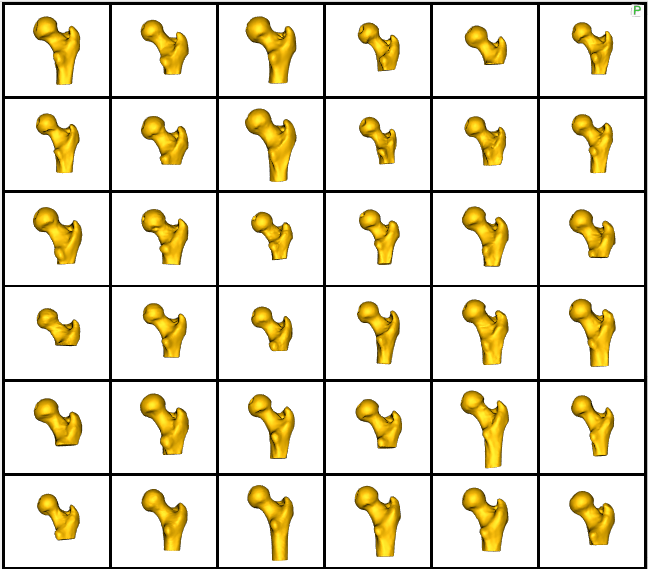

# Femur: Shape Model from Meshes with Cutting Planes

## What is the Use Case?

The `femur` use case demonstrates using the shape modeling workflow on a real-world femur dataset. The the femur shapes are represented as triangular surface meshes and the dataset also contains corresponding imaging data (e.g., CT). These images are groomed along with the shapes when `--groom_images` is used, so that they remain in alignment for subsequent analysis.

There are both left and right femurs in this dataset, thus some must be relfected so that they can all be aligned. The femur meshes have also been segmented with various shaft lengths, as can be seen below. To remove this variability so that it is not captured in the shape model, a cutting plane is used as an optimization constraint.


!!! important 
    Minimum of 32GB of RAM required to run the full use case.

## Grooming Steps

Here is what the femur meshes look like before grooming:


The femur mesh grooming steps are:

1. [**Reflect Meshes**](../../workflow/groom.md#reflect-meshes): In this use case, we have both right and left femur surface meshes. To align all the femurs, we choose one side to reflect.
2. [**Smoothing and Remeshing**](../../workflow/groom.md#remesh): Meshes are smoothed and remeshed to ensure uniform vertices.
3. [**Centering**](../../workflow/groom.md#aligning-meshes): Meshes are translated so that their center lies at [0,0,0].
4. [**Reference Selection**](../../workflow/groom.md#aligning-meshes): The reference is selected by first computing the mean (average) mesh, then selecting the mesh closest to that mean (i.e., medoid).
5. [**Rigid Alignment**](../../workflow/groom.md#aligning-meshes): All of the meshes are aligned to the selected reference using rigid alignment, which factors out the rotation and translation. 

*Note: The reflection, centering translation, and rigid alignment transforms are saved to use for grooming the corresponding images.*

If the `--groom_images` tag is used, the corresponding images are groomed as follows:

1. [**Reflection**](../../workflow/groom.md#reflect-meshes): If the corresponding mesh was reflected, we reflect the image.
2. [**Centering**](../../workflow/groom.md#aligning-segmentations): The translation used to center the mesh is applied to the image.
3. [**Reference selection**](../../workflow/groom.md#resampling-images-and-segmentations): The image corresponding to the reference mesh is selected as a reference image for applying rigid transforms to the images. The reference image is resampled to have isotropic spacing.
4. [**Rigid alignment**](../../workflow/groom.md#aligning-segmentations): All of the images are aligned using the rigid alignment transforms applied to the meshes. The reference image parameters (i.e. origin, dims, spacing, and coordsys) are passed to define a valid coordinate system for the resulting images.
5. [**Cropping**](../../workflow/groom.md#cropping-and-padding-segmentations): The images are cropped so that all of the samples are within the same bounding box. The bounding box parameters are computed based on the smallest bounding box that encapsulates all the groomed meshes.

Here are the resulting groomed femurs:


## Relevant Arguments
[--groom_images](../use-cases.md#-groom_images)
[--use_subsample](../use-cases.md#-use_subsample)
[--num_subsample](../use-cases.md#-use_subsample)
[--skip_grooming](../use-cases.md#-skip_grooming)
[--use_single_scale](../use-cases.md#-use_single_scale)
[--tiny_test](../use-cases.md#-tiny_test)

## Optimization Parameters
The python code for the use case calls the `optimize` command of ShapeWorks, which requires that the optimization parameters are specified in a python dictionary. Please refer to [Parameter Dictionary in Python](../../workflow/optimize.md#parameter-dictionary-in-python) for more details. 
Below are the default optimization parameters for this use case.
```python        
        "number_of_particles" : 512,
        "use_normals": 0,
        "normal_weight": 10.0,
        "checkpointing_interval" : 200,
        "keep_checkpoints" : 0,
        "iterations_per_split" : 1000,
        "optimization_iterations" : 500,
        "starting_regularization" : 100,
        "ending_regularization" : 0.1,
        "recompute_regularization_interval" : 2,
        "domains_per_shape" : 1,
        "domain_type" : 'mesh',
        "relative_weighting" : 10,
        "initial_relative_weighting" : 0.01,
        "procrustes_interval" : 1,
        "procrustes_scaling" : 1,
        "save_init_splits" : 1,
        "debug_projection" : 0,
        "verbosity" : 0,
        "use_statistics_in_init" : 0,
        "adaptivity_mode": 0,
        "cutting_plane_counts": cutting_plane_counts,
        "cutting_planes": cutting_planes,
        "use_shape_statistics_after" = 64
```

Here `cutting_plane_counts` is 49, one for every femur and the `cutting_planes` is the same cutting plane points for every femur.

## Analyzing Shape Model        
Here is the mean shape of the optimized shape mode using multi-scale optimization.


Note the particles are not placed below the cutting plane constraint. The surface extending below the particles is a surface reconstruction artifact which can be ignored.

Here are femur samples with their optimized correspondences.


Zooming in some femur samples.


Here is a video showing the shape modes of variation (computed using principal component analysis - PCA) of the femur dataset.

