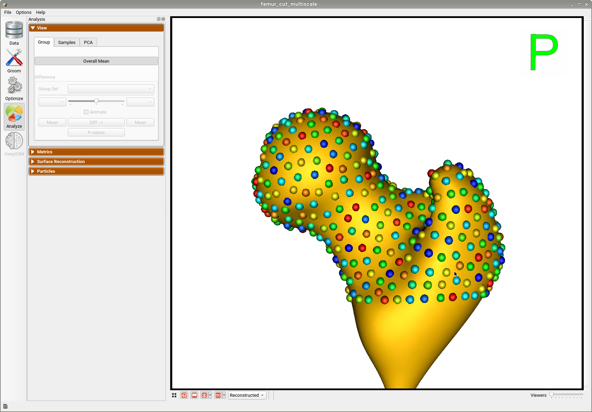
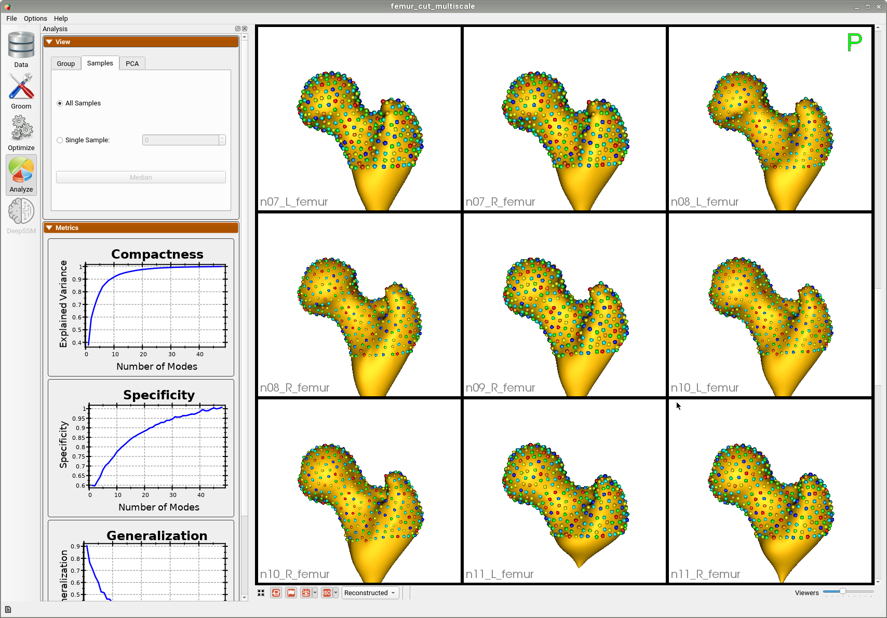

# Femur: Shape Model from Meshes with Cutting Planes

## What is the Use Case?

The `femur` use case demonstrates using the shape modeling workflow on a real-world femur dataset. The femur shapes are represented as triangular surface meshes and the dataset also contains corresponding imaging data (e.g., CT).

There are both left and right femurs in this dataset, thus some must be reflected so that they can all be aligned. The femur meshes have also been segmented with various shaft lengths, as can be seen below. To remove this variability so that it is not captured in the shape model, a cutting plane is used as an optimization constraint.


!!! important
    Minimum of 32GB of RAM required to run the full use case.

## Grooming Steps

Here is what the femur meshes look like before grooming. Some femurs are out of frame because they are not centered or aligned. 


The femur mesh grooming steps are:

1. [**Reflect Meshes**](../../workflow/groom.md#reflect-meshes): In this use case, we have both right and left femur surface meshes. To align all the femurs, we choose one side to reflect.
2. [**Smoothing and Remeshing**](../../workflow/groom.md#remesh): Meshes are smoothed and remeshed to ensure uniform vertices.
3. [**Centering**](../../workflow/groom.md#aligning-meshes): Meshes are translated so that their center lies at [0,0,0].
4. [**Reference Selection**](../../workflow/groom.md#aligning-meshes): The reference is selected by first computing the mean (average) mesh, then selecting the mesh closest to that mean (i.e., medoid).
5. [**Rigid Alignment**](../../workflow/groom.md#aligning-meshes): For all the shapes, the transformation is calculated to factor out translation and rotation based on the reference shape.This transformation matrix will be sent to the optimizer as a 'prefix transform'

Here we show how the shapes would look like if the transforms are applied along with respective cutting planes:


## Relevant Arguments
[--use_subsample](../use-cases.md#-use_subsample)
[--num_subsample](../use-cases.md#-use_subsample)
[--use_single_scale](../use-cases.md#-use_single_scale)
[--tiny_test](../use-cases.md#-tiny_test)

## Optimization Parameters
The python code for the use case calls the `optimize` command of ShapeWorks which reads the project sheet with the shape filenames and optimization parameter values. See [Project excel file](../../workflow/parameters.md#project-excel-file) for details regarding creating the project sheet.
Below are the default optimization parameters for this use case.
```python        
{
        "number_of_particles" : 512,
        "use_normals": 0,
        "normals_strength": 10.0,
        "checkpointing_interval" : 200,
        "keep_checkpoints" : 0,
        "iterations_per_split" : 1000,
        "optimization_iterations" : 500,
        "starting_regularization" : 100,
        "ending_regularization" : 0.1,
        "recompute_regularization_interval" : 2,
        "domains_per_shape" : 1,
        "relative_weighting" : 10,
        "initial_relative_weighting" : 0.1,
        "procrustes" : 1,
        "procrustes_interval" : 1,
        "procrustes_scaling" : 1,
        "save_init_splits" : 1,
        "debug_projection" : 0,
        "verbosity" : 0,
        "use_statistics_in_init" : 0,
        "adaptivity_mode": 0
} 
```

Here `cutting_plane_counts` is 49, one for every femur and the `cutting_planes` is the same cutting plane points for every femur.

## Analyzing Shape Model        
Here is the mean shape of the optimized shape mode using multi-scale optimization.



Note the particles are not placed below the cutting plane constraint. The surface extending below the particles is a surface reconstruction artifact which can be ignored.

Here are femur samples with their optimized correspondences.


Here is a video showing the shape modes of variation (computed using principal component analysis - PCA) of the femur dataset.


