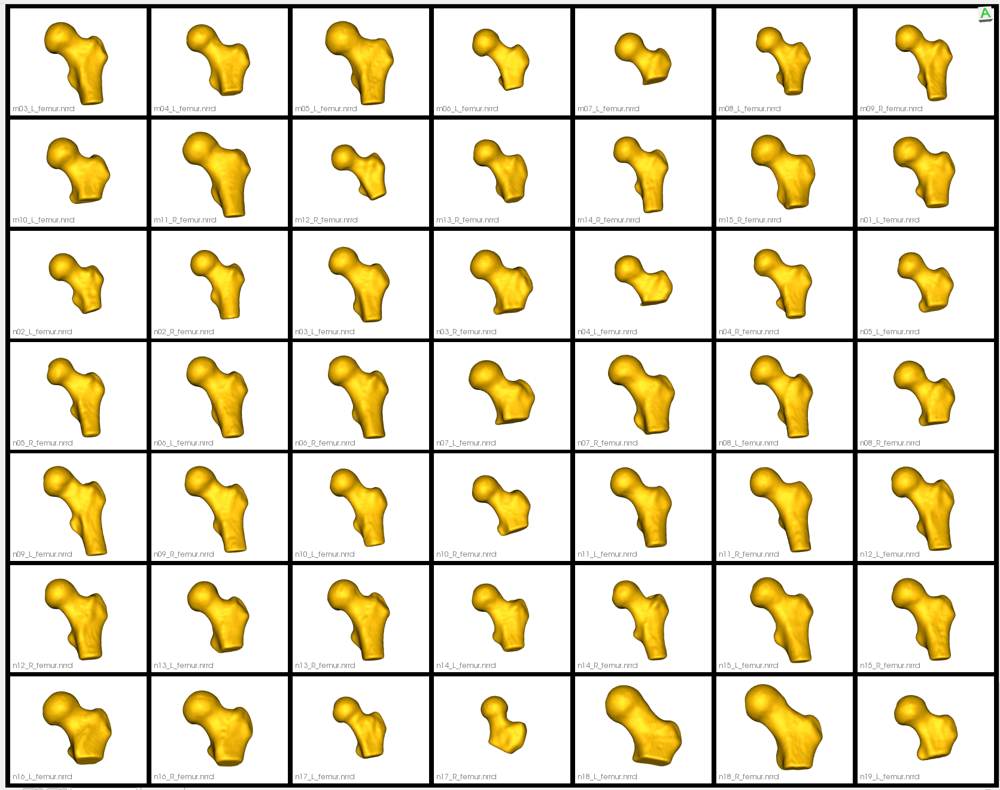

# Femur with Cutting Planes

## What is the Use Case?
The `femur_cut` use case demonstrates an alternative approach to the [femur use case](../mesh-based/femur.md) by using cutting planes to constrain the particle distribution on the femur surface. The data and workflow of this use case are identical to the [femur use case](../mesh-based/femur.md) with one exception: the shapes are not clipped using cutting planes in grooming, but rather the cutting planes are fed as an optimization parameter. This prevents particles from moving beyond the cutting plane during optimization, preventing the false bottom created by clipping from being captured in the shape model as it is in the [femur use case](../mesh-based/femur.md).

!!! important 
    Minimum of 32GB of RAM required to run the full use case.

## Grooming Steps
The grooming steps are the same as the [femur use case](../mesh-based/femur.md), except clipping is not performed. Please refer back to the [femur grooming steps](../mesh-based/femur.md#grooming-steps) for a full explanation of grooming.

Note because the clipping step is skipped, the groomed femurs vary in shaft length:


## Relevant Arguments
[--groom_images](../use-cases.md#-groom_images)
[--use_subsample](../use-cases.md#-use_subsample)
[--num_subsample](../use-cases.md#-use_subsample)
[--skip_grooming](../use-cases.md#-skip_grooming)
[--use_single_scale](../use-cases.md#-use_single_scale)
[--mesh_mode](../use-cases.md#-mesh_mode)
[--tiny_test](../use-cases.md#-tiny_test)

## Optimization Parameters
The python code for the use case calls the `optimize` command of ShapeWorks, which requires that the optimization parameters are specified in a python dictionary. Please refer to [Parameter Dictionary in Python](../../workflow/optimize.md#parameter-dictionary-in-python) for more details. 
Below are the default optimization parameters for this use case.
```python        
        "number_of_particles" : 1024,
        "use_normals": 0,
        "normal_weight": 10.0,
        "checkpointing_interval" : 200,
        "keep_checkpoints" : 1,
        "iterations_per_split" : 4000,
        "optimization_iterations" : 4000,
        "starting_regularization" : 100,
        "ending_regularization" : 0.1,
        "recompute_regularization_interval" : 2,
        "domains_per_shape" : 1,
        "domain_type" : 'image',
        "relative_weighting" : 10,
        "initial_relative_weighting" : 1,
        "procrustes_interval" : 1,
        "procrustes_scaling" : 1,
        "save_init_splits" : 1,
        "debug_projection" : 0,
        "verbosity" : 0,
        "use_statistics_in_init" : 0,
        "adaptivity_mode": 0,
        "cutting_plane_counts": cutting_plane_counts,
        "cutting_planes": cutting_planes,
        "use_shape_statistics_after" = 64
```

Here `cutting_plane_counts` is one for every femur and the `cutting_planes` is the same cutting plane points for every femur.

## Analyzing Shape Model        
Below we can see the mean shape, individual samples, and modes of shape variations of the optimized shape mode using single-scale optimization. Here we can see the particles are constrained to be above the cutting plane.

<p><video src="https://sci.utah.edu/~shapeworks/doc-resources/mp4s/femur_cut.mp4" autoplay muted loop controls style="width:100%"></p>

