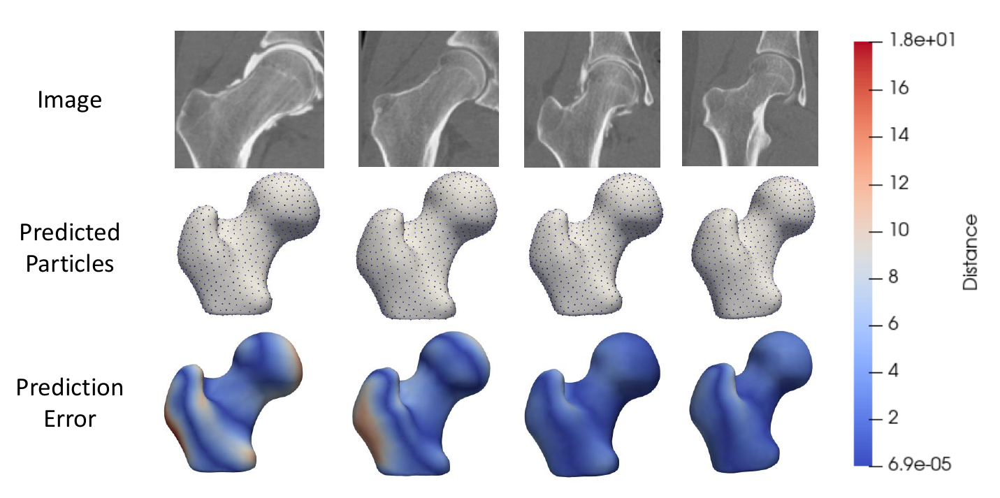

# Femur SSM Directly from Images

## What and Where is the Use Case? 

This use case demonstrates how to get shape models from unsegmented images using deep learning on the femur data. This includes performing data augmentation as well as building, training and testing a DeepSSM model. For a detailed description of these processes, please see [Data Augmentation for Deep Learning](../deep-learning/data-augmentation.md) and [SSMs Directly from Images](../deep-learning/deep-ssm.md). The image and shape data used for training and testing results from running the [Femur: SSM from Meshes](femur.md) use case.

The use case is located at: `Examples/Python/deep-ssm.py`

!!! note "Relevant papers"
    - Jadie Adams, Riddhish Bhalodia, Shireen Elhabian. Uncertain-DeepSSM: From Images to Probabilistic Shape Models. In MICCAI-ShapeMI, Springer, Cham, 2020.
    - Riddhish Bhalodia, Shireen Elhabian, Ladislav Kavan, and Ross Whitaker. DeepSSM: a deep learning framework for statistical shape modeling from raw images. In MICCAI-ShapeMI, pp. 244-257. Springer, Cham, 2018.
    - Riddhish Bhalodia, Anupama Goparaju, Tim Sodergren, Alan Morris, Evgueni Kholmovski, Nassir Marrouche, Joshua Cates, Ross Whitaker, Shireen Elhabian. Deep Learning for End-to-End Atrial Fibrillation Recurrence Estimation. Computing in Cardiology (CinC), 2018.

## Running the Use Case

To run the use case, run `RunUseCase.py` (in `Examples/Python/`) with proper tags.

```
$ cd /path/to/shapeworks/Examples/Python
$ python RunUseCase.py --use_case deep_ssm
```

See [Getting Started with Use Cases](../use-cases/use-cases.md#running-use-case) for the full list of tags. Note the following tags are not applicable to this use case:

* `--start_with_prepped_data`
* `--use_single_scale`
* `--interactive`
* `--start_with_image_and_segmentation_data`

This calls `deep_ssm.py` (in `Examples/Python/`) to perform the following.

* Loads the femur dataset using a local version if it exists (i.e., previously downloaded), otherwise the dataset is automatically downloaded from the [ShapeWorks Data Portal](http://cibc1.sci.utah.edu:8080/). This includes the particle files in `shape_models` created from running the femur use case. 
* Performs data augmentation as described in [Data Augmentation for Deep Learning](../deep-learning/data-augmentation.md).
* Creates a DeepSSM model as described in [SSMs Directly from Images](../deep-learning/deep-ssm.md) and uses it to make predictions on unseen images.

!!! danger "On CUDA"
    This use case uses Pytorch and requires a GPU to run in a timely manner. When you run `conda_installs.sh`, it detects if you have a GPU and and installs the version of Pytorch compatible with your version of CUDA. 
    
    Note we only support the three most recent versions of CUDA. If your GPU requires an older version of CUDA, you will need to update the Pytorch install in your shapeworks conda environment to the correct CUDA version. For more information on doing so, see [pytorch.org](https://pytorch.org/). 
    
    To do a quick check to see if Pytorch is running on your GPU, you can run the use case with the `--tiny-test` tag. This will run the use case quickly on a few examples and print an error if it is not running on the GPU.

## Use Case Pipeline

### Step 1: Getting the original data

The femur data is downloaded from the [ShapeWorks Data Portal](http://cibc1.sci.utah.edu:8080/). This use case uses the original unsegmented images and the corresponding `.particles` files in the `shape_models` folder downloaded with the femur dataset. Of the 50 examples in the femur dataset, 40 are used to create training and validation sets while the remaining 10 are saved for a test set (i.e., held out data).

### Step 2: Running data augmentation

For a full description of the data augmentation process and how to use the ShapeWorks data augmentation Python package, please see [Data Augmentation for Deep Learning](../deep-learning/data-augmentation.md). The functions relevant to this step are `runDataAugmentation` and `visualizeAugmentation`.

Data augmentation is run using the images and particle files allocated for training and validation. 4960 augmented samples are created so that DeepSSM can be trained on 5000 total examples. The data is embedded to 6 dimensions using PCA, preserving 95% of the population variation. A kernel density estimate (KDE) distribution is then fit to the embedded data and used in sampling new shape samples for data augmentation. The real and augmented results are then visualized in a matrix of scatterplots.

### Step 3: Creating torch loaders

For a full description of the DeepSSM process and how to use the ShapeWorks DeepSSM Python package, please see [SSMs Directly from Images](../deep-learning/deep-ssm.md). The functions relevant to this step are `getTrainValLoaders` and `getTestLoader`.

The images and particle files are reformatted into tensors for training and testing the DeepSSM network. The 5000 original and augmented image/particle pairs are turned into train (80%) and validation (20%) loaders and the images held out for the test set are turned into a test loader. A batch size of 8 is used for optimal GPU capacity. The images in the train, validation, and test sets are down sampled to 75% of their original size to decrease training time.

!!! note 
    If a CUDA memory error occurs when running the use case, the batch size value may need to be decreased. 

### Step 4: Training DeepSSM 

This step uses function `trainDeepSSM` documented in [SSMs Directly from Images](../deep-learning/deep-ssm.md). A DeepSSM model is created and trained for 50 epochs. A learning rate of 0.0001 is used and the validation error is calculated and reported every epoch.

### Step 5: Testing DeepSSM

This step uses function `testDeepSSM` documented in [SSMs Directly from Images](../deep-learning/deep-ssm.md). The trained DeepSSM model is used to predict the PCA scores of the unseen images in the test loader. These scores are then mapped to the particle shape model using the PCA information from data augmentation and the predicted particles are saved.

### Step 6: Analyze DeepSSM Results

This step uses function `analyzeResults` documented in [SSMs Directly from Images](../deep-learning/deep-ssm.md). The DeepSSM predictions are analyzed by considering the surface-to-surface distance between the mesh generated from the original segmentation and the mesh generated from the predicted particles. Heat maps of these distances on the meshes are saved to visualize the results.


