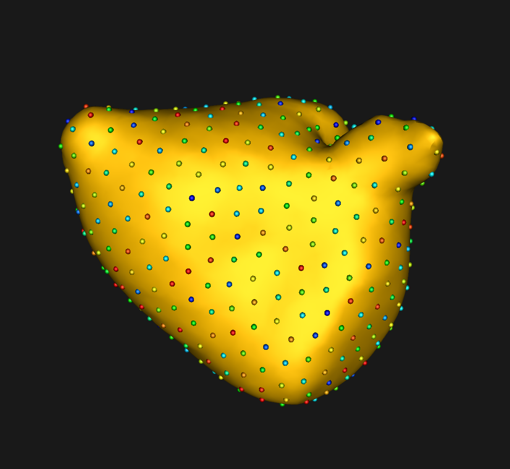

# Left Atrium: Shape Model from Segmentations

## What and Where is the Use Case? 


This use case demonstrates using ShapeWorks tools to perform the following.

- Build a shape model where shapes are given as binary segmentations
- Groom a dataset that contains both shapes (segmentations) and their corresponding imaging data (e.g., MRI)
- Showcase both single-scale and multi-scale optimization for particles optimization

For this use case, we have 58 MRI images and their corresponding binary segmentations of the left atrium (visit [MIDAS-NAMIC](https://www.insight-journal.org/midas/collection/view/197) for more details of the left atrium dataset).

The use case is located at: `Examples/Python/left_atrium.py`


## Running the Use Case

!!! important
    Minimum of 32GB of RAM required to run the full use case.

To run the use case, run `RunUseCase.py` (in `Examples/Python/`) with proper tags. The tags control the type of input data and the optimization method. See [Getting Started with Use Cases](../use-cases/use-cases.md#running-use-case) for the full list of tags.

* `--start_with_image_and_segmentation_data`: to groom both raw images and segmentations using the segmentations to find the grooming parameters (e.g., bounding box, reference shape for alignment). The default is grooming only segmentations
* `--use_single_scale`: to use the single-scale optimization. Default is multi-scale optimization
* `--start_with_prepped_data`: to run the optimization on previously processed/groomed data


To run the full pipeline with multi-scale:
            
```
$ cd /path/to/shapeworks/Examples/Python
$python RunUseCase.py --use_case left_atrium 
```

This calls `left_atrium.py` (in `Examples/Python/`) to perform the following.
            
* Loads the left atrium dataset using a local version if it exists (i.e., previously downloaded); otherwise, the dataset is automatically downloaded from the [ShapeWorks Data Portal](http://cibc1.sci.utah.edu:8080/).
* Grooms the images and segmentations by calling data preprocessing functions in `GroomUtils.py` (in `Examples/Python/`). See [Grooming Data](#grooming-data) for details about these preprocessing steps.
* Optimizes particle distribution (i.e., the shape/correspondence model) by calling optimization functions in `OptimizeUtils.py` (in `Examples/Python/`). See [Optimizing Shape Model](#optimizing-shape-model) for details about algorithmic parameters for optimizing the shape model.
* Launches ShapeWorksStudio to visualize the use case results (i.e., optimized shape model and the groomed data) by calling functions in `AnalyzeUtils.py` (in `Examples/Python/`).

If you wish to start with the optimization step using a previously groomed data, add `--start_with_prepped_data` tag.

```
$ python RunUseCase.py --use_case left_atrium --start_with_prepped_data
```

## Grooming Data

The grooming stage entails rigid transformations to align samples for groupwise modeling and analysis. It also changes the origin, voxel size, image size, orientation, etc. of the shape data. Imaging data (CT/MRI) soon becomes out of alignment and cannot be tied to the resulting shape models. Although we do not need the raw images for the shape model optimization, carrying over images. However, the grooming stage enables streamlined construction of a correspondence model of surface geometry that simultaneously map imaging data and physical properties (e.g., functional measurements, cortical thickness, cartilage thickness, etc.) to each correspondence point. 


ShapeWorks image-based grooming tools and associated python scripts are developed to carry volumetric data through each grooming step with the shapes (meshes or segmentations) to be used for subsequent analysis visualization. In each step of grooming, we use the segmentation files to find the grooming parameters such as finding the reference shape for alignment or the bounding box for cropping. We save them in a TXT file and use the same set of parameters to groom the raw images. 


The following preprocessing steps are only performed when you start with *unprepped* data, i.e., the tag `--start_with_prepped_data` is not used. For a description of the grooming tools and parameters, see: [How to Groom Your Dataset?](../workflow/groom.md).

1. **Isotropic Resampling**: Both binary segmentations in `left_atrium/segmentations/` and their corresponding images in `left_atrium/images/` are resampled to have an isotropic voxel spacing using a user-defined spacing. This step could also be used to produce images and segmentations with smaller voxel spacing, and thereby reduce aliasing artifacts (i.e., staircase/jagged surface) due to binarization for segmentations.
2. **Apply Padding**: Segmentations that touch the image boundary will have an artificial hole at that intersection. Segmentations and images are padded by adding a user-defined number of voxels along each image direction (rows, cols, and slices) to avoid introducing artificial holes.
3. **Center-of-Mass Alignment**: This translational alignment step is performed before rigidly aligning the samples to a shape reference. This factors out translations to reduce the risk of misalignment and allow for a medoid sample to be automatically selected as the reference for rigid alignment.
4. **Reference Selection**: The reference is selected by first computing the mean (average) distance transform of the segmentations, then selecting the sample closest to that mean (i.e., medoid).
5. **Rigid Alignment**: All of the segmentations and images are then aligned to the selected reference using rigid alignment, which factors out the rotation and remaining translation. The alignment parameters are computed based on aligning segmentations and then applied to their corresponding images.
6. **Cropping**: The images and segmentations are cropped so that all of the samples are within the same bounding box. The bounding box parameters are computed based on the biggest bounding box that encapsulate all the segmentations of the given dataset.
7. **Distance Transform**: Finally, the signed distance transform is computed, and the dataset is now ready for the optimize phase.


At the end of the grooming stage, both segmentations, which are turned into distance transforms, and corresponding images data, are groomed and ready for the optimize stage.


## Optimizing Shape Model

For a description of the optimize tool and its algorithmic parameters, see: [How to Optimize Your Shape Model](../workflow/optimize.md). 

The shape model can be optimized using either a single-scale or a multi-scale optimization. In both cases, particles on each shape sample are initialized using the particle splitting strategy starting from a single particle (or a given set of landmarks) until reaching the required number of particles (or the largest power of two number of particles that is closest to the required number of particles). The optimized particles at each scale are used to initialize the next scale. At each scale, particles undergo *initialization* and *optimization* stages. 

The multi-scale triggers both the initialization and optimization stages. The single-scale mode, on the other hand, uses the initialization stage at each scale and runs the optimization stage when the required number of particles is reached (i.e., at the last scale). The default mode is multi-scale; to run the single-scale optimization, use the `--use_single_scale` tag.

The differences between *initialization* and *optimization* stages are: 

- How important the correspondence (inter-surface) objective is compared to the surface sampling (intra-surface) term using a relative weighting parameter. Hence, the  `initial_relative_weighting` parameter is the weight used in the initialization stage, and the `relative_weighting` is the weight used for the optimization stage.

- How the notion of correspondence (inter-surface) is quantified. In initialization, especially when we do not have enough particles to describe the geometry of each surface, we use mean energy (i.e., pushing all shapes in the shape space to the mean shape or, in other words, the covariance matrix is assumed to be identity). In optimization, we use the entropy of the distribution of the shapes (assuming Gaussian-distributed shapes), which is quantified based on the covariance matrix. In the multi-scale setting, we have the option to use shape statistics at later scales using the `use_shape_statistics_after` parameter, where we have more particles that can reveal the covariance structure.


### Single-Scale Optimization

Below are the default optimization parameters when running this use case using the `--use_single_scale` tag.

```
$python RunUseCase.py --use_case left_atrium --use_single_scale
```

```
    "number_of_particles" : 512, 
    "use_normals": 0,
    "normal_weight": 10.0,
    "checkpointing_interval" : 200,
    "keep_checkpoints" : 0,
    "iterations_per_split" : 4000,
    "optimization_iterations" : 4000,
    "starting_regularization" : 1000,
    "ending_regularization" : 10,
    "recompute_regularization_interval" : 2,
    "domains_per_shape" : 1,
    "relative_weighting" : 10,
    "initial_relative_weighting" : 0.1,
    "procrustes_interval" : 1,
    "procrustes_scaling" : 1,
    "save_init_splits" : 0,
    "verbosity" : 3
```

### Multi-Scale Optimization

This use case can be run using the multi-scale optimization without the `--use_single_scale` tag as follows.

```
$python RunUseCase.py --use_case left_atrium 
```
The `use_shape_statistics_after` parameter is used to trigger the multi-scale optimization mode.

```
        "use_shape_statistics_after": 128
```


## Analyzing Shape Model

ShapeWorksStudio visualizes/analyzes the optimized particle-based shape model by visualizing the mean shape, individual shape samples, and the shape modes of variations. For more information, see: [How to Analyze Your Shape Model?](../workflow/analyze.md).            

### Single-Scale Optimization

Here is the mean shape of the optimized shape mode using single-scale optimization.


Here is a video showing the shape modes of variation (computed using principal component analysis - PCA) of the left atrium dataset using single-scale optimization.
<p><video src="https://sci.utah.edu/~shapeworks/doc-resources/mp4s/leftatrium_singlescale_pca.mp4" autoplay muted loop controls style="width:100%"></p>


### Multi-Scale Optimization

Here is the mean shape of the optimized shape mode using multi-scale optimization.
     


Here is a video showing the shape modes of variation (computed using principal component analysis - PCA) of the left atrium dataset using multi-scale optimization.

<p><video src="https://sci.utah.edu/~shapeworks/doc-resources/mp4s/leftatrium_multiscale_pca.mp4" autoplay muted loop controls style="width:100%"></p>
