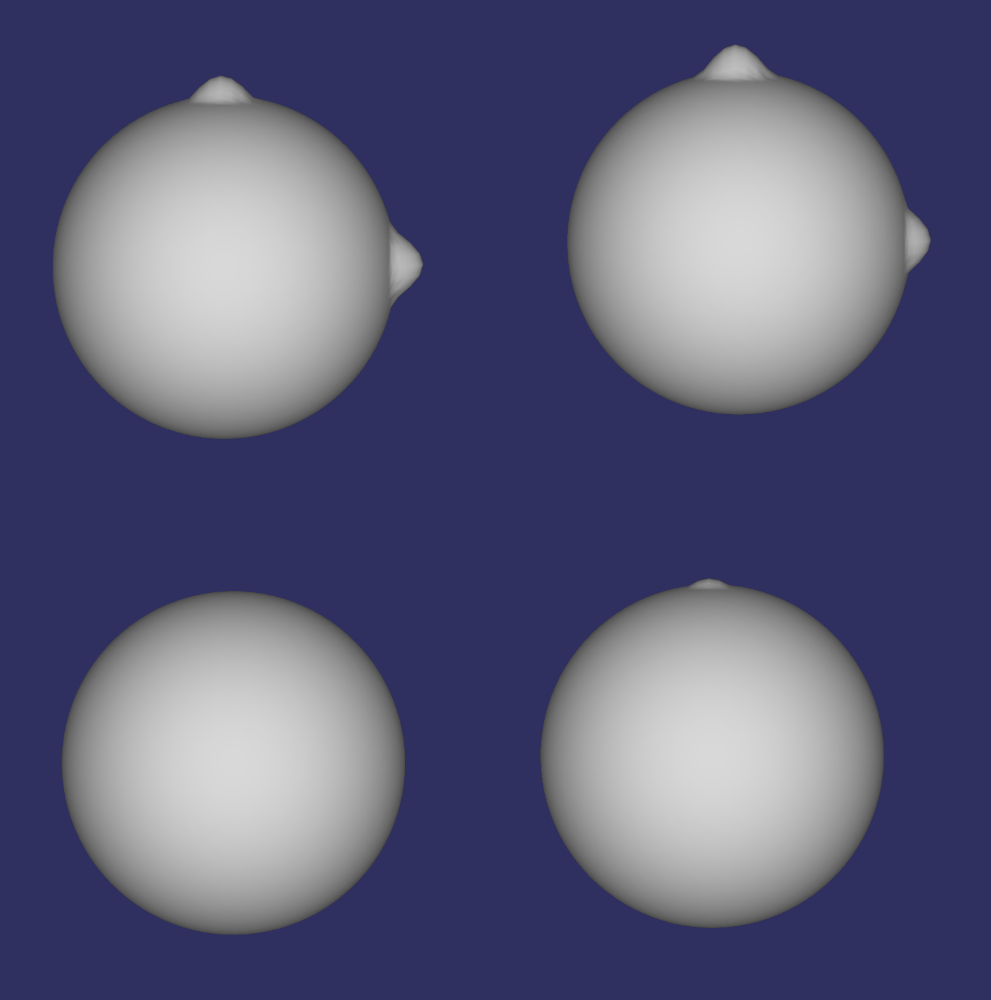
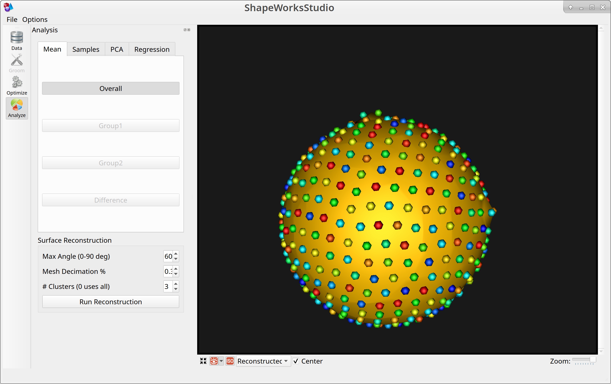
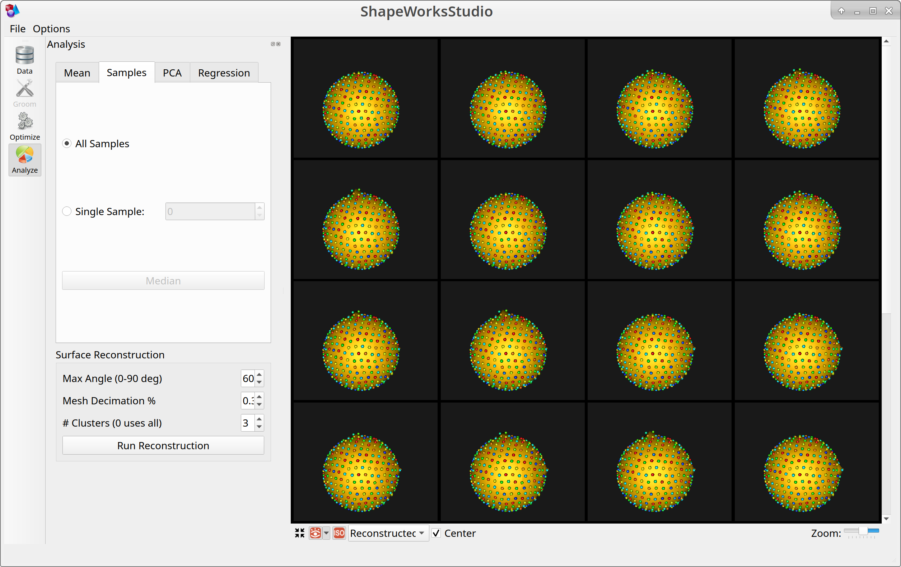

# Lumps: Shape Model directly from Mesh

## What and Where is the Use Case?

This use case demonstrates a minimal example to run ShapeWorks directly on a mesh using a synthetic dataset.

The use case is located at: `Examples/Python/lumps.py`


 
## Running the Use Case

To run the use case, run `RunUseCase.py` (in `Examples/Python/`).

```
$ cd /path/to/shapeworks/Examples/Python
$ python RunUseCase.py --use_case lumps
```

This calls `lumps.py` (in `Examples/Python/`) to perform the following.
            
* Loads the lumps dataset using a local version if it exists (i.e., previously downloaded); otherwise, the dataset is automatically downloaded from the [ShapeWorks Data Portal](http://cibc1.sci.utah.edu:8080/).
* Optimizes particle distribution (i.e., the shape/correspondence model) by calling optimization functions in `OptimizeUtils.py` (in `Examples/Python/`). See [Optimizing Shape Model](#optimizing-shape-model) for details about algorithmic parameters for optimizing the shape model.
* Launches ShapeWorksStudio to visualize the use case results (i.e., the optimized shape model and the groomed data) by calling functions in `AnalyzeUtils.py` (in `Examples/Python/`).


## Grooming Data

This is a synthetic dataset that does not require grooming.

## Optimizing Shape Model

Below are the default optimization parameters when running this use case. For a description of the optimize tool and its algorithmic parameters, see: [How to Optimize Your Shape Model](../workflow/optimize.md).

```bash
$ python RunUseCase.py --use_case lumps
```


```python
{
        "number_of_particles": 512,
        "use_normals": 0,
        "normal_weight": 10.0,
        "checkpointing_interval": 100,
        "keep_checkpoints": 0,
        "iterations_per_split": 2000,
        "optimization_iterations": 500,
        "starting_regularization": 10,
        "ending_regularization": 1,
        "recompute_regularization_interval": 1,
        "domains_per_shape": 1,
        "domain_type": "mesh",
        "relative_weighting": 10,
        "initial_relative_weighting": 1,
        "procrustes_interval": 0,
        "procrustes_scaling": 0,
        "save_init_splits": 0,
        "debug_projection": 0,
        "verbosity": 1
}
```

## Analyzing Shape Model

ShapeWorksStudio visualizes/analyzes the optimized particle-based shape model by visualizing the mean shape, individual shape samples, and the shape modes of variations. For more information, see: [How to Analyze Your Shape Model?](../workflow/analyze.md).            

Here is the mean shape of the optimized shape mode using single-scale optimization. Note the two tiny lumps at the top, and towards the right.



Here are lumps samples with their optimized correspondences.


Here is a video showing the shape modes of variation (computed using principal component analysis - PCA) of the lumps dataset using single-scale optimization.

TODO: Update video link and thumbnail
[](https://youtu.be/)
