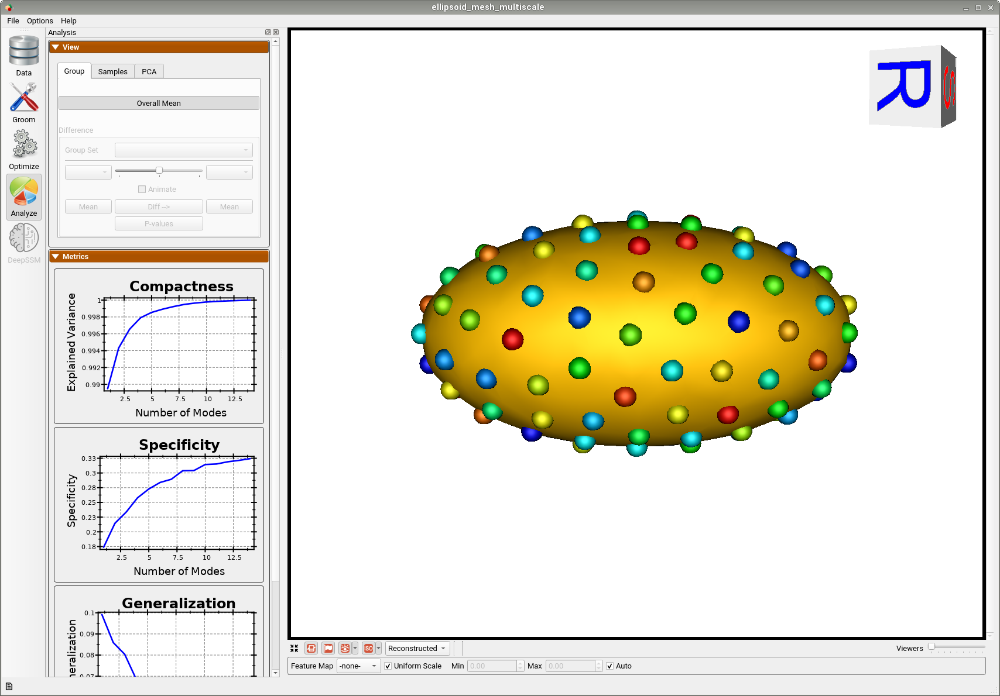

# Ellipsoid Mesh: Basic Example

## What is the Use Case? 
The `ellipsoid_mesh` use case uses the same dataset as the `ellipsoid` use case, but optimization is done on meshes rather than distance transforms. The dataset comprises of axis-aligned ellipsoids with varying radii along the x-axis. The `ellipsoid_mesh` use case represents the standard use version of a shape modeling workflow from meshes using ShapeWorks. 

## Grooming Steps
This use case starts with pre-aligned meshes and does not require grooming.  


## Relevant Arguments
[--use_subsample](../use-cases.md#-use_subsample)
[--num_subsample](../use-cases.md#-use_subsample)
[--use_single_scale](../use-cases.md#-use_single_scale)
[--tiny_test](../use-cases.md#-tiny_test)

## Optimization Parameters
The python code for the use case calls the `optimize` command of ShapeWorks, which requires that the optimization parameters are specified in a python dictionary. Please refer to [Parameter Dictionary in Python](../../workflow/optimize.md#parameter-dictionary-in-python) for more details. 
Below are the default optimization parameters for this use case.

```python
{        
        "number_of_particles": 128,
        "use_normals": 0,
        "normal_weight": 10.0,
        "checkpointing_interval": 200,
        "keep_checkpoints": 0,
        "iterations_per_split": 500,
        "optimization_iterations": 500,
        "starting_regularization": 100,
        "ending_regularization": 0.1,
        "recompute_regularization_interval": 2,
        "domains_per_shape": 1,
        "domain_type": 'mesh',
        "relative_weighting": 10,
        "initial_relative_weighting": 0.01,
        "procrustes_interval": 0,
        "procrustes_scaling": 0,
        "save_init_splits": 0,
        "verbosity": 0
}
```

## Analyzing Shape Model
Below is the mean shape reulting from optimization. Here we can see that there is only one major mode of variation.


Animating along the first PCA mode we can see the variation in the radius along the x-axis.


