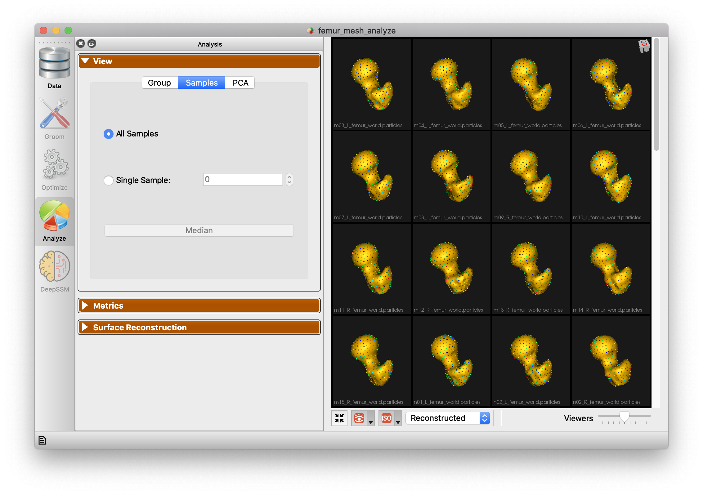

# Femur-Mesh: Shape Model directly from Mesh

## What is the Use Case?

The `femur_mesh` use case demonstrates using ShapeWorks to optimize particles on groomed femur meshes.

## Grooming Steps

In this use case, we download pre-groomed data. The use case will be updated soon to demonstrate the full mesh grooming process.

## Supported Tags

``` 
        --use_subsample --num_subsample --use_single_scale --tiny_test
``` 

## Optimization Parameters

Below are the default optimization parameters when running this use case.

```python
{
        "number_of_particles": 512,
        "use_normals": 0,
        "normal_weight": 10.0,
        "checkpointing_interval": 200,
        "keep_checkpoints": 0,
        "iterations_per_split": 1000,
        "optimization_iterations": 500,
        "starting_regularization": 100,
        "ending_regularization": 0.1,
        "recompute_regularization_interval": 2,
        "domains_per_shape": 1,
        "domain_type": 'mesh',
        "relative_weighting": 10,
        "initial_relative_weighting": 0.01,
        "procrustes_interval": 0,
        "procrustes_scaling": 0,
        "save_init_splits": 0,
        "verbosity": 1,
        "use_shape_statistics_after":256
}
```
Note `domain_type` is 'mesh'.

## Analyzing Shape Model

Here is the mean shape of the optimized shape mode using single-scale optimization.


Here are femur samples with their optimized correspondences.


Here is a video showing the shape modes of variation (computed using principal component analysis - PCA) of the femur dataset using single-scale optimization.

<p><video src="https://sci.utah.edu/~shapeworks/doc-resources/mp4s/femur_mesh_pca.mp4" autoplay muted loop controls style="width:100%"></p>
