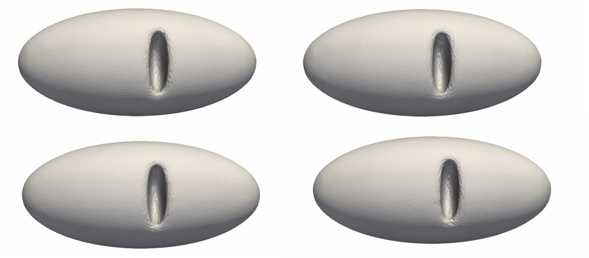
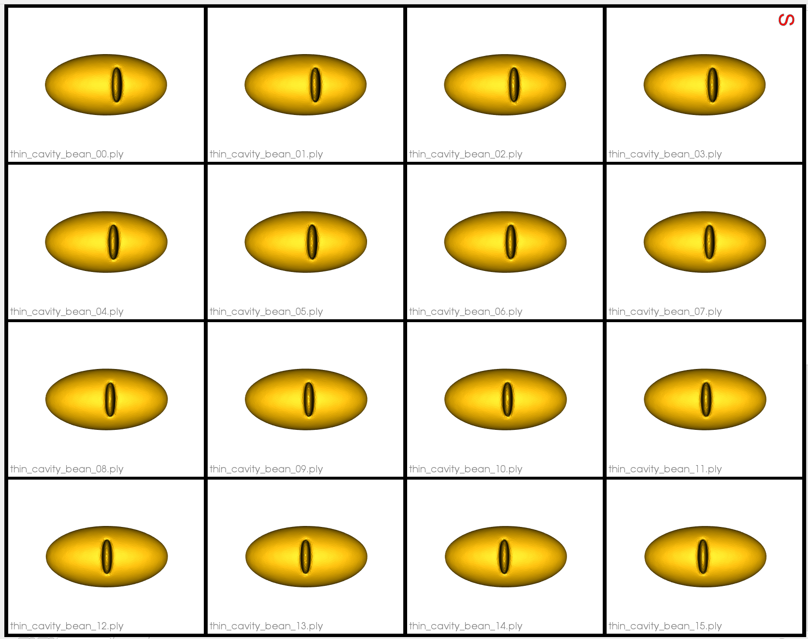

# Thin Cavity Bean: Shape Model with Geodesic Distances

## What is the Use Case?
The `thin_cavity_bean` use case demonstrates using geodesic distance based repulsion for mesh domains in optimization.

Here is an example of the data:


The shapes vary only in location of the thin cavity. This use case demonstrates that ShapeWorks optimization with geodescic distance can correctly capture this mode of variation.

## Grooming Steps
In this use case, we download pre-groomed data. Here are some examples of the meshes:


## Relevant Arguments
[--use_subsample](../use-cases.md#-use_subsample)
[--num_subsample](../use-cases.md#-use_subsample)
[--use_single_scale](../use-cases.md#-use_single_scale)
[--tiny_test](../use-cases.md#-tiny_test)

## Optimization Parameters
The python code for the use case calls the `optimize` command of ShapeWorks, which requires that the optimization parameters are specified in a python dictionary. Please refer to [Parameter Dictionary in Python](../../workflow/optimize.md#parameter-dictionary-in-python) for more details. 
Below are the default optimization parameters for this use case.

```python
{
        "number_of_particles": 1024,
        "use_normals": 1,
        "normal_weight": 10.0,
        "checkpointing_interval": 200,
        "keep_checkpoints": 0,
        "iterations_per_split": 150,
        "optimization_iterations": 2500,
        "starting_regularization": 3000,
        "ending_regularization": 0.1,
        "recompute_regularization_interval": 1,
        "domains_per_shape": 1,
        "domain_type": 'mesh',
        "relative_weighting": 15,
        "initial_relative_weighting": 0.01,
        "procrustes_interval": 0,
        "procrustes_scaling": 0,
        "save_init_splits": 0,
        "verbosity": 0,
        "use_shape_statistics_after": 32,
        "geodesics_enabled": 1
}
```

Note `geodesics_enabled` is set to on.

## Analyzing Shape Model

Here we can see the resulting shape model correctly captures the moving cavity as the only mode of variation.


