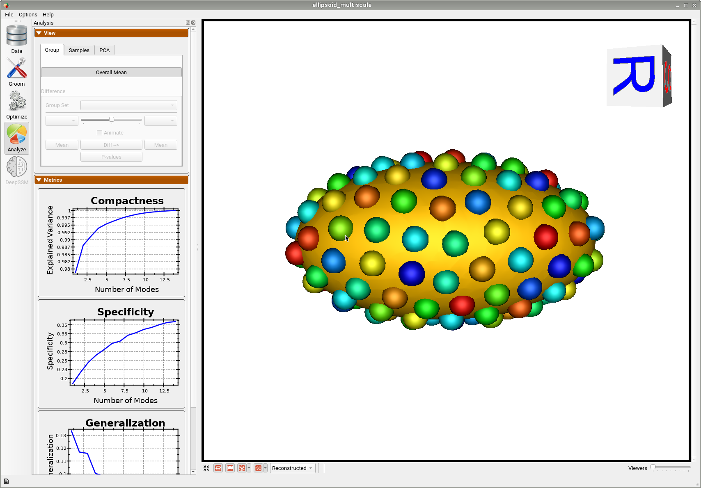

# Ellipsoid: Basic Example

## What is the Use Case? 

The ellipsoid dataset comprises of axis-aligned ellipsoids with varying radii along all the x-axis. This example is a stepping stone for the user to get familiar with the workflow of ShapeWorks. 

The `ellipsoid` use case represents the standard use version of a shape modeling workflow using ShapeWorks. 


## Grooming Steps

This is how the segmentations in the dataset look before grooming.Here it can been seen that the ellipsoids have random centers andn orientations.

1. [**Isotropic Resampling**](../../workflow/groom.md#resampling-images-and-segmentations): Binary segmentations in `ellipsoid/segmentations/` are resampled to have an isotropic voxel spacing.
2. [**Center-of-Mass Alignment**](../../workflow/groom.md#aligning-segmentations): This translational alignment step is performed before rigidly aligning the samples to a shape reference. This factors out translations to reduce the risk of misalignment and allow for a medoid sample to be automatically selected as the reference for rigid alignment.
3. [**Reference Selection**](../../workflow/groom.md#aligning-segmentations): The reference is selected by first computing the mean (average) distance transform of the segmentations, then selecting the sample closest to that mean (i.e., medoid).
4. [**Rigid Alignment**](../../workflow/groom.md#aligning-segmentations):For all the shapes, the transformation is calculated to factor out translation and rotation based on the reference shape.This transformation matrix will be sent to the optimizer as a 'prefix transform'
5. [**Bounding Box**](../../workflow/groom.md#cropping-and-padding-segmentations): The smallest region which fits all of the samples is found.
6. [**Cropping**](../../workflow/groom.md#cropping-and-padding-segmentations): The segmentations are cropped to the size of the bounding box.
7. [**Padding**](../../workflow/groom.md#cropping-and-padding-segmentations): The segmentations are padded with zeros on every side.
8. [**Distance Transform**](../../workflow/groom.md#converting-segmentations-to-smooth-signed-distance-transforms): Finally, the smooth signed distance transform is computed, and the dataset is now ready for the optimize phase.

Distance transform obtained after grooming.Here we show how the shapes would look like if the transforms are applied.

## Relevant Arguments
[--use_subsample](../use-cases.md#-use_subsample)
[--num_subsample](../use-cases.md#-use_subsample)
[--skip_grooming](../use-cases.md#-skip_grooming)
[--use_single_scale](../use-cases.md#-use_single_scale)
[--mesh_mode](../use-cases.md#-mesh_mode)
[--tiny_test](../use-cases.md#-tiny_test)

## Optimization Parameters
The python code for the use case calls the `optimize` command of ShapeWorks which reads the project sheet with the shape filenames and optimization parameter values. See [Project excel file](../../workflow/parameters.md#project-excel-file) for details regarding creating the project sheet.
Below are the default optimization parameters for this use case.

```python
{
        "number_of_particles": 128,
        "use_normals": 0,
        "normals_strength": 10.0,
        "checkpointing_interval": 1000,
        "keep_checkpoints": 0,
        "iterations_per_split": 1000,
        "optimization_iterations": 1000,
        "starting_regularization": 10,
        "ending_regularization": 1,
        "recompute_regularization_interval": 1,
        "domains_per_shape": 1,
        "relative_weighting": 1,
        "initial_relative_weighting": 0.05,
        "procrustes_interval": 0,
        "procrustes_scaling": 0,
        "save_init_splits": 0,
        "verbosity": 0
    }
```

## Analyzing Shape Model
Once the python code runs the optimization, the files are saved in the `Output` folder after which ShapeWorks Studio is launched from the python code to analyze the model. 

Below is the mean shape reulting from optimization. Here we can see that there is only one major mode of variation.


Below are the particles for each sample, we can see they are uniformly distributed.


Animating along the first PCA mode we can see the variation in the radius along the x-axis.

