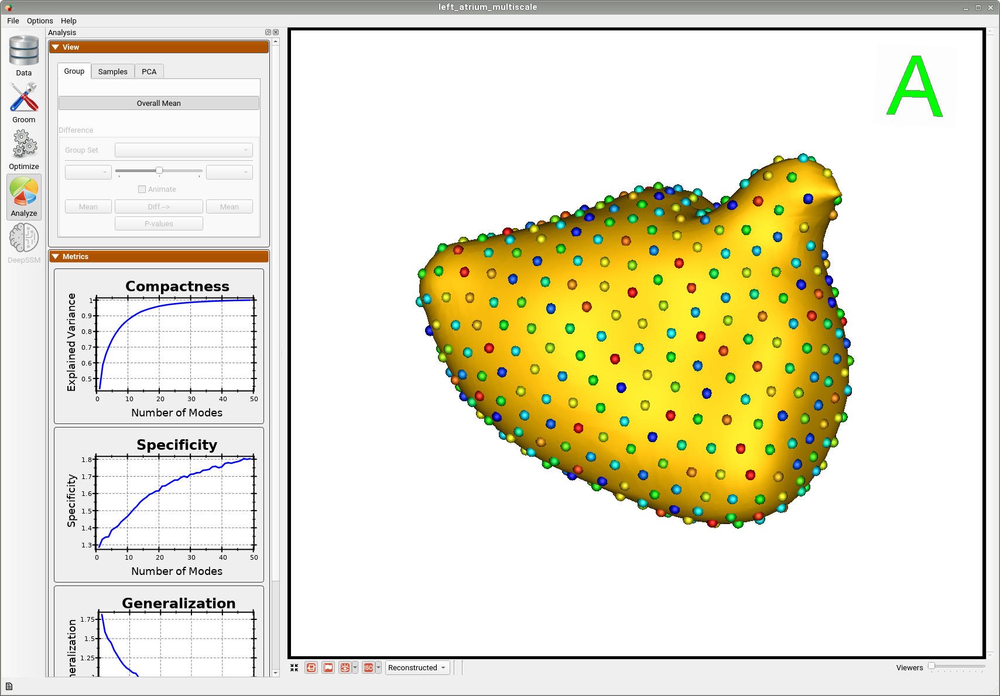

# Left Atrium: Shape Model from Segmentations

## What is the Use Case? 


The `left_atrium` use case demonstrates using ShapeWorks tools to perform the following:
- Groom data and build a shape model where shapes are given as binary segmentations
- Showcase both single-scale and multi-scale optimization for particles optimization
Corresponding imaging data (e.g., MRI) is available with this dataset.

## Grooming Steps
This is how the segmentations in the dataset look before grooming.Here it can been seen that the atriums have random centers andn orientations.

The grooming stage entails rigid transformations to align samples for groupwise modeling and analysis. It also changes the origin, voxel size, image size, orientation, etc. of the shape data. Grooming can be done with imaging data (CT/MRI) so that it is carried through each grooming step and with the shapes so that is remains in alignemtn and can be used for subsequent analysis. Here are the grooming steps:

1. [**Isotropic Resampling**](../../workflow/groom.md#resampling-images-and-segmentations): Binary segmentations in `left_atrium/segmentations/` are resampled to have an isotropic voxel spacing.
2. [**Centering**](../../workflow/groom.md#aligning-segmentations): Segmenations are translated to have an origin at (0,0,0).
3. [**Apply Padding**](../../workflow/groom.md#cropping-and-padding-segmentations): Segmentations that touch the image boundary will have an artificial hole at that intersection. Segmentations are padded by adding a user-defined number of voxels along each image direction (rows, cols, and slices) to avoid introducing artificial holes.
4. [**Center-of-Mass Alignment**](../../workflow/groom.md#aligning-segmentations): This translational alignment step is performed before rigidly aligning the samples to a shape reference. This factors out translations to reduce the risk of misalignment and allow for a medoid sample to be automatically selected as the reference for rigid alignment.
5. [**Reference Selection**](../../workflow/groom.md#aligning-segmentations): The reference is selected by first computing the mean (average) distance transform of the segmentations, then selecting the sample closest to that mean (i.e., medoid).
6. [**Rigid Alignment**](../../workflow/groom.md#aligning-segmentations): For all the shapes, the transformation is calculated to factor out translation and rotation based on the reference shape.This transformation matrix will be sent to the optimizer as a 'prefix transform'
7. [**Bounding Box**](../../workflow/groom.md#cropping-and-padding-segmentations): The smallest region which fits all of the samples is found.
8. [**Cropping**](../../workflow/groom.md#cropping-and-padding-segmentations): The segmentations are cropped to the size of the bounding box.
9. [**Distance Transform**](../../workflow/groom.md#converting-segmentations-to-smooth-signed-distance-transforms): Finally, the signed distance transform is computed, and the dataset is now ready for the optimize phase.

Here are the resulting groomed ditsance transforms.Here we show how the shapes would look like if the transforms are applied.


## Relevant Arguments
[--use_subsample](../use-cases.md#-use_subsample)
[--num_subsample](../use-cases.md#-use_subsample)
[--use_single_scale](../use-cases.md#-use_single_scale)
[--mesh_mode](../use-cases.md#-mesh_mode)
[--tiny_test](../use-cases.md#-tiny_test)

## Optimization Parameters
The python code for the use case calls the `optimize` command of ShapeWorks which reads the project sheet with the shape filenames and optimization parameter values. See [Project excel file](../../workflow/parameters.md#project-excel-file) for details regarding creating the project sheet.
Below are the default optimization parameters for this use case.

```python
{
        "number_of_particles": 512,
        "use_normals": 0,
        "normals_strength": 10.0,
        "checkpointing_interval": 200,
        "keep_checkpoints": 0,
        "iterations_per_split": 4000,
        "optimization_iterations": 4000,
        "starting_regularization": 1000,
        "ending_regularization": 10,
        "recompute_regularization_interval": 2,
        "domains_per_shape": 1,
        "relative_weighting": 10,
        "procrustes": 1,
        "initial_relative_weighting": 0.1,
        "procrustes_interval": 1,
        "procrustes_scaling": 1,
        "save_init_splits": 0,
        "verbosity": 0
    }
```
## Analyzing Shape Model
Once the python code runs the optimization, the files are saved in the `Output` folder after which ShapeWorks Studio is launched from the python code to analyze the model. 

Here is the mean shape of the optimized shape mode using multi-scale optimization.
     


Here is a video showing the shape modes of variation (computed using principal component analysis - PCA) of the left atrium dataset using multi-scale optimization.

