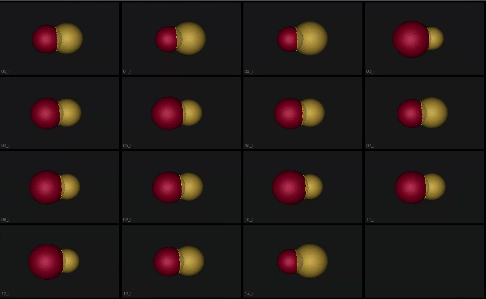
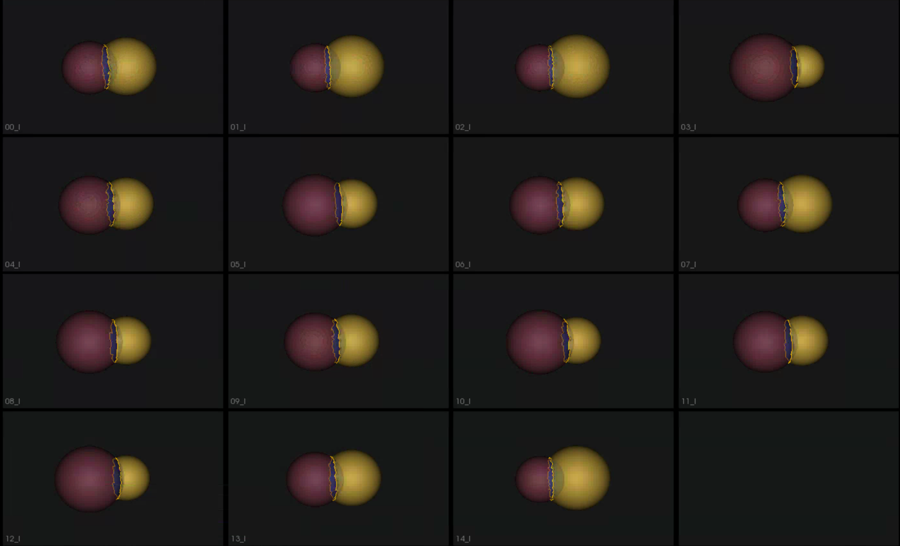

# Peanut: Shape Model of Multiple Domains with Shared Boundaries

## What is the Use Case? 
The `peanut_shared_boundary` use case demonstrates using ShapeWorks tools to perform shape modelings for anatomies with multiple structures (domains), e.g., joints, with shared boundaries to capture inter-domains correlations and interactions. It also demonstrates the shared mesh boundary and contour extraction tools and runs multi-domain (meshes and contours) optimization on the peanut dataset.

The peanut dataset,consists of two aligned spheres, but one of the spheres is subtracted from the other. There exists a shared surface between the two spheres. The radii of the two spheres vary inversely, ie: as one gets bigger the other gets smaller.

## Grooming Steps
This is how the meshes in the dataset look before grooming.



1. [**Remeshing**](../../workflow/groom.md#remesh): Meshes are remeshed to ensure uniform vertices.
2. [**Extract Shared Boundary**](../../workflow/groom.md#extract-shared-boundary): In this step, we ingest the two original shapes and output three new shapes, two of which correspond to the original shapes and one for the shared boundary.
3. [**Smoothing**](../../workflow/groom.md#smoothing):Applied laplacian smoothing.
4. [**Extract Contour**](../../workflow/groom.md#extract-contour): The boundary loop of the shared surface is obtained.

Groomed dataset. 


## Relevant Arguments
[--use_subsample](../use-cases.md#-use_subsample)
[--num_subsample](../use-cases.md#-use_subsample)
[--tiny_test](../use-cases.md#-tiny_test)

## Optimization Parameters
The python code for the use case calls the `optimize` command of ShapeWorks which reads the project sheet with the shape filenames and optimization parameter values. See [Project excel file](../../workflow/parameters.md#project-excel-file) for details regarding creating the project sheet.
Below are the default optimization parameters for this use case.

```python
# Create a dictionary for all the parameters required by optimization
    parameter_dictionary = {
        "number_of_particles": 128,
        "use_normals": 0,
        "normals_strength": 10.0,
        "checkpointing_interval": 1000,
        "keep_checkpoints": 0,
        "iterations_per_split": 1000,
        "optimization_iterations": 1000,
        "starting_regularization": 10,
        "ending_regularization": 1,
        "recompute_regularization_interval": 1,
        "domains_per_shape": 1,
        "relative_weighting": 1,
        "initial_relative_weighting": 0.05,
        "procrustes_interval": 0,
        "procrustes_scaling": 0,
        "save_init_splits": 0,
        "verbosity": 0
    }
```
## Analyzing Shape Model
Once the python code runs the optimization, the files are saved in the `Output` folder after which ShapeWorks Studio is launched from the python code to analyze the model. 

