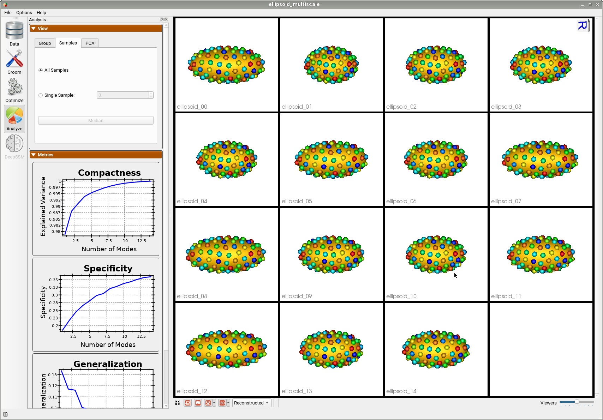

# Ellipsoid: Shape Statistics in Python

## What is the Use Case? 

The `ellipsoid_pca` use case demonstrates the functionality of shape statistics tools of ShapeWorks python API. These APIs include reading particle files and computing eigenvectors, eigenvalues, and PCA loadings. This use case reads the correspondence model of the ellipsoid segmentation images use case.


## Relevant Arguments

[--tiny_test](../use-cases.md#-tiny_test)

## Analyzing Shape Model Using Python APIs

The `ParticleShapeStatistics()` of `ShapeWorks` python API analyzes the optimized particle-based shape model by calculating the principal components of the shape model, eigenvalues, eigenvectors, and PCA loadings. This tool also estimates the variance explained by each mode and generates plots for PCA metrics similar to `ShapeWorks Studio.` 

```python
# Read the particle files from a pre-trained shape model
particle_data = sw.ParticleSystem(<list of local point files>)
```

To perform PCA:

```python
shape_statistics = sw.ParticleShapeStatistics()
shape_statistics.PCA(particleSystem = particle_data,domainsPerShape=1)
```

Using `shape_statistics` object, you can now extract the following entities:

* Calculate principal components : `principalComponentProjections()`

* Extract the loadings: `pcaLoadings()`
* Eigen Values: `eigenValues()`
* Eigen Vectors: `eigenVectors()`
* Number of shapes in the model: `sampleSize()`
* Dimension of each shape: `numDims()`
* Variance explained by each mode: `percentVarByMode()`


When the use case is run, plots similar to those below will be generated.

