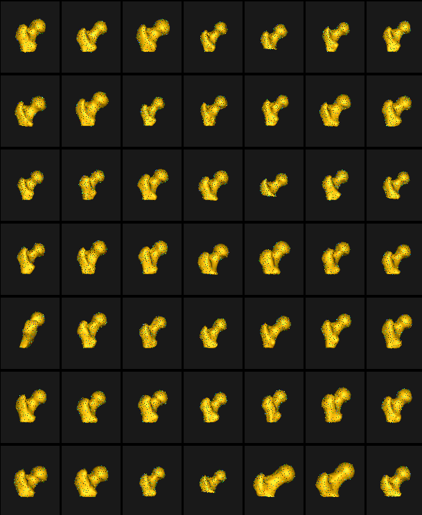

# Femur: Group Difference Statistics in Python

## What and Where is the Use Case? 

The `femur_pvalues` use case demonstrates the functionality of shape statistics tools to perform hypothesis testing of group shape differences. This use case analyzes the femur shape model obtained from running the [Femur: SSM from Meshes](../mesh-based/femur.md) use case. The data has 21 examples of normal femurs and 5 examples of pathological femurs with cam impingement. 

Here are femur samples with their optimized correspondences.

## Relevant Arguments

[--tiny_test](../use-cases.md#-tiny_test)

## Analyzing Shape Model

For the femur mode, separate statistical tests for differences in correspondence positions are applied to every correspondence index. We use Hotelling $T^2$ metric(nonparametric permutation test) with false discovery rate correction (FDR) for multiple comparisons. This method helps identify and visualize localized regions of significant shape differences. The null hypothesis for this test is that the distributions of the locations of corresponding sample points are the same regardless of the groups. Hence, higher p-values here would mean the group differences are significant and are not from the same distribution. 

This use case calculates the p-values and saves them in a text file. This same functionality is also available in ShapeWorks Studio, where you can also visualize the p-values on the mean shapes. 