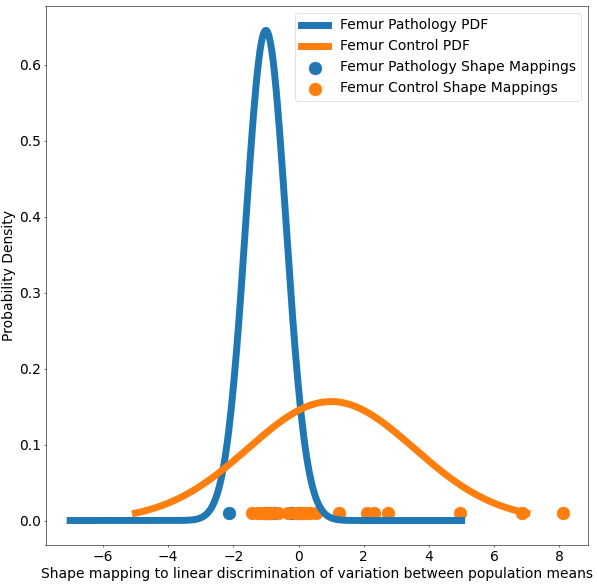

# Femur: Group Difference Statistics in Python

## What and Where is the Use Case? 

This use case demonstrates the functionality of shape statistics tools to perform hypothesis testing of group shape differences. This use case analyzes the femur shape model obtained from running the [Femur: SSM from Meshes with Cutting Planes](../constraint-based/femur-cutting-planes.md) use case. The data has 21 examples of normal femurs and 5 examples of pathological femurs with cam impingement.
This use case analyzes the femur shape model obtained from running the [Femur: SSM from Meshes with Cutting Planes](../constraint-based/femur-cutting-planes.md) use case. Separate statistical tests for differences in correspondence positions are applied to every correspondence index. We use **Hotelling $T^2$ metric**(nonparametric permutation test) with false discovery rate correction (FDR) for multiple comparisons. This method helps identify and visualize localized regions of significant shape differences.

The use case also demonstrates **Linear Discrimination of Variation (LDA)** for analyzing shape variation between the subgroups of patients with and without cam impingement and the distribution of individual shapes among these groups. In the group of samples, the mean shape (i.e., average correspondence particle locations) of the group of patients with cam impingement was compared to the mean shape of the group without cam impingement. The linear discrimination between the two groups was defined as the difference vector between the two mean shape vectors. The shape of each subject was then mapped/projected onto this vector by taking the dot product between the subject-specific shape representation (the particle correspondences) and this difference vector. This mapping results in a single scalar value (or a "shape-based score") that places subject-specific anatomy on a group-based shape difference that is statistically derived from the shape population. For interpretability, the mappings of the group mean shapes were normalized to -1 (patients with cam impingement) and 1 (without cam impingement). The other subjects' mappings were then similarly normalized relative to these values, giving a shape distribution of individual members of the population close to the mean shapes of their respective groups. A univariate Gaussian distribution was then fit to the normalized mapping of each group to define the probability density function of the shape scores for each group.

Here are femur samples with their optimized correspondences.

A brief overview of the analysis:

1. Given a shape model with group IDs, we create the subsets based on the group IDs. 
2. Since the shape models are in correspondence, we access one particle location at a time and create two vectors.
x: All particle locations of group 1 at ith location
y: All particle locations of group 2 at ith location
3. Using the two-sample Hotelling-T2 test, we are trying to see if the particle positions at the ith location of all group 1 samples come from the same distribution as the particle position at ith location of group 2 samples. 
4. If the group differences are significant, the particle positions are not from the same distribution.
## Relevant Arguments

[--tiny_test](../use-cases.md#-tiny_test)

## Analyzing Shape Model

For the femur mode, separate statistical tests for differences in correspondence positions are applied to every correspondence index. We use Hotelling $T^2$ metric(nonparametric permutation test) with false discovery rate correction (FDR) for multiple comparisons. This method helps identify and visualize localized regions of significant shape differences. The null hypothesis for this test is that the distributions of the locations of corresponding sample points are the same regardless of the groups. Hence, lower p-values would mean we can reject the null hypothesis and conclude that the group differences are significant and not from the same distribution. 

This use case calculates the p-values and saves them in a text file. This same functionality is also available in ShapeWorks Studio, where you can also visualize the p-values on the mean shapes. The use case also generates a plot based on LDA with the shape-based scores for both the groups of femurs. 

