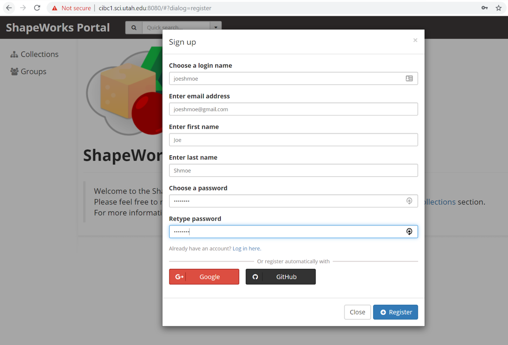

# Use Cases
ShapeWorks comes with a multitude of python use cases that can help the user get familiar with the shape modeling workflow. Use cases demonstrate the processing of the datasets that are downloaded from the [ShapeWorks Data Portal](http://cibc1.sci.utah.edu:8080/).

Each use case consists of:

1. [Grooming](../workflow/groom.md) 
2. [Optimization](../workflow/optimize.md)
3. [Analysis of Results](../workflow/analyze.md) 

## Running A Use Case

The use cases are located at: `Examples/Python/`. When a use case is run, the dataset required for the use case is automatically downloaded. 

!!! important
    You must first register for a *free* ShapeWorks account by visiting the [ShapeWorks Data Portal](http://cibc1.sci.utah.edu:8080/).

To run a use case, run the following command from the `Examples/Python/` directory:

```
$ cd /path/to/shapeworks/Examples/Python
$ python RunUseCase.py [use case name]
```

For names for the use cases that are currently released and the complete list of optional arguments, run:

```
$ python RunUseCase.py --help
```

!!! note "Using **bash** on Windows"
    Windows also has several Unix shells such as **git-bash** available. These also work with `conda activate shapeworks` in the same way. However, there is one crucial issue: running Python scripts requires prefixing with `winpty`. For example, `winpty python RunUseCase.py ...`.

### Downloading Use Case Dataset 

Use Case datasets such as the ellipsoid and left atrium datasets will be downloaded
automatically from the [ShapeWorks Data Portal](http://cibc1.sci.utah.edu:8080/).
When running one of the use case example scripts, you will see something like this:

```
Can't find ellipsoid.zip in the current directory.
.___________________________.
|                           |
|     ShapeWorks Portal     |
|___________________________|

Downloading the ellipsoid dataset from the ShapeWorks Portal
Login info is not found in the current directory.
New ShapeWorks Portal users: Register an account at 
http://cibc1.sci.utah.edu:8080/#?dialog=register
Returning ShapeWorks Portal users: Enter your username and password.

Username: 
```



!!! danger
    Do not use the same password as for your bank account or email!  


After registering a free account, you can log in from within the script.
Note: You are only required to enter your credentials the first time. 
```
Username: joeshmoe
Password:
[1/1 MB]
joeshmoe downloaded the ellipsoid dataset from the ShapeWorks Portal.
```
Check out [How to Add New Datasets?](../dev/datasets.md) for dataset upload instructions and guidelines. 

### Downloaded Data

When a use case is run, it downloads the appropriate zipped data to `Examples/Python/Data/`. The data is then extracted to `Examples/Python/output/use_case_name/` where all the output from running the use case is also saved.

The downloaded data includes the raw data the use case starts with (segmentations, meshes, and/or images) as well as the output from the final grooming step of the use case (i.e., distance transforms) and the shape model generated from running the use case (particle files and XML). 

The "analyze.xml" file can be opened in Studio to visualize a shape model.
For example, to view the shape model downloaded for the ellipsoid use case run:
```
$ cd Examples/Python/Output/ellipsoid/
$ ShapeWorksStudio ellipsoid-v0/shape_models/ellipsoid/analyze_128.xml
```

## Arguments for Use Cases

* `--use_subsample`: To run on a subset of the data in the use case, add the `--use_subsample` argument followed by the `--num_subsample` argument with the number of samples you wish to use. This will select a representative subset of the specified sample size to run through the pipeline so that the use case runs faster and uses less memory. The subset is determined by running clustering, then picking one sample from each cluster so that the resulting subset is representative of all the data. If `--use_subsample` is used without `--num_subsample`, it will use the default number of subsamples which is 3.The entire dataset will be downloaded to run the clustering.

```
$ python RunUseCase.py [use case name] --use_subsample --num_subsample 10
```

* `--skip_grooming`: When this argument is used, the grooming steps are skipped. Instead of generating the distance transforms from segmentations via grooming, the distance transforms from the data .zip folder are used in optimization. If a user wishes to start with the optimization step, add `--skip_grooming` argument.

```
$ python RunUseCase.py [use case name] --skip_grooming
```
           
* `--groom_images`: Some use cases can be run solely on segmentations plus the corresponding imaging data. The '-- groom_images ' argument must be used to carry the images through the grooming process with the segmentation. Note if this argument is used with a use case that does not have images, a warning will be printed, and the argument will be ignored.

```
$ python RunUseCase.py [use case name] --groom_images
```
          
* `--use_single_scale`: Use cases can be run with multi-scale or single-scale optimization. In both cases, particles on each shape sample are initialized using the particle splitting strategy starting from a single particle (or a given set of landmarks) until reaching the required number of particles. The optimized particles at each scale are used to initialize the next scale. At each scale, particles undergo *initialization* and *optimization* stages. The multi-scale triggers both the initialization and optimization stages. The single-scale mode uses the initialization stage at each scale and runs the optimization stage when the required number of particles is reached (i.e., at the last scale). 

The differences between *initialization* and *optimization* stages are: 

1. How important the correspondence (inter-surface) objective is compared to the surface sampling (intra-surface) term using a relative weighting parameter. Hence, the  `initial_relative_weighting` parameter is the weight used in the initialization stage, and the `relative_weighting` is the weight used for the optimization stage.

2. How the notion of correspondence (inter-surface) is quantified. In initialization, especially when we do not have enough particles to describe the geometry of each surface, we use mean energy (i.e., pushing all shapes in the shape space to the mean shape or, in other words, the covariance matrix is assumed to be identity). In optimization, we use the entropy of the distribution of the shapes (assuming Gaussian-distributed shapes), which is quantified based on the covariance matrix. In the multi-scale setting, we can use shape statistics at later scales using the `use_shape_statistics_after` parameter, where we have more particles that can reveal the covariance structure.The default mode is multi-scale. To run single-scale, use the `--use_single_scale` argument.

```
$ python RunUseCase.py [use case name] --use_single_scale
```

* `--mesh_mode`: Use cases that optimize on distance transforms can be run in mesh mode to optimize on meshes instead. When the `--mesh_mode` argument is used, groomed distance transforms are converted to meshes (by extracting the isosurface at zero), and those meshes are passed to the optimizer. The `--mesh_mode` argument does not affect mesh-based use cases.

```
$ python RunUseCase.py [insert name of image-based use case here] --mesh_mode
```

* `--tiny_test`: Users can run a fast version of the use case using the `--tiny_test argument`. This runs on a subset of the data for fewer optimization iterations to verify ShapeWorks has been properly installed. It is meant to test that use cases can run, not to create a good correspondence model. Only a subset of the data will be downloaded directly in the `Output` folder for the tiny test, and no zip file will be downloaded in the `Data` folder. No new data will be downloaded if the data has already been unzipped in the `Output` folder.

```
$ python RunUseCase.py [use case name] --tiny_test
```

## Running Subsequent Analysis

To rerun ShapeWorks Studio without running the entire pipeline, you must first navigate to the `Examples/Python/` directory and then run ShapeWorks Studio on the appropriate analysis XML file.  For example:

```
$ cd /path/to/shapeworks/Examples/Python
$ ShapeWorksStudio TestEllipsoids/PointFiles/analyze.xml
```    


