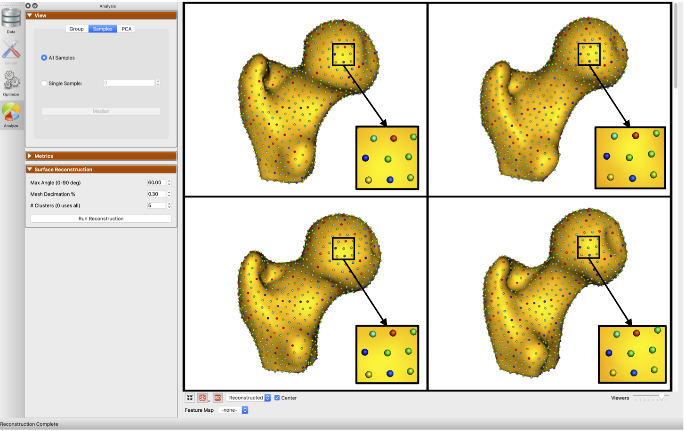
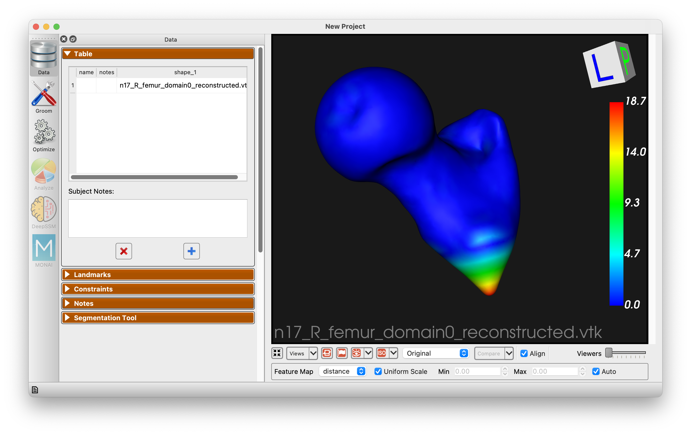
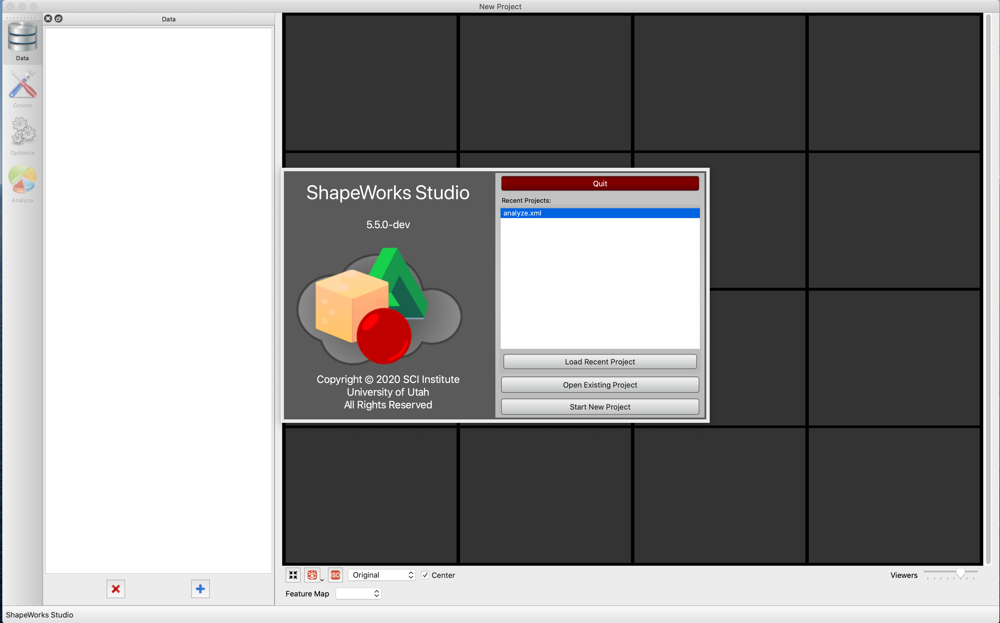
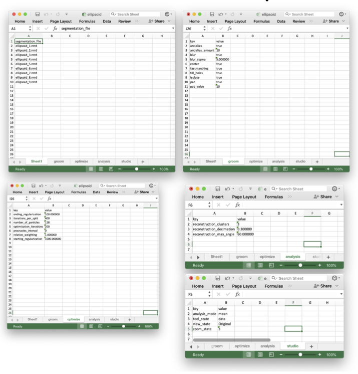
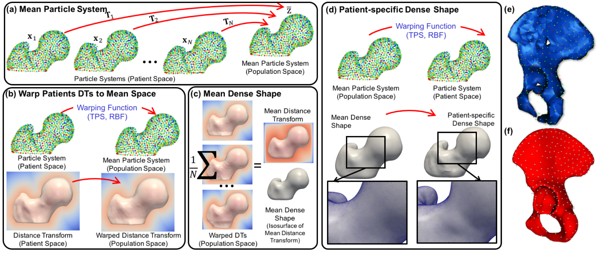
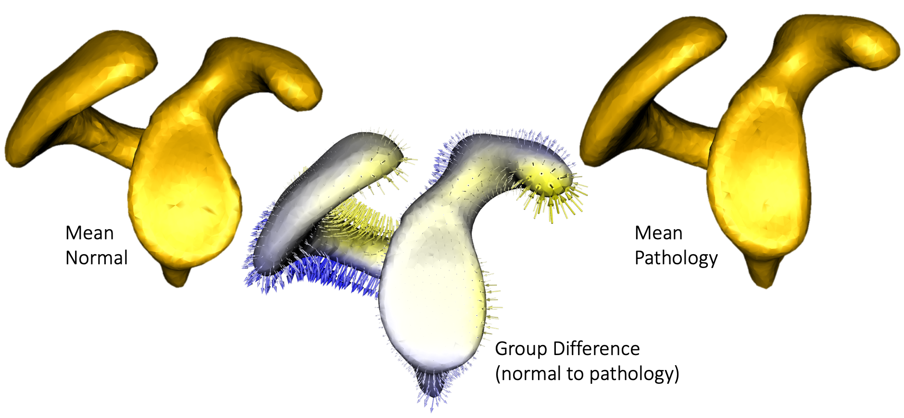
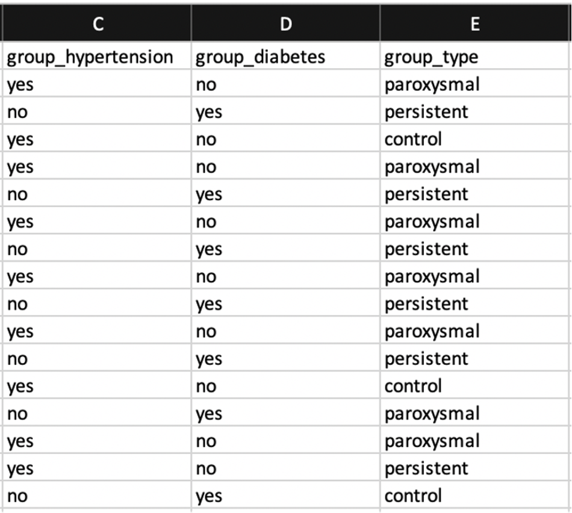
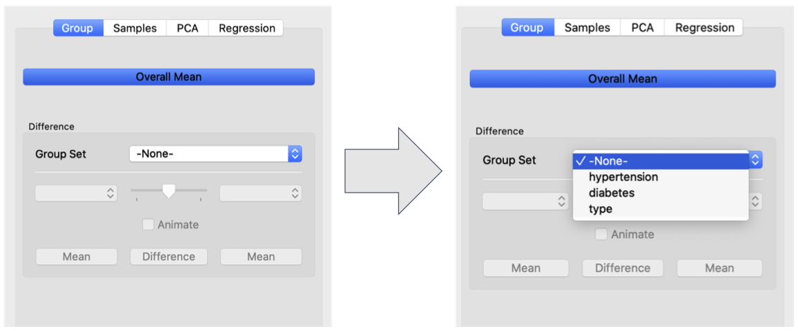
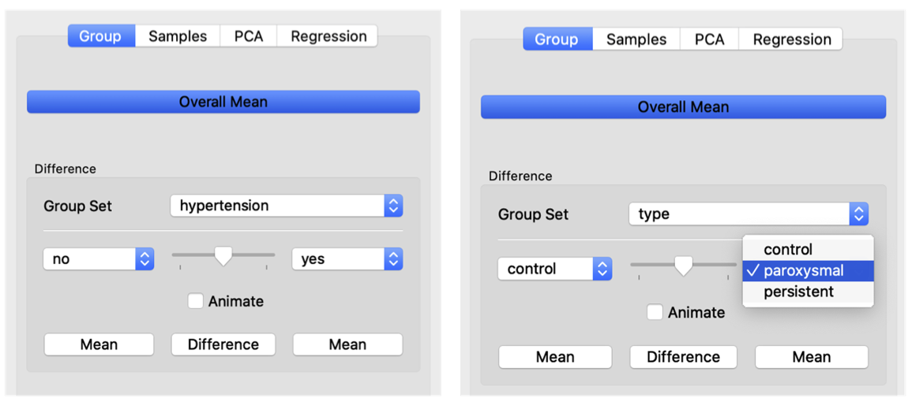

# How to Analyze Your Shape Model?

## Surface Correspondences 

ShapeWorks includes a Qt and VTK-based graphical user interface (GUI), **ShapeWorks Studio**, that allows visualizing the optimized particle system (i.e., correspondence model) for each shape sample where particle coloring is used to reflect correspondence among shapes. 


*Particles' coloring reflects surface correspondences across different shape samples*



You can scroll through the dataset and zoom in and out to inspect fewer or more samples. ShapeWorks Studio keeps a consistent camera view across all shape samples to facilitate qualitative comparisons of different samples relative to each other.

*Correspondence model inspectation by scrolling though the dataset and zooming in & out*
<p><video src="https://sci.utah.edu/~shapeworks/doc-resources/mp4s/studio_scroll.mp4" autoplay muted loop controls style="width:100%"></p>


## Correspondence Quality

Scrolling through the model tells you whether correspondence *looks* right. To quantify it per subject, use the `correspondence-quality` command, or the [Correspondence Quality panel](../studio/studio-analyze.md#correspondence-quality) in Studio, which additionally lets you sort the samples worst-first so the challenging shapes come up front.

For each subject, ShapeWorks reconstructs the surface from that subject's **local** particles by biharmonic mesh warp from the cohort template, and then measures how far the reconstruction and that subject's groomed mesh disagree. A subject whose particles no longer describe its own surface — a failed split, a bad initialization, an outlier shape the model does not cover — shows up as a large disagreement.

The disagreement is measured in both directions, because each one is blind to a different failure:

* **Pull** measures from each reconstructed vertex to the groomed surface. It catches reconstruction that departs from the surface — folds, flaps, spikes — but not surface the reconstruction never reaches: a torn opening or a missing appendage leaves every reconstructed vertex sitting on the groomed mesh, so pull reports nothing wrong.
* **Push** measures from each groomed vertex to the reconstruction. It catches those gaps, but not a flap that sticks out while the groomed surface stays covered.
* **Disagreement** combines the two on the groomed mesh: at each groomed vertex, the larger of its push distance and the pull distance of any reconstructed vertex that lands beside it. Its area-weighted mean is the number to rank by, and it is the field to color by, since the groomed mesh is the only surface on which a gap can be shown.

The original pull statistics are still reported, unchanged, alongside push and disagreement.

The template is the cohort L1-medoid (the same subject Studio picks as the median shape). Its own reconstruction is near-identity, so its row is reported but excluded from the aggregate statistics, which would otherwise be skewed on small cohorts.

Distances are reported both in world units and normalized by each subject's groomed-mesh bounding-box diagonal. The normalized values are scale-invariant, so they can be compared across anatomies and are the better basis for a "good/bad" threshold.

**Usage:**

```
shapeworks correspondence-quality --name <project.swproj|project.xlsx>
                                  [--output <report.csv>]
                                  [--output_meshes <dir>]
                                  [--method point-to-cell|point-to-point]
                                  [--worst <n>]
```

| Option | Description |
| --- | --- |
| `--name` | Path to the project file (`.swproj` or `.xlsx`). Required. |
| `--output` | Write the per-subject table to CSV. |
| `--output_meshes` | Write each reconstructed mesh as `<subject>_domain<d>_reconstructed.vtk` with the per-vertex pull `distance` field, and each groomed mesh as `<subject>_domain<d>_groomed_disagreement.vtk` with per-vertex `disagreement` and `push` fields, for visual inspection of *where* correspondence breaks down. |
| `--method` | `point-to-cell` (default) or `point-to-point`. |
| `--worst` | How many worst-ranked subjects to print. Default 5. |

The command prints a summary — mean, median, p95 and max of the per-subject mean distance, raw and normalized — for pull, push and disagreement, followed by the subjects with the worst disagreement. The CSV has one row per subject per domain. Its first columns are the pull statistics, as before: `subject`, `domain`, `is_template`, `mean_dist`, `median_dist`, `p99_dist`, `max_dist`, `bbox_diag`, `norm_mean`, `norm_median`, `norm_p99`, `norm_max`. They are followed by the same eight statistics for push and then for disagreement, prefixed `push_` and `disagreement_` (`push_mean`, `push_median`, `push_p99`, `push_max`, `push_norm_mean`, … `disagreement_norm_max`). Push and disagreement are weighted by surface area over the groomed mesh, so a region counts in proportion to its size however finely it is meshed. The p99 statistics are the 99th percentile of the per-vertex distances: a measure of the worst part of the surface that, unlike max, does not move with a single bad vertex.

*A reconstructed mesh written by `--output_meshes`, coloured by the pull `distance` field. The groomed meshes written alongside carry the `disagreement` field, which also shows where the reconstruction fails to cover the groomed surface. Load either in Studio and select the field from the scalar dropdown.*


Note that this measures the correspondence model against the *groomed* meshes, so it reflects both optimization quality and any grooming problems upstream of it.

### Python API

```python
import shapeworks as sw

project = sw.Project()
project.load("project.swproj")

report = sw.CorrespondenceEvaluation.evaluate(project)

print(report.template_subject, report.num_evaluated)
print(report.agg_disagreement_norm.mean, report.agg_disagreement_norm.p95)

for row in report.rows:
    print(row.subject, row.domain, row.is_template)
    print("  disagreement", row.disagreement.mean, row.disagreement.p99, row.disagreement.max)
    print("  push        ", row.push.mean, row.push.p99, row.push.max)
    print("  pull        ", row.mean_dist, row.p99_dist, row.max_dist)
```

`row.push` and `row.disagreement` each have `mean`, `median`, `p99` and `max`, plus `norm_` versions divided by the bounding-box diagonal. `report.agg_push_raw`/`agg_push_norm` and `report.agg_disagreement_raw`/`agg_disagreement_norm` summarize them across subjects the way `agg_raw`/`agg_norm` summarize pull.

`evaluate()` also takes `method` (`sw.CorrespondenceEvaluation.DistanceMethod.PointToCell` or `PointToPoint`) and `output_meshes_dir`. The project's relative paths are resolved against the current working directory, so run from the project's directory.

## Running ShapeWorks Studio

When you open ShapeWorks Studio without a project, either from terminal or double-clicking on the application binary/exe file, the splash screen is displayed to enable you to load a recent project, open existing projects on your local machine, or create a new project.

*ShapeWorks Studio splash screen*


### Using XML Files

You can run ShapeWorks Studio using an *XML* parameter file that includes the following tags.

- `<point_files>` [required]: list of `_world.particles` files (output of the `shapeworks optimize`)
- `<group_ids>` [optional]: the group id (1 or 2) in case the data contains groups
- `<world_point_files>` [optional]: list of `_world.particles` files (output of the `shapeworks optimize`), same as `<point_files>`
- `<local_point_files>` [optional]: list of `_local.particles` files (output of the `shapeworks optimize`)
- `<distance_transform_files>` [optional]: list of distance transforms (input of the `shapeworks optimize`)


Please note the following:

- If the xml file only contains the `<point_files>` list, VTK-based surface reconstruction is used for surface reconstruction. 
- To enable particle-based surface reconstruction,`<world_point_files>`, `<local_point_files>`, and `<distance_transform_files>` lists should be given.
- `Examples/Python/<use-case-name>.py` include an analyze step that generates *`analyze.xml`*, which includes the path to the input data and corresponding particles. 
- All lists should have the same order of shape samples


Given the XML files, you can launch ShapeWorks Studio through the terminal using the following command.
 
```
$ ShapeWorksStudio analyze.xml
```

### Using Spreadsheets

ShapeWorks Studio can also load datasets (and shape models) using spreadsheets, a more user-friendly user-editable file format. See the ellipsoid studio example in `Examples/Studio/ellipsoid.xlsx` for an example. 


*ShapeWorks Studio keeps track of results from different phases in individual sheets*



<p><video src="https://sci.utah.edu/~shapeworks/doc-resources/mp4s/studio_ellipsoid.mp4" autoplay muted loop controls style="width:100%"></p>


## Surface Reconstruction 

For visualization purposes, the shape's particle system is used to reconstruct its surface mesh using a template-deformation approach to establish an inter-sample dense surface correspondence given a sparse set of optimized particles. To avoid introducing bias due to template choice, we use an unbiased framework for template mesh construction that entails:

 - A generalized Procrustes alignment to define the mean particle system
- A nonlinear warping function built using the shape's particle system and the mean one as control points.
-  A mean distance transform (DT) computed by averaging warped sample-specific DT. 

The template mesh will then be constructed by triangulating the isosurface of this mean DT. A warping function is constructed to deform the dense template mesh to the sample space using the sample's and mean particle systems as control points to reconstruct a sample-specific surface mesh.


*Particle-based surface reconstruction currently supported by ShapeWorks Studio*



*(old) VTK-based surface reconstruction*
<p><video src="https://sci.utah.edu/~shapeworks/doc-resources/mp4s/vtk_reconstruction.mp4" autoplay muted loop controls style="width:100%"></p>

*(new) particle-based surface reconstruction*
<p><video src="https://sci.utah.edu/~shapeworks/doc-resources/mp4s/particles_reconstruction.mp4" autoplay muted loop controls style="width:100%"></p>


You can export any mesh using `File -> Export -> Export Current Mesh ...`. 


## Statistical Analysis 

Statistical analysis is performed using principal component analysis (PCA), where the mean and modes of shape variation are computed based on the optimized correspondence model. Animation is allowed to watch the shape morph at various standard deviations along a user-selected variation mode. 

*Animating the shape variation along with a principal component while passing through the mean shape*

<p><video src="https://sci.utah.edu/~shapeworks/doc-resources/mp4s/femur_first_mode.mp4" autoplay muted loop controls style="width:100%"></p>


You can also export the eigenvalues and each shape's PCA loadings in an excel sheet for further analysis. 


## Group Differences


If there are groups in the data, ShapeWorks Studio can visualize significant group differences. 


*Statistical group differences for characterizing scapular morphology in Hill-Sachs patients*



If you are using an XML file to [load your data into ShapeWorks Studio](#running-shapeworksstudio), a group id (1 or 2) should be given to each sample. If you are using a spreadsheet, specify group columns in the `data` (first) sheet in the spreadsheet with the prefix `group_`, which enables adding multiple groups to your project and selecting the group-of-interest within ShapeWorks Studio. 

*Groups as columns in the project spreadsheet*



*In the Group tab of the Analyze panel, choose which column to indicate the group set of interest*



*Then, select which groups you would like to compare (now support more than two groups)*


## Feature Maps

ShapeWorks Studio has the ability to integrate **feature maps**.  A **feature map** is a 3d image volume that contains scalar values to be associated with each shape’s surface.  For example, this could be raw or processed CT/MRI data.  The feature map can be displayed for each surface by choosing the desired feature map in the feature map combobox at the bottom of the screen. 
After the correspondence is generated, the average feature map can be displayed on the mean shape in the analysis tab.

<p><video src="https://sci.utah.edu/~shapeworks/doc-resources/mp4s/studio_feature_map.mp4" autoplay muted loop controls style="width:100%"></p>


