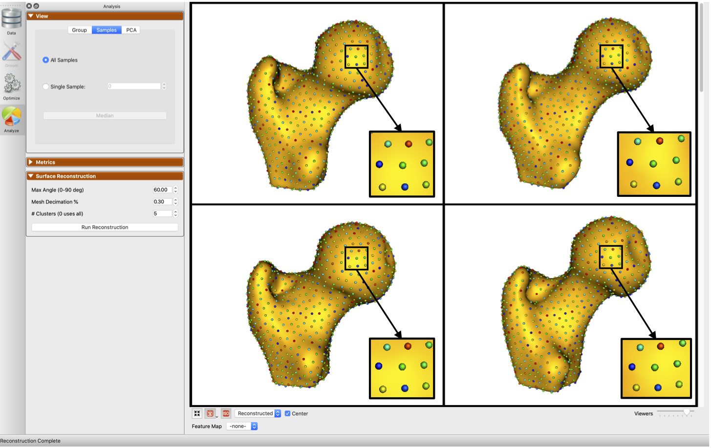
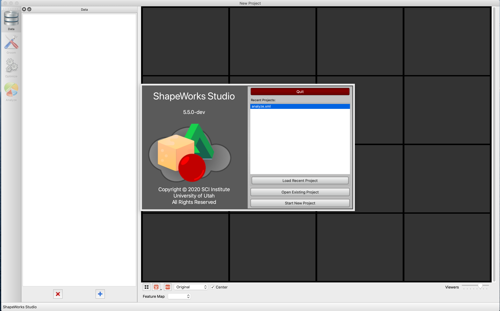
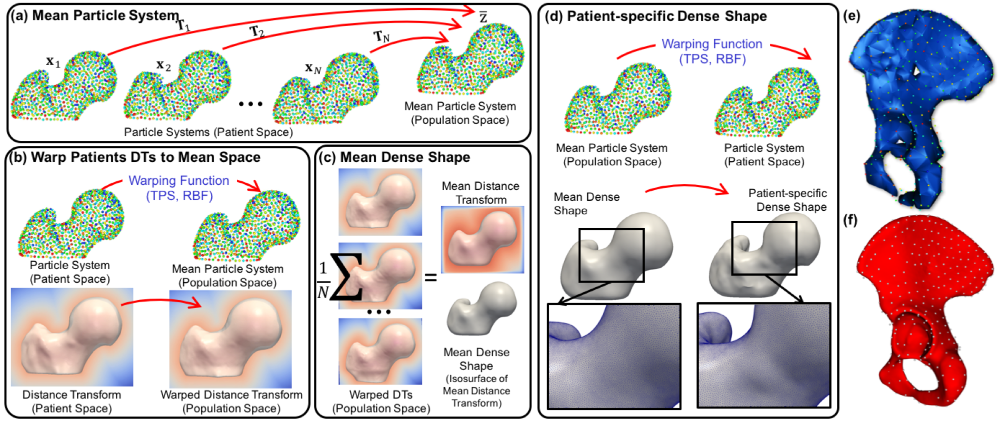
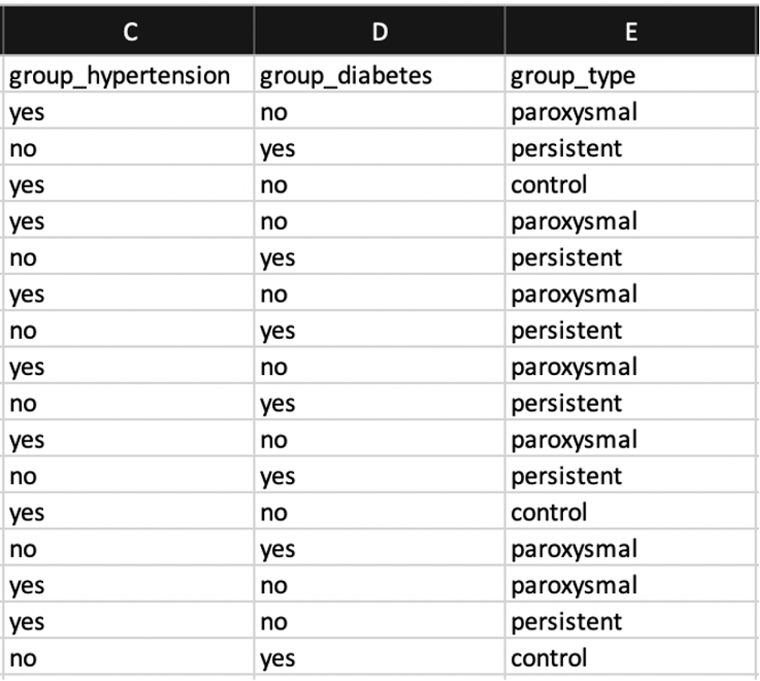
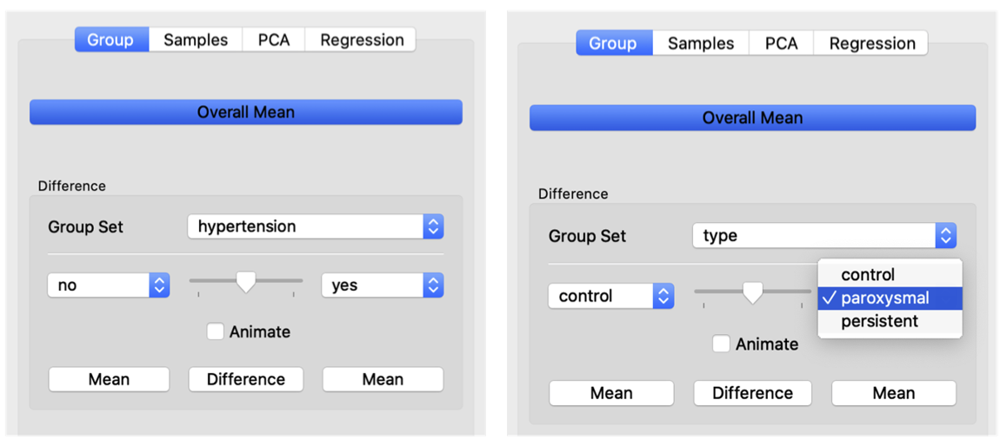

# How to Analyze Your Shape Model?

## Surface Correspondences 

ShapeWorks includes a Qt and VTK-based graphical user interface (GUI), **ShapeWorks Studio**, that allows visualizing the optimized particle system (i.e., correspondence model) for each shape sample where particle coloring is used to reflect correspondence among shapes. 


*Particles' coloring reflects surface correspondences across different shape samples*



You can scroll through the dataset and zoom in and out to inspect fewer or more samples. ShapeWorks Studio keeps a consistent camera view across all shape samples to facilitate qualitative comparisons of different samples relative to each other.

*Correspondence model inspectation by scrolling though the dataset and zooming in & out*
<p><video src="https://sci.utah.edu/~shapeworks/doc-resources/mp4s/studio_scroll.mp4" autoplay muted loop controls style="width:100%"></p>


## Running ShapeWorks Studio

When you open ShapeWorks Studio without a project, either from terminal or double-clicking on the application binary/exe file, the splash screen is displayed to enable you to load a recent project, open existing projects on your local machine, or create a new project.

*ShapeWorks Studio splash screen*


### Using XML Files

You can run ShapeWorks Studio using an *XML* parameter file that includes the following tags.

- `<point_files>` [required]: list of `_world.particles` files (output of the `shapeworks optimize`)
- `<group_ids>` [optional]: the group id (1 or 2) in case the data contains groups
- `<world_point_files>` [optional]: list of `_world.particles` files (output of the `shapeworks optimize`), same as `<point_files>`
- `<local_point_files>` [optional]: list of `_local.particles` files (output of the `shapeworks optimize`)
- `<distance_transform_files>` [optional]: list of distance transforms (input of the `shapeworks optimize`)


Please note the following:

- If the xml file only contains the `<point_files>` list, VTK-based surface reconstruction is used for surface reconstruction. 
- To enable particle-based surface reconstruction,`<world_point_files>`, `<local_point_files>`, and `<distance_transform_files>` lists should be given.
- `Examples/Python/<use-case-name>.py` include an analyze step that generates *`analyze.xml`*, which includes the path to the input data and corresponding particles. 
- All lists should have the same order of shape samples


Given the XML files, you can launch ShapeWorks Studio through the terminal using the following command.
 
```
$ ShapeWorksStudio analyze.xml
```

### Using Spreadsheets

ShapeWorks Studio can also load datasets (and shape models) using spreadsheets, a more user-friendly user-editable file format. See the ellipsoid studio example in `Examples/Studio/ellipsoid.xlsx` for an example. 


*ShapeWorks Studio keeps track of results from different phases in individual sheets*


<p><video src="https://sci.utah.edu/~shapeworks/doc-resources/mp4s/studio_ellipsoid.mp4" autoplay muted loop controls style="width:100%"></p>


## Surface Reconstruction 

For visualization purposes, the shape's particle system is used to reconstruct its surface mesh using a template-deformation approach to establish an inter-sample dense surface correspondence given a sparse set of optimized particles. To avoid introducing bias due to template choice, we use an unbiased framework for template mesh construction that entails:

 - A generalized Procrustes alignment to define the mean particle system
- A nonlinear warping function built using the shape's particle system and the mean one as control points.
-  A mean distance transform (DT) computed by averaging warped sample-specific DT. 

The template mesh will then be constructed by triangulating the isosurface of this mean DT. A warping function is constructed to deform the dense template mesh to the sample space using the sample's and mean particle systems as control points to reconstruct a sample-specific surface mesh.


*Particle-based surface reconstruction currently supported by ShapeWorks Studio*



*(old) VTK-based surface reconstruction*
<p><video src="https://sci.utah.edu/~shapeworks/doc-resources/mp4s/vtk_reconstruction.mp4" autoplay muted loop controls style="width:100%"></p>

*(new) particle-based surface reconstruction*
<p><video src="https://sci.utah.edu/~shapeworks/doc-resources/mp4s/particles_reconstruction.mp4" autoplay muted loop controls style="width:100%"></p>


You can export any mesh using `File -> Export -> Export Current Mesh ...`. 


## Statistical Analysis 

Statistical analysis is performed using principal component analysis (PCA), where the mean and modes of shape variation are computed based on the optimized correspondence model. Animation is allowed to watch the shape morph at various standard deviations along a user-selected variation mode. 

*Animating the shape variation along with a principal component while passing through the mean shape*

<p><video src="https://sci.utah.edu/~shapeworks/doc-resources/mp4s/femur_first_mode.mp4" autoplay muted loop controls style="width:100%"></p>


You can also export the eigenvalues and each shape's PCA loadings in an excel sheet for further analysis. 


## Group Differences


If there are groups in the data, ShapeWorks Studio can visualize significant group differences. 


*Statistical group differences for characterizing scapular morphology in Hill-Sachs patients*


If you are using an XML file to [load your data into ShapeWorks Studio](#running-shapeworksstudio), a group id (1 or 2) should be given to each sample. If you are using a spreadsheet, specify group columns in the `data` (first) sheet in the spreadsheet with the prefix `group_`, which enables adding multiple groups to your project and selecting the group-of-interest within ShapeWorks Studio. 

*Groups as columns in the project spreadsheet*



*In the Group tab of the Analyze panel, choose which column to indicate the group set of interest*


*Then, select which groups you would like to compare (now support more than two groups)*


## Feature Maps

ShapeWorks Studio has the ability to integrate **feature maps**.  A **feature map** is a 3d image volume that contains scalar values to be associated with each shape’s surface.  For example, this could be raw or processed CT/MRI data.  The feature map can be displayed for each surface by choosing the desired feature map in the feature map combobox at the bottom of the screen. 
After the correspondence is generated, the average feature map can be displayed on the mean shape in the analysis tab.

<p><video src="https://sci.utah.edu/~shapeworks/doc-resources/mp4s/studio_feature_map.mp4" autoplay muted loop controls style="width:100%"></p>


