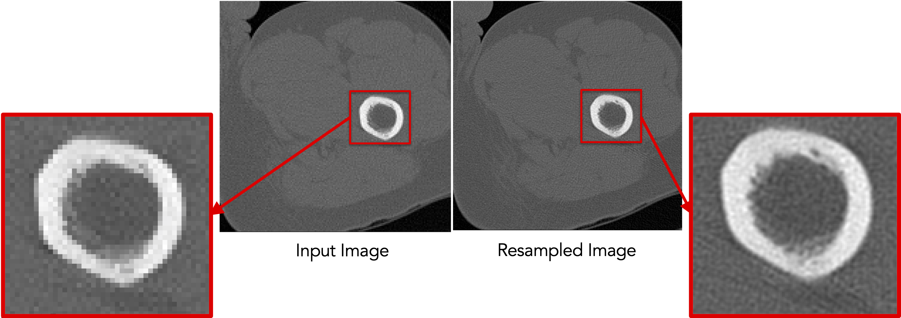
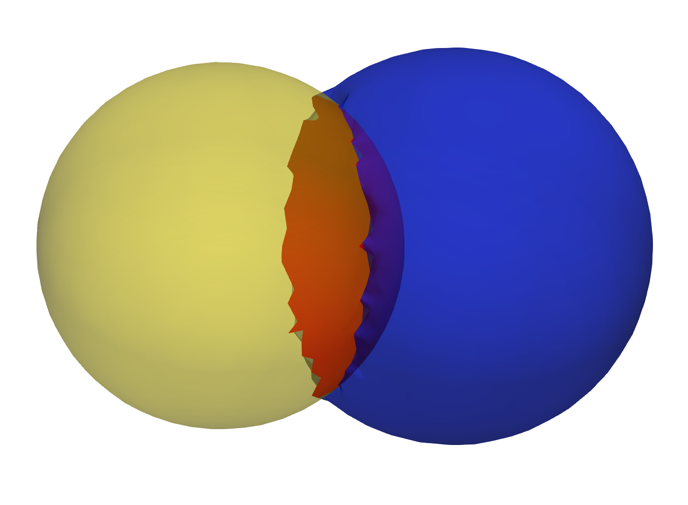
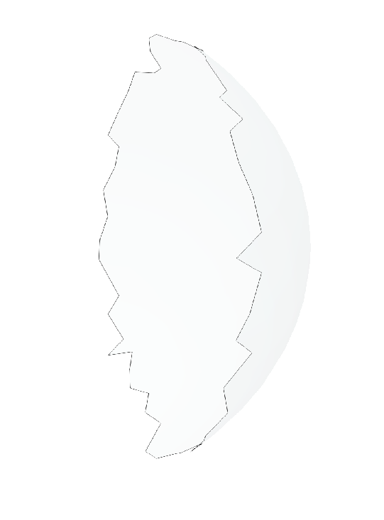
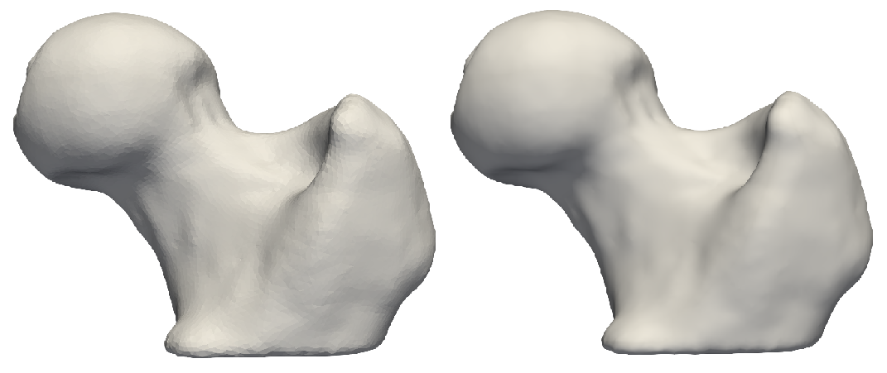

# How to Groom Your Dataset?

ShapeWorks needs suitable distance transforms or meshes for establishing shape correspondence. The groom stage has the pipeline to generate aligned distance transforms from binary segmentations or groomed meshes from unaligned meshes.  Common grooming steps are outlined below. For descriptions of the ShapeWorks commands used, see: [ShapeWorks Commands](http://sciinstitute.github.io/ShapeWorks/tools/ShapeWorksCommands.html).

## Common Pre-Processing Steps for Segmentations

### Resampling images and segmentations 

This grooming step resamples all the binary volumes, which in a raw setting could be in different physical spaces (different dimensions and voxel spacing). This grooming step brings all segmentations to the same voxel spacing, typically isotropic spacing (e.g., 1,1,1).

A smaller voxel spacing than the original spacing improves the resolution of the segmentations and reduces the aliasing (i.e., staircase) artifact resulting from the thresholding/binarization process. 


!!! note "Resampling both images and segmentations"
    If your dataset contains both images (e.g., CTs, MRIs) and binary segmentations, it is recommended that resampling is performed on both to keep them aligned for subsequent analyses that might entail/need imaging data. 

Since image resampling entails interpolation, directly resampling binary segmentations will not result in a binary segmentation, but rather an interpolated version that does not have two distinct labels (i.e., foreground and background).

To mitigate this behavior, we need first to convert the binary segmentations (with zero-one voxels) to a continuous-valued (gray-scale) image. This can be done by either antialiasing the segmentations, which smooths the foreground-background interface, or converting a segmentation to a signed distance transform, where each voxel encodes the physical distance to the closest surface point (zero-one interface) with the sign indicating whether the voxel is inside or outside the foreground region.

Here is a resampling pipeline example for binary segmentation that uses antialiasing:

- `antialias` the binary segmentation to convert it to a smooth continuous-valued image
- `resample` the antialiased image using the same (and possible smaller) voxel spacing for all dimensions
- `binarize` (aka thresholding) the resampled image to results in a binary segmentation with the desired voxel spacing

Here is an example of resampling an ellipsoid with spacing (1,1,2) to have spacing (1,1,1):

```python
antialias_iterations = 30
shape_seg            = sw.Image(in_shape_filename)

shape_seg.antialias(antialias_iterations)
shape_seg.resample([1,1,1], sw.InterpolationType.Linear)
shape_seg.binarize().write(out_shape_filename)
```


!!! note "Resampling images"
    Images are already given as a continued-valued grid of pixels. Hence, images can be directly resampled without any pre- or post-processing steps.
 
*Resampling images reduces pixelation and smooths out intensity noise.*   


*Resampling segmentations smooths out shape boundaries and reduces binarization aliasing.*


### Aligning segmentations

Rigidly aligning a cohort of shapes entails removing differences across these shapes pertaining to global transformations, i.e., translation and rotation. This step requires a reference coordinate frame to align all shapes to, where one of the shapes can be selected as a reference.

Rigid alignment (aka registration) is an optimization process that might get stuck in a bad local minima if shapes are significantly out of alignment. To bring shapes closer, we can remove translation differences using center-of-mass alignment. This factors out translations to reduce the risk of misalignment and allow for a medoid sample to be automatically selected as the reference for subsequent rigid alignment.

!!! note "Applying transformation to segmentations"
    Applying a transformation to segmentations entails interpolation due to image resampling in the new coordinate frame. Similar to the resampling workflow, we will first antialias the segmentation to convert it to a continuous-valued image with a smooth foreground-background interface, then apply the transformation, and finally binarize the tranformed image.
    
Hence, the shapes alignment pipeline includes the following steps:

- *Center-of-mass alignment for segmentations:* 
	- `antialias` the binary segmentation to convert it to a smooth continuous-valued image
	- `translate` the binary segmentation so that the center of the image doamin is the center of mass of the shape.
	- `binarize` (aka thresholding) to get a binary segmentation
  - `recenter` moves the center of the image (which is now the center of mass) to (0,0,0)
	
- *Reference shape selection:* One option for a reference is to select the shape that is closest to all other samples in the given cohort, i.e., the medoid shape. If shape instances are misaligned (i.e., do not share the same coordinate frame), translational and rotational differences should be factored out before reference selection.
	- Use the pymodule function `find_reference_image_index` that perform pairwise rigid registration using the iterative closest point method and selects the sample that is closest to all other samples after factoring out global transformation differences.
	<!-- computes the mean shape, computes the distance to mean shape, select the shape sample that is closest to the mean shape and returns it's index.-->
	
- *Rigid alignment:*
	- `antialias` the binary segmentation and reference to convert them to a smooth continuous-valued image
	- `createTransform`: compute the rigid transformation parameters that would align a segmentation 
    to the reference shape
    - `applyTransform`: apply the rigid transformation to the segmentation and make it have the same cooridnate system as the reference 
    - `binarize` (aka thresholding) to get a binary segmentation

Here is an example of performing center of mass alignment on one ellipsoid:

```python
shape_seg            = sw.Image(in_shape_filename)
antialias_iterations = 30
translation_vector   =  shape_seg.center() - shape_seg.centerOfMass() 

shape_seg.antialias(antialias_iterations)
         .translate(translation_vector)
         .binarize().recenter()
         .write(out_shape_filename)
```


<p><video src="https://sci.utah.edu/~shapeworks/doc-resources/mp4s/nb-groom-com-pv.mp4" autoplay muted loop controls style="width:100%"></p>

Finding the reference:

```python
ref_index = sw.find_reference_image_index(shape_seg_list)
ref_seg   = shape_seg_list[ref_index].write('reference.nrrd')
```


Rigid alignment:

```python
antialias_iterations = 30

ref_seg    = sw.Image(ref_shape_filename)
shape_seg  = sw.Image(in_shape_filename)

ref_seg.antialias(antialias_iterations)
shape_seg.antialias(antialias_iterations)

iso_value      = 1e-20
icp_iterations = 200
rigidTransform = shape_seg.createTransform(ref_seg, sw.TransformType.IterativeClosestPoint, iso_value, icp_iterations)

shape_seg.applyTransform(rigidTransform,
                         ref_seg.origin(),  ref_seg.dims(),
                         ref_seg.spacing(), ref_seg.coordsys(),
                         sw.InterpolationType.Linear)

shape_seg.binarize().write(out_shape_filename)
```


<p><video src="https://sci.utah.edu/~shapeworks/doc-resources/mp4s/nb-groom-align.mp4" autoplay muted loop controls style="width:100%"></p>


### Clip segmentations

In some cases, binary segmentations need to be clipped with a cutting plane so that only the desired part of the shape is reflected in the shape model. To perform this step, you can use `clip` defined the cutting plane defined using three points.

Example of clipping:

```python
shape_seg            = sw.Image(in_shape_filename)
cutting_plane_point_1 = [10, 10, 0]
cutting_plane_point_2 = [-10, -10, 0]
cutting_plane_point_3 = [10, -10, 0]

shape_seg.clip(cutting_plane_point_1,
               cutting_plane_point_2,
               cutting_plane_point_3,))
              ).write(out_shape_filename)
```


### Cropping and padding segmentations

In many cases, image boundaries are not tight around shapes. This leaves too much irrelevant background voxels that might increase the memory footprint when optimizing the shape model. We can remove this irrelevant background while keeping our segmentations intact and avoid cropped segmentations to touch image boundaries, which results in artifical holes in the shape boundary and does not allow particles to be distributed in regions touching the image boundary. 

This cropping and padding step entails the following steps:

- `ImageUtils.boundingBox`: computes the smallest bounding box (ShapeWorks region) that fits all segmentations in the given shape cohort. Note that this step should be applied to at segmentations that share the same coordinate frame (i.e., aligned)
- `crop` the segmentation using the computed bounding box
- `pad` the cropped segmentation to ensure the shape is not touching the image boundary

Example of cropping and padding:

```python
iso_value         = 0.5 # a threshold value between 0 and 1 for binary segmentations
padding_size      = 10  # number of voxels to pad for each dimension
padding_value     = 0  # the constant value used to pad the segmentations

segs_bounding_box = sw.ImageUtils.boundingBox(shape_seg_list, iso_value)
shape_seg         = sw.Image(in_shape_filename)

shape_seg.crop(segs_bounding_box)
         .pad(padding_size, padding_value)
         .write(out_shape_filename)
```


### Converting segmentations to smooth signed distance transforms

For numerical computations for correspondences optimization, we need to convert binary segmentations to a continuous-valued image that satisfies the following requirements.

- smooth for gradient updates stability
- reflect the shape's surface (i.e., foreground-background) interface
- provide a signal for the particle to snap (move back) to the surface in case particles gets off the surface during optimization, which is a typical scenario when using gradient descent based optimization


An antialiased segmentation satisfies the first two requirements. However, if a particles leaves the surface (i.e., the zero-level set) during model optimization, which is typical in gradient descent based optimization, it would be challenging to snap it back to the surface.

A representation that satisfies all the requirements is the *signed distance transform*. 

- A signed distance transform assigns to each voxel the physical distance to the closest point on the surface (i.e., the minimum distance from that voxel to nearest voxel on the foreground-background interface).
- The sign is used to indicate whether that voxel is inside or outside the foreground object.
- The zero-level set (zero-distance to the surface) indicates the foreground-background interface (i.e., the shape's surface).
- The gradient of a signed distance transform at a voxels indicates what direction to move in from that voxels to most rapidly increase the value of this distance. Hence, we can use the negative of this gradient as a signal to move a particle back to the surface.

The `computeDT` API needs an `iso_value` that defines the foreground-background interface. To create  a smoother interface, we first antialias the segmentation then compute the distance transform at the zero-level set. We then need to smooth the DT as it will have some remaining aliasing effect of binarization. 

So the steps are:

- `antialias` the binary segmentation to convert it to a smooth continuous-valued image
- `computeDT`: Compute distance transform
- `gaussianBlur`: Apply smoothing by convolving the image with a 3D gaussian filter with a given sigma (in physical coordinates)
- Save the distance transform

```python
iso_value = 0
sigma     = 1.3

shape_seg = sw.Image(in_shape_filename)

shape_seg.antialias(antialias_iterations)
         .computeDT(iso_value)
         .gaussianBlur(sigma)
         .write(out_shape_filename)
```


*Gaussian blur with a small sigma. Note aliasing left-overs!*
<p><video src="https://sci.utah.edu/~shapeworks/doc-resources/mp4s/nb-groom-dt-smooth-small-sigma2.mp4" autoplay muted loop controls style="width:100%"></p>


*Gaussian blur with a larger sigma. Note a smooth surface.*
<p><video src="https://sci.utah.edu/~shapeworks/doc-resources/mp4s/nb-groom-dt-smooth.mp4" autoplay muted loop controls style="width:100%"></p>


!!! note "Caution when using Gaussian blur"
    The `gaussianBlur` method could be use for blobby-like structures. However, for shapes with thin features and high curvature regions, the gaussian blurring method could impact the underlying geometrical features. For these shapes, topology-preserving smoothing is recommended. Topology-preserving smoothing is currently under developement and will be released soon.
    

## Common Pre-Processing Steps for Meshes

### Reflect meshes

It is common in medical imaging data to have a left and right anatomy. To align and model all such shapes, we must reflect some meshes so that all are oriented the same.

- `reflect`: reflects the mesh across the given axis (typically x-axis for anatomy)

Here is an example of reflecting a mesh:

```python
shape_mesh = sw.Mesh(in_mesh_filename)
shape_mesh.reflect(sw.X).write(out_mesh_filename)
```


### Meshes to volumes

Meshes can be converted to binary segmentations if desired so that grooming can be done on segmentations and optimization on distance transforms. 

The steps to convert meshes to volumes are:

- `toImage` convert the mesh to a signed distance transform
- `binarize` (aka thresholding) to get a binary segmentation

Example of turning a mesh to a segmentation:

```python
shape_mesh = sw.Mesh(in_mesh_filename)
shape_seg  = shape_mesh.toImage()
                       .binarize()
                       .write(out_shape_filename)
```


For list of commands, check out [ShapeWorks Commands](http://sciinstitute.github.io/ShapeWorks/tools/ShapeWorksCommands.html)

### Remesh

Remeshing creates meshes with evenly spaced vertices. 
- `remeshPercent` remeshes the mesh to have a given percent of the current number of vertices

```python
mesh.remeshPercent(percentage=0.80, adaptivity=1.0)
```


### Aligning meshes

Rigidly aligning a cohort of shapes entails removing differences across these shapes pertaining to global transformations, i.e., translation and rotation. This step requires a reference coordinate frame to align all shapes to, where one of the shapes can be selected as a reference.
    
Hence, the shapes alignment pipeline includes the following steps:

- *Reference shape selection:* One option for a reference is to select the shape that is closest to all other samples in the given cohort, i.e., the medoid shape. If shape instances are misaligned (i.e., do not share the same coordinate frame), translational and rotational differences should be factored out before reference selection.
  - Use the pymodule function `find_reference_mesh_index` that perform pairwise rigid registration using the iterative closest point method and selects the sample that is closest to all other samples after factoring out global transformation differences.
  <!-- computes the mean shape, computes the distance to mean shape, select the shape sample that is closest to the mean shape and returns it's index.-->
  
- *Rigid alignment:*
  - `createTransform`: compute the rigid transformation parameters that would align a segmentation 
    to the reference shape
  - `applyTransform`: apply the rigid transformation to the segmentation and make it have the same cooridnate system as the reference 

Here is an example of performing reference selection and rigid alignment on a list of meshes:

```python
# reference selection 
ref_index = sw.find_reference_mesh_index(mesh_list)
ref_mesh = mesh_list[ref_index]
# align all meshes in the list to the reference 
for mesh in mesh_list:
    # compute rigid transformation
    rigid_transform = mesh.createTransform(ref_mesh, sw.Mesh.AlignmentType.Rigid, 100)
    # apply rigid transform
    mesh.applyTransform(rigid_transform)
```


### Extract Shared Boundary
In this step, we ingest the two original shapes and the output consists of three new shapes, two of which correspond to the original shapes and one for the shared boundary. Let us designate the original meshes as Lo and Ro. Then:

1. Find all the triangles in Lo that are close to Ro, and construct a mesh with these triangles called Ls. A triangle with vertices v0, v1 and v2 is considered close to a mesh if the shortest euclidean distance to the mesh for all the three vertices is below a small threshold. We similarly find all the triangles in Ro that are close to Lo and designate this mesh as Rs
2. Find the remainder of the mesh in Lo after removing the triangles in Ls and designate this as Lr. Similarly, we find the remainder of the mesh in Ro after removing the triangles in Rs and designate this as Rr.
3. Arbitrary designed Rs as the shared surface M.
4. Snap all the points on the boundary loop of Lr to the boundary loop of M
5. Return three new shapes Lr, M and Rr

```python
 extracted_l,extracted_r,extracted_s = 
 sw.MeshUtils.sharedBoundaryExtractor(mesh_l,mesh_r,tol)
```
#### Input shapes with shared surface


#### Output extracted surfaces


### Extract Contour
The boundary loop of the shared surface M obtained using the `sharedBoundaryExtractor` is computed. 
```python
output_contour = sw.MeshUtils.boundaryLoopExtractor(extracted_shared_meshes)
```


### Smoothing 
Laplacian Smoothing allows you to reduce noise on a mesh’s surface with minimal changes to its shape.The effect is to "relax" the mesh, making the cells better shaped and the vertices more evenly distributed.
```python
mesh.smooth(iterations, relaxation)
```
