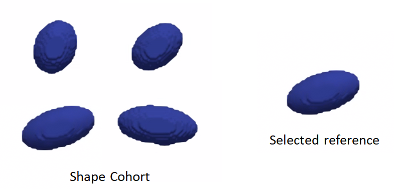
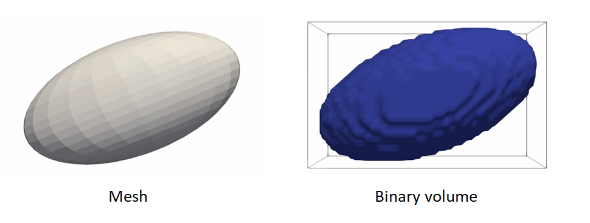

# How to Groom Your Dataset?

ShapeWorks needs suitable distance transforms or meshes for establishing shape correspondence. The groom stage has the pipeline to generate aligned distance transforms from binary segmentations or groomed meshes from unaligned meshes.  Common grooming steps are outlined below. For descriptions of the ShapeWorks commands used, see: [ShapeWorks Commands](http://sciinstitute.github.io/ShapeWorks/tools/ShapeWorksCommands.html).

## Common Pre-Processing Steps

### Resampling segmentations 
This grooming step resamples all the binary volumes which in a raw setting could be in different physical spaces (different dimensions and voxel spacing). This brings all segmentations to the same voxel spacing (typically isotropic meaning spacing (1,1,1)).

If a smaller voxel spacing is used, this improves the resolution of the segmentations and reduce the staircase effect seen in the volume rendering.

Since image resampling entails interpolation, directly resampling binary segmentations will not result in a binary segmentation, but rather an interpolated version that does not have two distinct labels (i.e., foreground and background).

To mitigate this behavior, we need first to convert the binary segmentations (with zero-one voxels) to a continuous-valued (gray-scale) image. This can be done by antialiasing the segmentations, which smooths the foreground-background interface.

Hence, the resampling pipeline for a binary segmentation includes the following steps:

- `antialias` the binary segmentation to convert it to a smooth continuous-valued image
- `resample` the antialiased image using the same (and possible smaller) voxel spacing for all dimensions
- `binarize` (aka thresholding) the resampled image to results in a binary segmentation with the desired voxel spacing

Here is an example of resampling an ellipsoid with spacing (1,1,2) to have spacing (1,1,1):
```
shape_seg = sw.Image(in_shape_filename)
antialias_iterations = 30
shape_seg.antialias(antialias_iterations)
shape_seg.resample([1,1,1], sw.InterpolationType.Linear)
shape_seg.binarize().write(out_shape_filename)
```


### Aligning segmentations
Rigidly aligning a cohort of shapes entails removing differences across these shapes pertaining to global transformations, i.e., translation and rotation. This step requires a reference coordinate frame to align all shapes to, where one of the shapes can be selected as a reference.

Rigid alignment (aka registration) is an optimization process that might get stuck in a bad local minima if shapes are significantly out of alignment. To bring shapes closer, we can remove translation differences using center-of-mass alignment. This factors out translations to reduce the risk of misalignment and allow for a medoid sample to be automatically selected as the reference for subsequent rigid alignment.

Hence, the shapes alignment pipeline includes the following steps:

- Center-of-mass alignment of segmentations 
	- `antialias` the binary segmentation to convert it to a smooth continuous-valued image
	- `translate` the binary segmentation so that the center of the image doamin is the center of mass of the shape.
	- `binarize` (aka thresholding) to get a binary segmentation
- Reference shape selection - One option for a reference is to select the shape that is closest to the mean shape, i.e., the medoid shape.
	- Use the pymodule function `find_reference_image_index` which computes the mean shape, computes the distance to mean shape, select the shape sample that is closest to the mean shape and returns it's index.
- Rigid alignment
	- `antialias` the binary segmentation and reference to convert them to a smooth continuous-valued image
    - `createTransform`: compute the rigid transformation parameters that would align a segmentation 
    to the reference shape
    - `applyTransform`: apply the rigid transformation to the segmentation and make it have the same cooridnate system as the reference 
    - `binarize` (aka thresholding) to get a binary segmentation

Here is an example of performing center of mass alignment on one ellipsoid:
```
shape_seg = sw.Image(in_shape_filename)
antialias_iterations = 30
translation_vector =  shape_seg.center() - shape_seg.centerOfMass() 
shape_seg.antialias(antialias_iterations).translate(translation_vector).binarize().write(out_shape_filename)
```


Finding the reference:
```
ref_index = sw.find_reference_image_index(shape_seg_list)
ref_seg = shape_seg_list[ref_index].write('reference.nrrd')
```


Rigid alignment:

```
ref_seg.antialias(antialias_iterations)
shape_seg = sw.Image(in_shape_filename)
antialias_iterations = 30
shape_seg.antialias(antialias_iterations)
iso_value = 1e-20
icp_iterations = 200
rigidTransform = shape_seg.createTransform(ref_seg, sw.TransformType.IterativeClosestPoint, iso_value, icp_iterations)
shape_seg.applyTransform(rigidTransform,
                            ref_seg.origin(),  ref_seg.dims(),
                            ref_seg.spacing(), ref_seg.coordsys(),
                            sw.InterpolationType.Linear)
shape_seg.binarize().write(out_shape_filename)
```


### Clip segmentation
In some cases binary segmentations need to be clipped with a cutting plane so that only the desired part of the shape is reflected in the shape model. 
- `clip` the segmentation using a cutting plane defined by three points

Example of clipping:
```
shape_seg = sw.Image(in_shape_filename)
cutting_plane_points = [10, 10, 0,-10, -10, 0, 10, -10, 0]
shape_seg.clip(10, 10, 0, -10, -10, 0, 10, -10 , 0, 0.0).write(out_shape_filename)
```


### Cropping and padding segmentations
In many cases, image boundaries are not tight around shapes. This leaves too much irrelevant background voxels that might increase the memory footprint when optimizing the shape model. We can remove this irrelevant background while keeping our segmentations intact and avoid cropped segmentations to touch image boundaries. This involves:

- `ImageUtils.boundingBox`:computes the bounding box (ShapeWorks region) that fits all segmentations using an isovalue
- `crop` the segmentation using the computed bounding box
- `pad` the cropped segmentation to ensure the shape is not on the image boundary

Example of cropping and padding:
```
iso_value = 0.5
segs_bounding_box = sw.ImageUtils.boundingBox(shape_seg_list, iso_value)
padding_size = 10  # number of voxels to pad for each dimension
padding_value = 0  # the constant value used to pad the segmentations
shape_seg = sw.Image(in_shape_filename)
shape_seg.crop(segs_bounding_box).pad(padding_size, padding_value).write(out_shape_filename)
```


### Converting segmentations to smooth signed distance transforms
For numerical computations for correspondences optimization, we need to convert binary segmentations to a continuous-valued signed distance transform.

A representation that satisfies all the requirements is the signed distance transform. 
- A signed distance transform assigns to each voxel the physical distance to the closest point on the surface (i.e., the minimum distance from that voxel to nearest voxel on the foreground-background interface).
- The sign is used to indicate whether that voxel is inside or outside the foreground object.
- The zero-level set (zero-distance to the surface) indicates the foreground-background interface (i.e., the shape's surface).
- The gradient of a signed distance transform at a voxels indicates what direction to move in from that voxels to most rapidly increase the value of this distance. Hence, we can use the negative of this gradient as a signal to move a particle back to the surface.

The computeDT API needs an iso_value that defines the foreground-background interface, to create 
a smoother interface we first antialiasing the segmentation then compute the distance transform 
at the zero-level set. We then need to smooth the DT as it will have some remaining aliasing effect 
of binarization. 
So the steps are:

- `antialias` the binary segmentation to convert it to a smooth continuous-valued image
- `computeDT`: Compute distance transform
- `gaussianBlur`: Apply smoothing
- Save the distance transform

```
iso_value = 0
sigma = 1.3
shape_seg = sw.Image(in_shape_filename)
shape_seg.antialias(antialias_iterations).computeDT(
        iso_value).gaussianBlur(sigma).write(out_shape_filename)
```


### Reflect meshes
It is common in medical imagining data to have a left and right anatomy. In order to align and model all such shapes we must reflect some so that all are oriented the same.
- `reflect`: reflects the mesh across the given axis (typically x-axis for anatomy)

Here is an example of reflecting a mesh:
```
shape_mesh = sw.Mesh(in_mesh_filename)
shape_mesh.reflect(sw.X).write(out_mesh_filename)
```


### Meshes to volumes
Meshes can be converted to binary segmentations if desired so that grooming can be done on segmentations and optimization on distance transforms. The steps are:
- `toImage`: convert the mesh to an image
- `binarize` (aka thresholding) to get a binary segmentation

Example of turning a mesh to a segmentation:
```
shape_mesh = sw.Mesh(in_mesh_filename)
shape_seg = shape_mesh.toImage().binarize().write(out_shape_filename)
```


For list of commands, check out [ShapeWorks Commands](http://sciinstitute.github.io/ShapeWorks/tools/ShapeWorksCommands.html)
