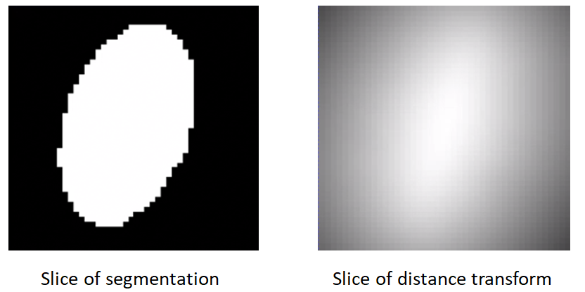

# How to Groom Your Dataset?

ShapeWorks needs suitable distance transforms or meshes for establishing shape correspondence. The groom stage has the pipeline to generate aligned distance transforms from binary segmentations or groomed meshes from unaligned meshes.  It consists of image and mesh pre-processing tools. We outline common grooming steps then give a description of relevant ShapeWorks functions. 

## Common Pre-Processing Steps

### Resampling segmentations 
This grooming step resamples all the binary volumes which in a raw setting could be in different physical spaces (different dimensions and voxel spacing). This brings all segmentations to the same voxel spacing (typically isotropic meaning spacing (1,1,1)).

If a smaller voxel spacing is used, this improves the resolution of the segmentations and reduce the staircase effect seen in the volume rendering.

Since image resampling entails interpolation, directly resampling binary segmentations will not result in a binary segmentation, but rather an interpolated version that does not have two distinct labels (i.e., foreground and background).

To mitigate this behavior, we need first to convert the binary segmentations (with zero-one voxels) to a continuous-valued (gray-scale) image. This can be done by antialiasing the segmentations, which smoothes the foreground-background interface.

Hence, the resampling pipeline for a binary segmentation includes the following steps:

- `antialias` the binary segmentation to convert it to a smooth continuous-valued image
- `resample` the antialiased image using the same (and possible smaller) voxel spacing for all dimensions
- `binarize` (aka thresholding) the resampled image to results in a binary segmentation with the desired voxel spacing

Here is an example of resampling an ellipsoid with spacing (1,1,2) to have spacing (1,1,1):
```
shape_seg = sw.Image(in_shape_filename)
antialias_iterations = 30
shape_seg.antialias(antialias_iterations)
shape_seg.resample([1,1,1], sw.InterpolationType.Linear)
shape_seg.binarize().write(out_shape_filename)
```


### Aligning segmentations
Rigidly aligning a cohort of shapes entails removing differences across these shapes pertaining to global transformations, i.e., translation and rotation. This step requires a reference coordinate frame to align all shapes to, where one of the shapes can be selected as a reference.

Rigid alignment (aka registration) is an optimization process that might get stuck in a bad local minima if shapes are significantly out of alignment. To bring shapes closer, we can remove translation differences using center-of-mass alignment. This factors out translations to reduce the risk of misalignment and allow for a medoid sample to be automatically selected as the reference for subsequent rigid alignment.

Hence, the shapes alignment pipeline includes the following steps:

- Center-of-mass alignment of segmentations 
	- `antialias` the binary segmentation to convert it to a smooth continuous-valued image
	- `translate` the binary segmentation so that the center of the image doamin is the center of mass of the shape.
	- `binarize` (aka thresholding) to get a binary segmentation
- Reference shape selection - One option for a reference is to select the shape that is closest to the mean shape, i.e., the medoid shape.
	- Use the pymodule function `find_reference_image_index` which computes the mean shape, computes the distance to mean shape, select the shape sample that is closest to the mean shape and returns it's index.
- Rigid alignment
	- `antialias` the binary segmentation and reference to convert them to a smooth continuous-valued image
    - `createTransform`: compute the rigid transformation parameters that would align a segmentation 
    to the reference shape
    - `applyTransform`: apply the rigid transformation to the segmentation and make it have the same cooridnate system as the reference 
    - `binarize` (aka thresholding) to get a binary segmentation

Here is an example of performing center of mass alignment on one ellipsoid:
```
shape_seg = sw.Image(in_shape_filename)
antialias_iterations = 30
translation_vector =  shape_seg.center() - shape_seg.centerOfMass() 
shape_seg.antialias(antialias_iterations).translate(translation_vector).binarize().write(out_shape_filename)
```


Finding the reference:
```
ref_index = sw.find_reference_image_index(shape_seg_list)
ref_seg = shape_seg_list[ref_index].write('reference.nrrd')
```


Rigid alignment:

```
ref_seg.antialias(antialias_iterations)
shape_seg = sw.Image(in_shape_filename)
antialias_iterations = 30
shape_seg.antialias(antialias_iterations)
iso_value = 1e-20
icp_iterations = 200
rigidTransform = shape_seg.createTransform(ref_seg, sw.TransformType.IterativeClosestPoint, iso_value, icp_iterations)
shape_seg.applyTransform(rigidTransform,
                            ref_seg.origin(),  ref_seg.dims(),
                            ref_seg.spacing(), ref_seg.coordsys(),
                            sw.InterpolationType.Linear)
shape_seg.binarize().write(out_shape_filename)
```


### Clip segmentation
In some cases binary segmetnations need to be clipped with a cutting plane so that only the desired part of the shape is reflected in the shape model. 
- `clip` the segmentation using a cutting plane defined by three points

Example of clipping:
```
shape_seg = sw.Image(in_shape_filename)
cutting_plane_points = [10, 10, 0,-10, -10, 0, 10, -10, 0]
shape_seg.clip(10, 10, 0, -10, -10, 0, 10, -10 , 0, 0.0).write(out_shape_filename)
```


### Cropping and padding segmentations
In many cases, image boundaries are not tight around shapes. This leaves too much irrelevant background voxels that might increase the memory footprint when optimizing the shape model. We can remove this irrelevant background while keeping our segmentations intact and avoid cropped segmentations to touch image boundaries. This involeves:

- `ImageUtils.boundingBox`:computes the bounding box (ShapeWorks region) that fits all segmentations using an isovalue
- `crop` the segmentation using the computed bounding box
- `pad` the cropped segmentation to ensure the shape is not on the image boundary

Example of cropping and padding:
```
iso_value = 0.5
segs_bounding_box = sw.ImageUtils.boundingBox(shape_seg_list, iso_value)
padding_size = 10  # number of voxels to pad for each dimension
padding_value = 0  # the constant value used to pad the segmentations
shape_seg = sw.Image(in_shape_filename)
shape_seg.crop(segs_bounding_box).pad(padding_size, padding_value).write(out_shape_filename)
```


### Converting segmentations to smooth signed distance transforms
For numerical computations for correspondences optimization, we need to convert binary segmentations to a continuous-valued signed distance transform.

A representation that satisfies all the requirements is the signed distance transform. 
- A signed distance transform assigns to each voxel the physical distance to the closest point on the surface (i.e., the minimum distance from that voxel to nearest voxel on the foreground-background interface).
- The sign is used to indicate whether that voxel is inside or outside the foreground object.
- The zero-level set (zero-distance to the surface) indicates the foreground-background interface (i.e., the shape's surface).
- The gradient of a signed distance transform at a voxels indicats what direction to move in from that voxels to most rapidly increase the value of this distance. Hence, we can use the negative of this gradient as a signal to move a particle back to the surface.

The computeDT API needs an iso_value that defines the foreground-background interface, to create 
a smoother interface we first antialiasing the segmentation then compute the distance transform 
at the zero-level set. We then need to smooth the DT as it will have some remaining aliasing effect 
of binarization. 
So the steps are:

- `antialias` the binary segmentation to convert it to a smooth continuous-valued image
- `computeDT`: Compute distance transform
- `gaussianBlur`: Apply smoothing
- Save the distance transform

```
iso_value = 0
sigma = 1.3
shape_seg = sw.Image(in_shape_filename)
shape_seg.antialias(antialias_iterations).computeDT(
        iso_value).gaussianBlur(sigma).write(out_shape_filename)
```


### Reflect meshes
It is common in medical imagining data to have a left and right anatomy. In order to align and model all such shapes we must reflect some so that all are oriented the same.
- `reflect`: reflects the mesh across the given axis (typically x-axis for anatomy)

Here is an example of reflecting a mesh:
```
shape_mesh = sw.Mesh(in_mesh_filename)
shape_mesh.reflect(sw.X).write(out_mesh_filename)
```


### Meshes to volumes
Meshes can be converted to binary segmentations if desired so that grooming can be done on segmentations and optimization on distance transforms. The steps are:
- `toImage`: convert the mesh to an image
- `binarize` (aka thresholding) to get a binary segmentation

Example of turning a mesh to a segmentation:
```
shape_mesh = sw.Mesh(in_mesh_filename)
shape_seg = shape_mesh.toImage().binarize().write(out_shape_filename)
```


## Image Tools
### Antialias
This tool antialiases binary volumes (with zero-one voxels) to a continuous-valued (gray-scale) image.

Command Line Interface:  
``
shapeworks readimage --name $1 antialias maxrmserror $2 iterations $3 layers $4 writeimage --name $5
``

Python Interface:  
```
image = sw.Image(<input path>)
image.antialias(iterations, maxRMSErr, layers).write(<output path>)
```

Arguments:

* maxrmserror/maxRMSErr: Maximum RMS error determines how fast the solver converges. Range [0.0, 1.0], larger is faster [default: 0.01].
* iterations: Maximum number of iterations [default: 50].
* layers: Number of layers around a 3d pixel to use for this computation [default: 3].

### Resample
This tool uses an interpolation process to resample anisotropic voxels into isotropic-sized voxels.

``
shapeworks readimage --name $1 resample --isospacing $2 --spacex $3 --spacey $4 --spacez $5 --sizex $6 --sizey $7 --sizez $8 writeimage --name $9
``

Here is the list of arguments.

* isospacing: The isotropic spacing in all dimensions.
* spacex: Pixel spacing in x-direction [default: 1.0].
* spacey: Pixel spacing in y-direction [default: 1.0].
* spacez: Pixel spacing in z-direction [default: 1.0].
* sizex: Output size in x-direction [default: calculated using current size and desired spacing].
* sizey: Output size in y-direction [default: calculated using current size and desired spacing].
* sizez: Output size in z-direction [default: calculated using current size and desired spacing].

### Binarize

This tool sets portion of image greater than min and less than or equal to max to the specified value. 

``
shapeworks readimage --name $1 binarize --min $2 --max $3 --value $4 writeimage --name $5
``

Here is the list of arguments.

* min: Lower threshold level [default: 0.0].
* max: Upper threshold level [default: inf ]. 
* value: Value to set region [default: 1.0].

### Translate

This tool translates image by specified physical (image space) distance.

``
shapeworks readimage --name $1 translate --centerofmass writeimage --name $2
``

``
shapeworks readimage --name $1 translate --tx $2 --ty $3 --tz $4 writeimage --name $5
``

Here is the list of arguments.

* centerofmass: Use center of mass [default: false].
* tx: X distance
* ty: Y distance
* tz: Z distance

### Recenter
This tool recenters an image by changing its origin in the image header to the physical coordinates of the center of the image.

``
shapeworks readimage --name $1 recenter writeimage --name $2
``

### Pad

This tool pads an image with specified value by specified number of voxels in the x-, y-, and/or z- directions; origin remains at the same location (note: negative padding to shrink an image is permitted).

``
shapeworks readimage --name $1 pad --padding $2 --value $3 writeimage --name $4
``

``
shapeworks readimage --name $1 pad --padx $2 --pady $3 --padz $4 writeimage --name $5
``

Here is the list of arguments.

* padding: Pad this many voxels in ALL directions (used if set) [default: 0].
* padx: Pad this many voxels in the x-direction [default: 0].
* pady: Pad this many voxels in the y-direction [default: 0].
* padz: Pad this many voxels in the z-direction [default: 0].
* value: Value used to fill padded voxels [default: 0.0].

### Scale

This tool scales image by specified value.

``
shapeworks readimage --name $1 scale --sx $2 --sy $3 --sz $4 writeimage --name $5
``

Here is the list of arguments.

* tx: X scale
* ty: Y scale
* tz: Z scale

### Rotate

This tool rotates image by specified value.

``
shapeworks readimage --name $1 rotate --rx $2 --radians $3 writeimage --name $4
``

``
shapeworks readimage --name $1 rotate --degrees $2 writeimage --name $3
``

Here is the list of arguments.

* rx: Physical axis around which to rotate [default: z-axis]
* ry: Physical axis around which to rotate [default: z-axis]
* rz: Physical axis around which to rotate [default: z-axis]
* radians: Angle in radians
* degrees: Angle in degrees

### Extract Label

This tool extracts/isolates the specific voxel label from a given multi-label volume and outputs the corresponding binary image.

``
shapeworks readimage --name $1 extractlabel label $2 writeimage --name $3
``

Here is the list of arguments.

* label: Label value to be extracted [default: 1.0].

### Close Holes

This tool closes holes in a volume defined by values larger than specified value.

``
shapeworks readimage --name $1 closeholes writeimage --name $2
``

### Compute DT

This tool computes signed distance transform volume from an image at the specified isovalue.

``
shapeworks readimage --name $1 computedt --isovalue $2 writeimage --name $3
`` 

Here is the list of arguments.

* isovalue: Level set value that defines the interface between foreground and background [default: 0.0].

### Curvature

This tool denoises an image using curvature driven flow using curvature flow image filter.

``
shapeworks readimage --name $1 curvature --iterations $2 writeimage --name $3
`` 

Here is the list of arguments.

* iterations: Number of iterations [default: 10].

### Gradient

This tool computes gradient magnitude of an image region at each pixel using gradient magnitude filter.

``
shapeworks readimage --name $1 curvature --iterations $2 writeimage --name $3
`` 

Here is the list of arguments.

* iterations: Number of iterations [default: 10].

### Sigmoid

This tool computes sigmoid function pixel-wise using sigmoid image filter.

``
shapeworks readimage --name $1 sigmoid --alpha $2 --beta $3 writeimage --name $4
`` 

Here is the list of arguments.

* alpha: Value of alpha [default: 10.0].
* beta: Value of beta [default: 10.0].

### TPLevelSetFilter

This tool segments structures in image using topology preserving geodesic active contour level set filter.

``
shapeworks readimage --name $1 tplevelset --featureimage $2 --scaling $3 writeimage --name $4
`` 

Here is the list of arguments.

* featureimage: Path of feature image for filter
* scaling: Value of scale [default: 20.0].

### TopologyPreservingFilter

This tool is a helper command that applies gradient and sigmoid filters to create a feature image for the TPLevelSet filter; note that the curvature flow filter is sometimes applied to the image before this.

``
shapeworks readimage --name $1 topopreservingsmooth --scaling $2 --alpha $3 --beta $4 writeimage --name $5
`` 

Here is the list of arguments.

* scaling: Scale for TPLevelSet level set filter [default: 20.0].
* alpha: Value of alpha for sigmoid fitler [default: 10.0].
* beta: Value of beta for sigmoid fitler [default: 10.0.0].

### Blur

This tool applies gaussian blur.

``
shapeworks readimage --name $1 blur --sigma $2 writeimage --name $3
`` 

Here is the list of arguments.

* sigma: Value of sigma [default: 0.0].

### ICPRigid

This tool transform current image using iterative closest point (ICP) 3D rigid registration computed from source to target distance maps.

``
shapeworks readimage --name $1 icp --source $2 --target $3 --isovalue $4 --iterations $5 writeimage --name $6
`` 

Here is the list of arguments.

* source: Distance map of source image.
* target: Distance map of target image.
* isovalue: Isovalue of distance maps used to create ICPtransform [default: 0.0].
* iterations: Number of iterations run ICP registration [default: 20].

### Bounding Box

This tool computes the largest bounding box for the shape population needed for cropping all the images.

``
shapeworks readimage --name $1 boundingbox --names $2 -- --padding $3 --isovalue $4 writeimage --name $5
``

Here is the list of arguments.

* names: Paths to images (must be followed by `--`), ex: \"bounding-box --names *.nrrd -- --isovalue 1.5\").
* padding: Number of extra voxels in each direction to pad the largest bounding box [default: 0].
* isovalue: Threshold value [default: 1.0].


### Crop

This tool crops image down to the current region (e.g., from bounding-box command), or the specified min/max in each direction [default: image dimensions].

``
shapeworks readimage --name $1 crop --xmin $2 --xmax $3 --ymin $4 --ymax $5 --zmin $6 --zmax $7 writeimage --name $8
``

Here is the list of arguments.

* xmin: Minimum X.
* xmax: Maximum X.
* ymin: Minimum Y.
* ymax: Maximum Y.
* zmin: Minimum Z.
* zmax: Maximum Z.

### Clip Volume
This tool clips volume with the specified cutting planes defined by three 3D points

``
shapeworks readimage --name $1 clip --x1 $2 --y1 $3 --z1 $4 --x2 $5 --y2 $6 --z2 $7 --x3 $8 --y3 $9 --z3 $10 writeimage --name $11
``

Here is the list of arguments.

* x1: Value of x1 for cutting plane [default: 0.0].
* y1: Value of y1 for cutting plane [default: 0.0].
* z1: Value of z1 for cutting plane [default: 0.0].
* x2: Value of x2 for cutting plane [default: 0.0].
* y2: Value of y2 for cutting plane [default: 0.0].
* z2: Value of z2 for cutting plane [default: 0.0].
* x3: Value of x3 for cutting plane [default: 0.0].
* y3: Value of y3 for cutting plane [default: 0.0].
* z3: Value of z3 for cutting plane [default: 0.0].

### Reflect Images

This tool reflects image with respect to logical image center and the specified axis.

``
shapeworks readimage --name $1 reflect --axis $2 writeimage --name $3
``

Here is the list of arguments.

* axis: Axis along which to reflect (X, Y, or Z).

### Set Origin

This tool sets origin.

``
shapeworks readimage --name $1 setorigin --x $2 --y $3 --z $4 writeimage --name $5
``

Here is the list of arguments.

* x: x value of origin [default: 0.0].
* y: y value of origin [default: 0.0].
* z: z value of origin [default: 0.0].

### Warp

This tool finds the warp between the source and target landmarks and transforms image by this warp.

``
shapeworks readimage --name $1 warpimage --source $2 --target $3 --landmarks $4 writeimage --name $5
``

Here is the list of arguments.

* source: Path to source landmarks.
* target: Path to target landmarks.
* landmarks: Every _stride_ points will be used for warping [default: 1].

### Compare

This tool compares two images.

``
shapeworks readimage --name $1 compare --name $2 --verifyall $4 --tolerance $4 --precision $5 writeimage --name $6
``

Here is the list of arguments.

* name: Compare this image with another
* verifyall: Also verify origin, spacing, and direction matches [default: true].
* tolerance: Allowed percentage of pixel differences [default: 0.0].
* precision: Allowed difference between two pixels for them to still be considered equal [default: 0.0].

### Negate

This tool negates the values in the given image.

``
shapeworks readimage --name $1 negate writeimage --name $2
``

### Add

This tool adds a value to each pixel in the given image and/or add another image in a pixelwise manner.

``
shapeworks readimage --name $1 add --value $2 --name $3 writeimage --name $4
``

Here is the list of arguments.

* value: Value to add to each pixel.
* name: Name of image to add pixelwise.

### Subtract

This tool subtracts a value from each pixel in the given image and/or subtract another image in a pixelwise manner.

``
shapeworks readimage --name $1 subtract --value $2 --name $3 writeimage --name $4
``

Here is the list of arguments.

* value: Value to add to each pixel.
* name: Name of image to subtract pixelwise.

### Multiply

This tool multiplies an image by a constant.

``
shapeworks readimage --name $1 multiply --value $2 writeimage --name $3
``

Here is the list of arguments.

* value: Value with which to multiply.

### Divide

This tool divides an image by a constant.

``
shapeworks readimage --name $1 divide --value $2 writeimage --name $3
``

Here is the list of arguments.

* value: Value with which to divide.

### ImageToMesh

This tool converts the current image to a mesh.

Here is the list of arguments.

* isovalue: Isovalue to determine mesh boundary [default: 1.0].

### Create Transform

### Apply Transform

### Gaussian Blur

### ImageUtils Bounding Box

## Mesh Tools

#### Reflect Mesh
This tool reflects a mesh segmentation. It can be used when you want to align all pairs of anatomies together. For example, if you have left and right femurs and want to align them all, you would first reflect one side or the other so they are all either left or right femurs.

``
ReflectMesh --inFilename $1 --outFilename $2 --reflectCenterFilename $3 --inputDirection $4 --meshFormat $5
``

* inFilename: The filename of the input mesh to be reflected.
* outFilename: The filename of the output reflected mesh.
* reflectCenterFilename: The filename where the image center about which reflection occured will be stored.
* inputDirection: Direction along which to reflect.
* meshFormat: Mesh file format such as "vtk" or "ply"

### Mesh to volume
This tool generates a binary volume and distance transform from a ".ply" mesh. If an image corresponding to the mesh exists, the origin, spacing, and size settings should be the same as this image. This information can be acquired using the WriteImageInfoToText tool.

``
TopologyPreservingSmoothing parameterFile.xml
`` 

Here is the list of all parameters in the parameter file.
* mesh: The file name of the input mesh.
* origin_x: The x origin of the output ".nrrd" files.
* origin_y: The y origin of the output ".nrrd" files.
* origin_z: The z origin of the output ".nrrd" files.
* size_x: The x size of the output ".nrrd" files.
* size_y: The y size of the output ".nrrd" files.
* size_z: The z size of the output ".nrrd" files.
* spacing_x: The x spacing of the output ".nrrd" files.
* spacing_y: The y spacing of the output ".nrrd" files.
* spacing_z: The z spacing of the output ".nrrd" files.