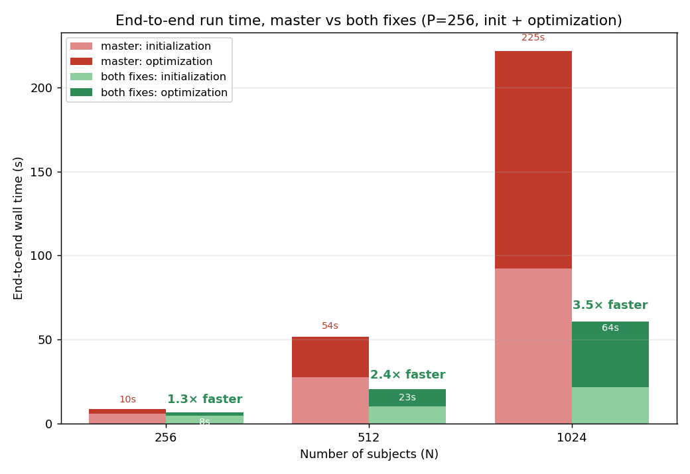
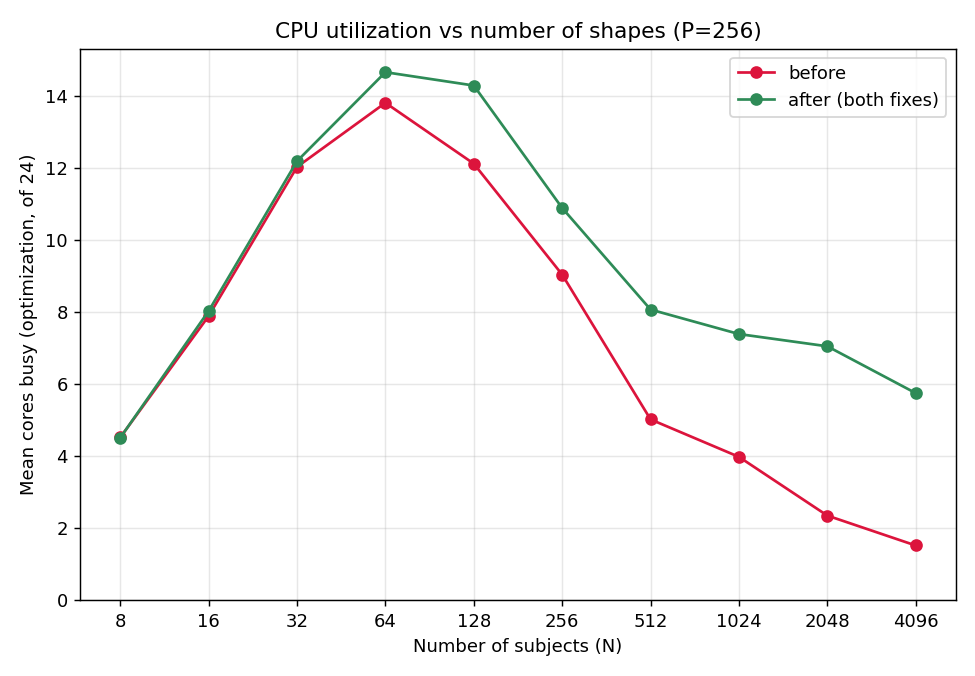
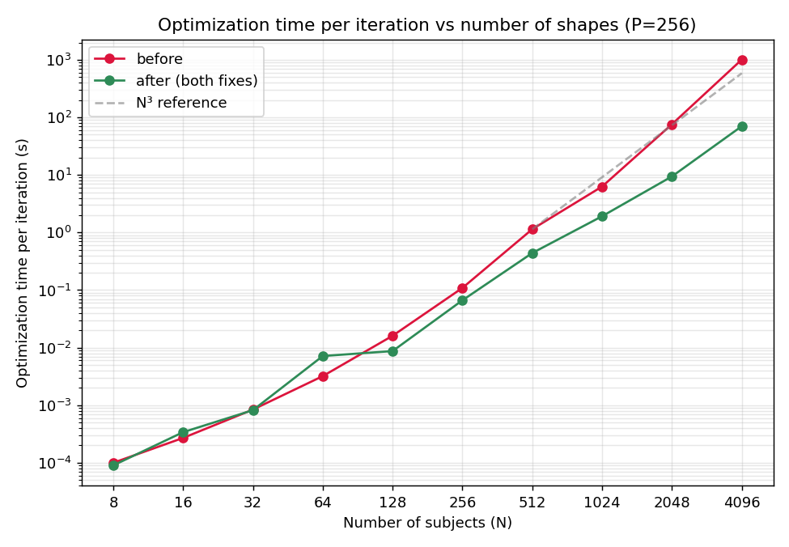
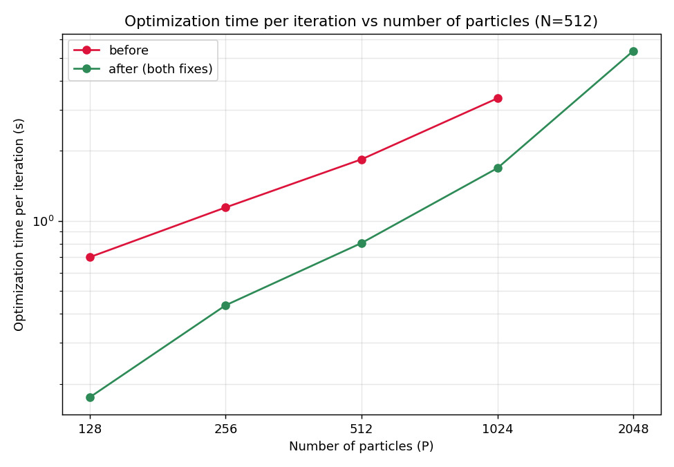

# Optimization Performance & Scaling

This page explains how `shapeworks optimize` scales with the size of your dataset, and what recent
improvements changed. If you are optimizing hundreds or thousands of shapes and want to know what to
expect for runtime and CPU usage, start here.

## What to expect

- Runtime grows faster with the number of shapes (subjects, N) than with the number of particles. The
  correspondence step at the center of each iteration decomposes an N×N matrix built from the shapes,
  which costs O(N³), so adding shapes is much more expensive than adding particles.
- Recent improvements cut this cost and restored multi-core use in both phases of a run. A full run at
  N=1024 is about 3.5x faster than before, and the gap grows with N. See
  [Recent improvements](#recent-improvements) below.
- Adding particles is much cheaper than adding shapes.

## Recent improvements

Two changes to the per-iteration correspondence update made both phases of a run faster and brought
back multi-core usage on large cohorts. Neither changes the optimization result.

1. Initialization no longer multiplies by an identity matrix. In the initialization (mean-energy)
   phase the update reduces to the mean-centered points, but the code used to build an N×N identity
   and run the full multiply every iteration, an O(P·N²) no-op. Removing it makes initialization far
   faster at scale (the whole initialization phase at N=2048 went from about 10 minutes to about 45
   seconds) and keeps it multi-core.

2. The optimization phase uses a symmetric eigensolver. The N×N matrix is symmetric
   positive-semidefinite, so a symmetric eigensolver replaces the general SVD and the surrounding
   matrix work runs multithreaded. This is faster per iteration by an amount that grows with N: about
   2.6x at N=512, 8x at N=2048, and 14x at N=4096.

End to end, both changes together (initialization plus optimization), on the same cohorts:

| N | before | after | speedup |
|---|---|---|---|
| 256 | 10.0 s | 8.0 s | 1.3x |
| 512 | 53.6 s | 22.6 s | 2.4x |
| 1024 | 224.9 s | 64.0 s | 3.5x |

Below a few hundred shapes the difference is small, because the parts these changes target only
dominate at larger N. The payoff grows with the cohort.

CPU utilization also recovers. Mean cores busy for each phase (of 24), before and after, at P=256:

| N | initialization before / after | optimization before / after |
|---|---|---|
| 256 | 11.9 / 13.8 | 9.0 / 10.9 |
| 1024 | 4.0 / 12.7 | 4.0 / 7.4 |
| 2048 | 2.0 / 12.6 | 2.4 / 7.0 |

Before the changes, optimization utilization fell to about 1.5 cores at N=4096. After, it stays around
6, because the eigensolve itself is still serial even though the matrix work around it is now
threaded. So utilization is much better but still declines at the very high end.

## Why shapes cost more than particles

Each optimization iteration has two parts:

| part | complexity | parallel? |
|---|---|---|
| per-particle gradient update (`tbb::parallel_for` over subjects) | O(N·P) | yes, across subjects |
| correspondence: build the N×N matrix and decompose it | O(N³) | the eigensolve is serial; the surrounding matrix work runs multithreaded |

N is the number of subjects and P the number of particles. The decomposition is O(N³) in the number
of shapes, so runtime still grows cubically with N even after the improvements. The changes lower the
constant and parallelize most of the surrounding work, but the eigensolve itself is serial, which is
why very large cohorts remain expensive. This holds whether or not `use_normals` is enabled, because
both correspondence formulations build the same N×N decomposition.

Optimization time per iteration, before and after. Both follow the N³ reference at large N, so the
slope is unchanged, but the eigensolver change shifts the curve down by a widening margin, reaching
about 14x at N=4096. At very small N the two are within measurement noise; the eigensolver has a small
fixed overhead that does not matter once the matrices are tiny.

Adding particles grows the cheaper terms, not the cubic decomposition, so it scales far more slowly
than adding shapes.

## What you can do for very large cohorts

- Use incremental optimization. It optimizes a small initial subset of shapes from scratch, then adds
  the remaining shapes in batches. The expensive particle initialization runs only on the initial
  subset, and each later batch starts from already-placed particles, so the full-cohort passes need
  far fewer iterations. It does not remove the per-iteration cost: the final batch still includes
  every shape and pays the O(N³) decomposition each iteration. See
  [Incremental Supershapes](../use-cases/multistep/incremental_supershapes.md) for a worked example.
  Incremental optimization is available through the Python and command-line interfaces; ShapeWorks
  Studio does not currently support it.
- Lowering the iteration count does not reduce the per-iteration cost. The decomposition runs every
  iteration, so lowering `optimization_iterations` reduces the number of iterations but not the cost
  of each one.
- If you need higher-resolution models, adding particles is much cheaper than adding shapes.

## Measurements

Measured on a 24-core machine with 128 GB of memory. Cohorts were built by replicating a single femur
mesh (15,002 vertices) N times with a small random rigid transform and per-vertex noise, so N can be
varied over a wide range. Shape content does not affect the decomposition cost, which depends only on
the matrix size. Before and after numbers come from back-to-back runs with the binary swapped per N
under the same load, since machine contention alone can move cross-run timings by roughly 1.8x.

## Summary

- Runtime still grows cubically with the number of shapes, because the correspondence step decomposes
  an N×N matrix each iteration. Recent improvements lowered the constant and restored multi-core use,
  but did not change the cubic shape.
- The number of shapes drives the cost. The number of particles has less of an impact.
- For very large cohorts, incremental optimization is the most useful option: it does the expensive
  initialization on a small subset and lets later batches run with far fewer iterations.
