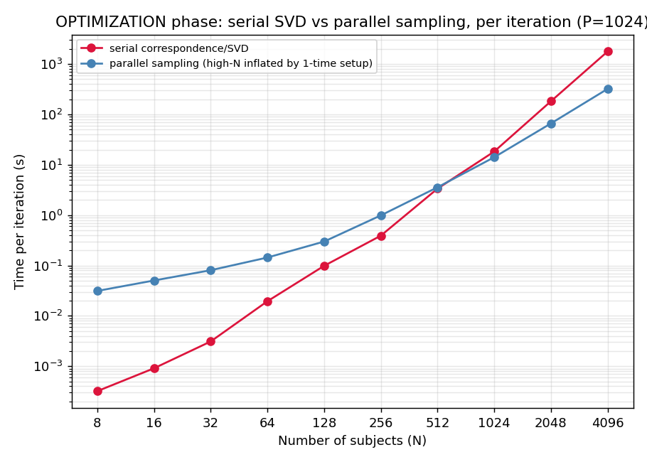
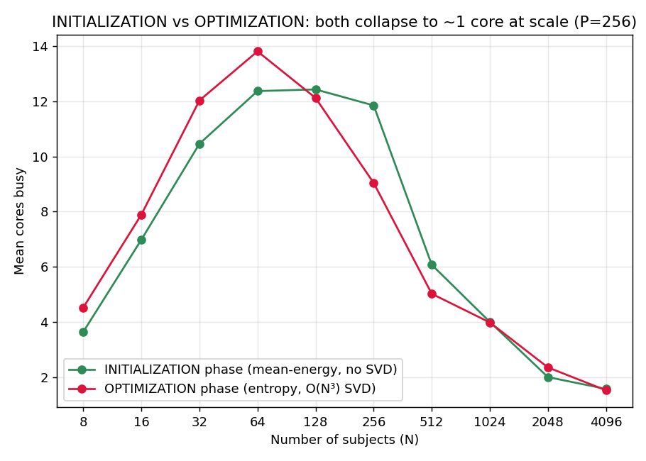
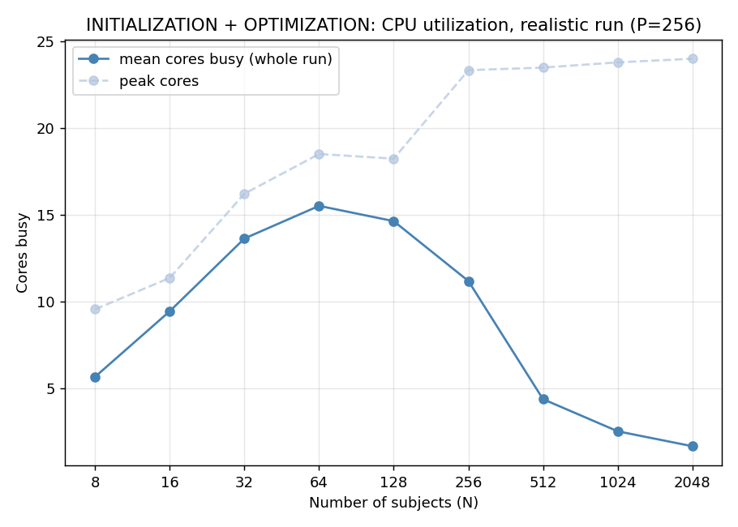

# Optimization Performance & Scaling

This page explains how `shapeworks optimize` scales with the size of your dataset: how runtime grows
with the number of shapes and particles, and why very large cohorts tend to use only a single CPU
core. If you are optimizing hundreds or thousands of shapes and seeing long runtimes or low CPU
utilization, this page describes what to expect and what you can do about it.

## What to expect

- Runtime grows cubically with the number of shapes (subjects, N). Doubling the number of shapes can
  multiply optimization time by roughly 8x in the large-cohort regime.
- Large cohorts use about one CPU core. Small and medium datasets parallelize across many cores. As
  the number of shapes grows into the thousands, the optimizer spends most of its time in a serial
  step, so utilization falls toward a single core.
- Particle count is much cheaper than shape count. Increasing the number of particles grows runtime
  far more slowly than increasing the number of shapes.

## What you can do

- Use incremental optimization for large cohorts. It optimizes a small initial subset of shapes from
  scratch, then adds the remaining shapes in batches. The expensive particle initialization runs only
  on the initial subset, and each later batch starts from already-placed particles, so the
  full-cohort passes need far fewer iterations. This lowers total runtime. It does not remove the
  per-iteration cost: the final batch still includes every shape and pays the O(N³) SVD each
  iteration. See [Incremental Supershapes](../use-cases/multistep/incremental_supershapes.md) for a
  worked example. Incremental optimization is available through the Python and command-line
  interfaces; ShapeWorks Studio does not currently support it.
- Lowering the iteration count does not reduce the per-iteration cost. The expensive step runs every
  iteration, so lowering `optimization_iterations` reduces the number of iterations but not the cost
  of each one.
- If you need higher-resolution models, adding particles is much cheaper than adding shapes.

## Why

Each optimization iteration has two parts:

| part | complexity | parallel? |
|---|---|---|
| per-particle gradient update (`tbb::parallel_for` over subjects) | O(N·P) | yes, across subjects |
| correspondence entropy: an N×N Gram matrix and one SVD | O(N³) | no, single-threaded |

N is the number of subjects and P the number of particles. The per-particle gradient is spread across
cores, but the correspondence step runs a serial SVD on an N×N matrix once per iteration, which is
O(N³). As N grows, that serial cubic step dominates, so total runtime grows cubically and CPU usage
falls toward one core. This happens whether or not `use_normals` is enabled, because both
correspondence formulations build the same N×N SVD.

## Measurements

Measured on a 24-core machine with 128 GB of memory. Cohorts were built by replicating a single femur
mesh (15,002 vertices) N times with a small random rigid transform and per-vertex noise, so N can be
varied over a wide range. Shape content does not affect the O(N³) SVD, which depends only on the
matrix size. Metrics are reported per iteration, since a full 100-iteration run at N=4096 takes days.

### Runtime per iteration vs number of shapes

The curve is flat at small N, where the parallel work dominates, then bends up to follow the N³
reference beyond N=512. The lines converge because the SVD cost does not depend on the particle
count.

### The serial SVD overtakes the parallel work

The serial SVD (slope near 3) passes the parallel per-particle work (slope near 1) at about N=1024 and
dominates beyond that.

### CPU utilization vs number of shapes

Mean cores busy rises to a peak around N=64, then falls as the serial SVD takes over, dropping to
about 1.3 cores at N=4096. A cohort of thousands of shapes sits on the right side of this curve, in
the single-core regime. The high utilization on small datasets is the left side of the same curve.

### Particle scaling is much milder

Adding particles grows the cheaper terms, not the cubic SVD, so it scales far more slowly than adding
shapes.

## Initialization vs optimization

A run has two phases. Initialization adds particles by splitting, running `iterations_per_split`
iterations at each level. Optimization then runs `optimization_iterations` at the full particle count.
The expensive SVD runs in the optimization phase; initialization uses a cheaper mean-energy mode. For
a typical run, initialization is often the majority of the wall time.

Core utilization for each phase measured in isolation (P=256):

| N | initialization cores | optimization cores |
|---|---|---|
| 256 | 11.9 | 9.0 |
| 1024 | 4.0 | 4.0 |
| 2048 | 2.0 | 2.4 |

Initialization parallelizes well for typical cohorts of up to a few hundred shapes, but at thousands
of shapes it also becomes serial-bound. Very large cohorts see reduced CPU utilization in both phases.

The blended view of a realistic run shows high utilization at small N, falling toward a single core as
the number of shapes reaches the thousands.

## Summary

- The cubic runtime and single-core behavior on large cohorts are expected. A serial O(N³) SVD runs
  once per optimization iteration.
- The number of shapes drives the cost. The number of particles has less of an impact.
- No setting removes the per-iteration O(N³) cost. Incremental optimization is the most useful option
  for large cohorts: it does the expensive initialization on a small subset and lets later batches run
  with far fewer iterations.
