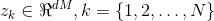
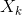

# How to Optimize Your Shape Model?

ShapeWorks uses the processed data groomed to the sign distance transform for optimization step.
ShapeWorks uses the Particle Based Modeling (PBM) approach to constructs a correspondence 
point model of shape, which describes shape variation by choosing a discrete set of corresponding points 
on shape surfaces whose relative positions can be statistically analyzed. Consider a statistical sample of N surface 
representations embeded in a d-dimensional Cartesian space(typically, d= 2, d= 3). A model for shape variation is constructed
by choosing a set of M, d-dimensional points on each of the N surfaces. Each of the points is called a *correspondence*  point
and Collectively, the set of M points is known as the *configuration*.
The PBM algorithm models the correspondence positions as sets of dynamic particles that are constrained to lie on the surface of the sample set.
The optimization is based on the idea of treating correspondence position in configuration space as a random variable, while
simultaneously treating correspondence configuration as a random variable.

Correspondence positions are optimized by gradient descent on an energy function that balances the negative entropy of 
the distribution of particles in configuration space with the positive entropy of the distribution of the configurations
in shape space. The method is to consider 
 both as observations on a dM × 1 vector random
variable Z and as N samples of M observations on N , d × 1 vector random variables 
 . The optimization to establish correspondence minimizes the energy function
 
 


where H is an estimation of differential entropy. Minimization of the first term in Q
produces a compact distribution of samples in shape space, while the second term seeks
uniformly-distributed correspondence positions on the shape surfaces for accurate shape
representation. Each term is given in commensurate units of entropy, avoiding the need
for a separate regularization strategy. Because correspondence points in this formulation
are not tied to a specific parameterization, the method operates directly on volumetric
data and extends easily to arbitrary shapes, even nonmanifold surfaces.

The optimization is consists f two part the initialization of correspondence and optimization. 

## Initialization
 One effective approach is to use an iterative, particle splitting strategy, in which the full set of particles is
initialized in a multi-scale fashion as follows. First, the PBM system is initialized with a
single particle on each shape that finds the nearest zero of the implicit surface. This sin-
gle particle is then split to produce a new, nearby particle. The two-particle (per shape)
system is then optimized for correspondence until a steady state is reached. The splitting
process, followed by optimization, is then repeated until a specific number of particles
have been produced. Thus, the initialization proceeds simultaneously with the optimization in a multi-scale fashion,
 generating progressively more detailed correspondence models with each split.
Typically, we set the numerical parameters for the PBM optimization automatically based on the machine precision.

## Optimization
ShapeWorks has two mode of optimization *single scale* and hierarchical *multi-scale* optimization.

### Single Scale Optimization
This method takes a fixed number of particles (usually a power of 2 ) and performs the initialization step to independently
spread out particles uniformly on each shape. Then it performs the full optimization using the surface as well as
population based entropy terms of the ShapeWorks optimization and bringing the points on all the shapes into correspondence.

### Multi-Scale Optimization
This operation runs the entire code for different number of particles ina hierarchical manner. ShapeWorks with a low 
number of particles, say 64 particles and perform the single scale optimization using this many particles, then we move to the
next power of 2 number of particle which is 128, and using the ShapeWorks
output of 64 particles as initialization for the next level. We do this till the
desired number of particles is reached. This way of performing ShapeWorks
results in more robust shape models as the optimization using the full objective function is happening at each level.
In addition this method helps us with debugging the optimization parameters. 

#### Usage
To run each of these optimization methods we need a proper set of parameters in a *.xml* file.
The command to run the optimization with parameter files ``parameters.xml`` is as follows.
```
ShapeWorksRun parameters.xml
``` 
Here is the list of parameters and their descriptions.
* inputs: Path to the directory containing the processed data in form of signed distance transform.
* output_dir:  The directory where you need to save the output produced by the ShapeWorks optimization.
* number of particles: (default:128) The desire number of particles to be placed in power of 2.
* starting_particles: (_Only for multi-scale optimization_) The initial number of particles.
* number_of_levels: (_Only for multi-scale optimization_) number of levels to run single scale optimization to reach desire number of particles.
* iterations_per_split: The number of iterations in initialization step for each level of split. 
* use_shape_statistics_in_init: (default: 1) uses the the statistics of shapes for next level initialization
* save_init_splits: (default: 1) A boolean to save the particles foe each split in initialization stage. 
* use_normals: A boolean variable for considering normal vector for each particle in optimization.
* normal_weight: (if use_normal = True) The weights of normal vector for each axis (usually in scale of 10).
* attribute_scales: The scale of each axis 
* starting_regularization: (default:1000) Sets the starting regularization value (usually high value).
* ending_regularization: (default:1e-4) Sets the ending regularization value (usually small value less than 1).
* recompute_regularization_interval: Skip interval to compute the regularization value.
* domains_per_shape: 
* relative_weighting: (default: 1) Relative weight between the sampling and correspondence terms of the objective function
* initial_relative_weighting: (default: 0.05) Starting relative weighting to make sure that initially the surfaces
 are covered uniformly (usually in order of ~0.1 or 0.01)
* procrustes_scaling: (default: 0)  A boolean if the scaling in procrustes is to be enabled or not.
* procrustes_interval: (default: 0) The interval between procrustes runs, 0 when procrustes is to be turned off.
* mesh_based_attributes: (default: 1) 
* use_xyz: (default: 1)
* optimization_iterations: The number of running the optimization.
* keep_checkpoints: 
* checkpointing_interval: 
* verbosity: (default: '2') '0' : almost zero verbosity(error massage only), '1': minimal verbosity( notification of important steps,
 '2': additional details about parameters read from xml and files written, '3': full verbosity.
* debug_projection: (default: 0) A boolean to run in debug mode or not.
* narrow_band: (default: 4.0) Specifies the range of distance transforms on which the optimizer runs. If narrow_band==4.0, the band considered is upto +/- 4.0

### Fixed Domains 

This is a mode in shape works optimize which fixes the particles on selected shapes and optimize over the other to bring them into the fixed shape shape. The parameters related to this functionality are described as follows

* point_files: these are paths to the existing correspondences which are to be kept fixed, the new (to be optimzed) scans should be initialized with mean particles.
* fixed_domains: This is used to specify which of the data is not to be optimized and set fixed. Strting from 0 it takes the id of the selected scans. 
