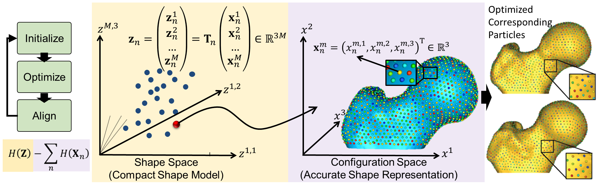
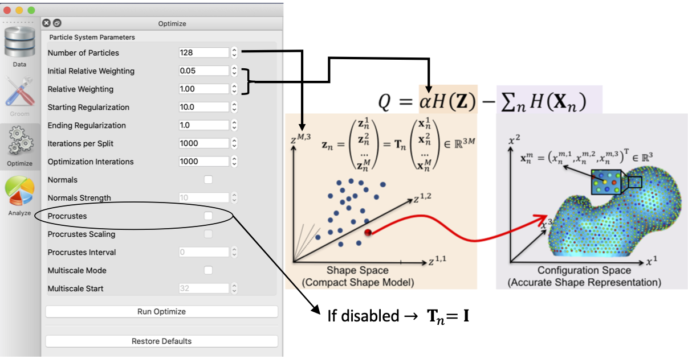
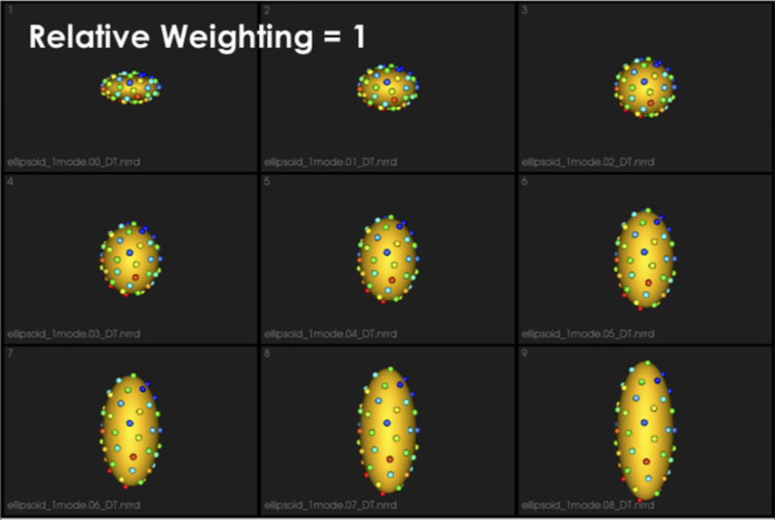
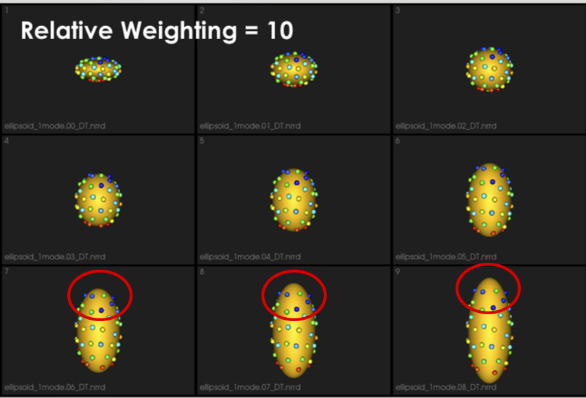
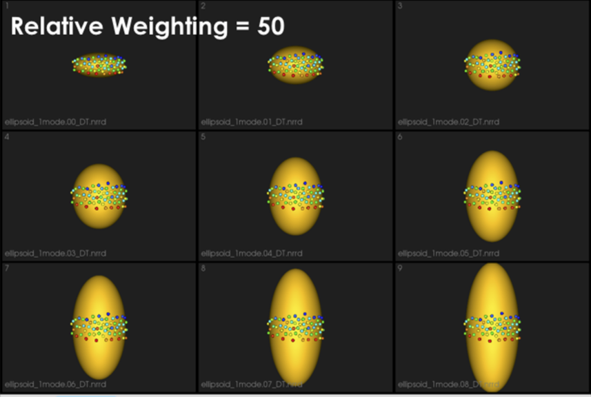
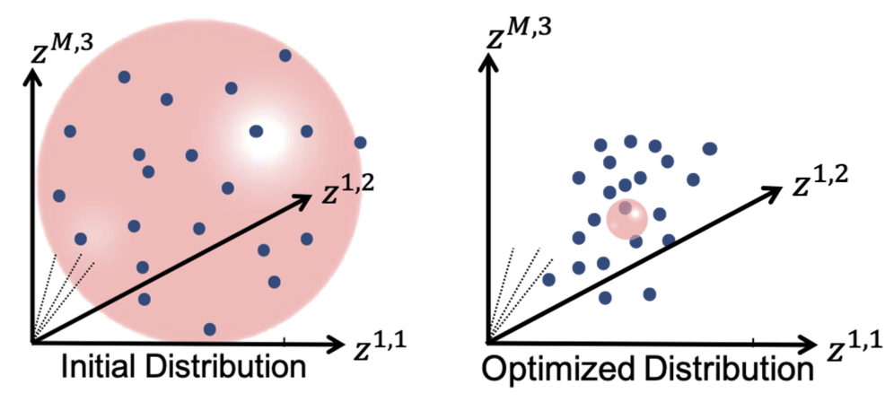
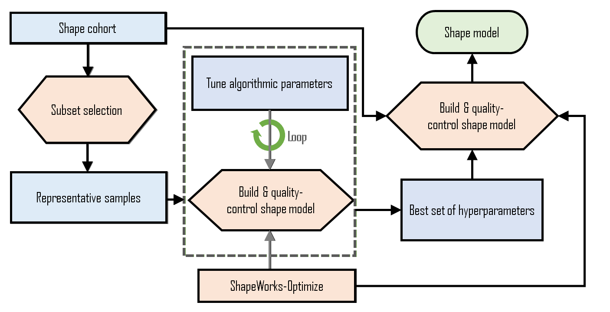

# How to Optimize Your Shape Model?

## Particle-based Shape Modeling

ShapeWorks constructs *statistically optimal anatomical mapping across different shape samples* by automatically computing a dense set of corresponding landmark positions that are geometrically consistent on a set of anatomy segmentations or surface meshes and *does not rely on any specific surface parameterization*. 


ShapeWorks uses a set of *interacting particle systems*, one for each shape, to produce optimal sets of surface correspondences in an ensemble. Particles interact with one another via mutually repelling forces to cover optimally and, therefore, describe surface geometry. Particles are positioned on surfaces automatically by optimizing the model's information content via an entropy optimization scheme. 


*ShapeWorks optimizes landmark positions to minimize the overall information content of the model (first term) while maintaining a good sampling of surface geometry (second term)*



## Particle-based Representation

More formally, consider a cohort of shapes $\mathcal{S} = \{\mathbf{z}_1, \mathbf{z}_2, ..., \mathbf{z}_N\}$ of $N$ surfaces, each with its own set of $M$ corresponding particles $\mathbf{z}_n = [\mathbf{z}_n^1, \mathbf{z}_n^2, ..., \mathbf{z}_n^M] \in \mathbb{R}^{dM}$ where each particle $\mathbf{z}_n^m \in \mathbb{R}^d$ lives in a $d-$dimensional Cartesian space (typically $d=3$ for anatomies), and whose ordering implies correspondence among shapes. Each of the particles is called a *correspondence* point, and is constrained to lie on the shape's surface. Collectively, the set of $M$ particles is known as the *configuration*.

## Shape vs. Configuration Spaces

This particle-based representation incorporates two types of random variables: a *shape space* variable $\mathbf{Z} \in \mathbb{R}^{dM}$ and a particle position variable $\mathbf{X}_n \in \mathbb{R}^d$ that encodes the distribution of particles on the $n-$th shape (*configuration space*). This particle-based representation avoids many of the problems inherent in parametric representations such as the limitation to specific topologies, processing steps necessary to construct parameterizations, and bias toward model initialization. 


## World vs. Local Coordinates

For groupwise modeling, shapes in the shape space should share the same *world* coordinate system. Hence, we use *generalized Procrustes alignment* to estimate a rigid transformation matrix $\mathbf{T}_n$ that can transform the particles in the $n-$th shape *local* coordinate $\mathbf{x}_n^m$ in the configuration space to the world common coordinate $\mathbf{z}_n^m$ in the shape space such that $\mathbf{z}_n^m = \mathbf{T}_n\mathbf{x}_n^m$. 


## Optimization Cost Function

Correspondences are established by minimizing a combined shape correspondence and surface sampling cost function $Q = \alpha H(\mathbf{Z}) - \sum_{n=1}^N H(\mathbf{X}_n)$, where $H$ is an entropy estimation of the shape distribution in the shape space, and $\alpha$ is the relative weighting of the correspondence term. 

In particular, ShapeWorks explicitly models the inherent trade-off between the statistical simplicity of the model (i.e., compactness or lowest entropy) in the *shape space* (i.e., inter-surface) and the accuracy of the shape representations (i.e., good surface samplings or highest entropy) in the *configuration space* (i.e., intra-surface). The cost function $Q$ is minimized using gradient descent with an adaptive time step.


Because correspondence points (or particles) in this formulation are not tied to a specific surface parameterization, the method operates directly on both volumetric data and triangular surface meshes. It can also be easily extended to arbitrary shapes, even nonmanifold surfaces.


## Particles Initialization & Optimization


ShapeWorks entails a nonconvex optimization problem. Hence, it is not practical to perform the optimization of the configuration space (intra-surface) and the shape space (inter-surface) with a full set of correspondence points (or particles) in one step.


We address this using a coarse-to-fine optimization scheme to speed up convergence to an acceptable local minimum. In particular, the optimization is performed as a multi-step process where particles are added via spitting each particle to produce a new, nearby particle at each step until the desired number of particles is reached. 

*ShapeWorks uses a particle splitting strategy, in which the full set of particles is optimized in a multi-scale (i.e., coarse-to-fine) fashion*
<p><video src="https://sci.utah.edu/~shapeworks/doc-resources/mp4s/studio_ellipsoid_optimize.mp4" autoplay muted loop controls style="width:100%"></p>


For these steps, the optimization of the configuration space (intra-surface) and the shape space (inter-surface) is weighted to downplay the effect of the correspondence term (default $\alpha = 0.05$), which results in an evenly spaced distribution of particles on each surface. These steps are collectively called the *initialization* steps.

At each scale, the initialization step is followed by an *optimization* step. For this step, the optimization of the configuration space (intra-surface) and the shape space (inter-surface) are weighted (equally or sometimes using $\alpha > 1$ to emphasize the correspondence term).

Thus, the initialization proceeds simultaneously with the optimization in a multi-scale fashion, generating progressively more detailed correspondence models with each split. 


For both, the initialization and optimization steps, the weighting to the shape space may be set by the user. Further, as each step of the optimization is an iterative process, the number of iterations may be set by the user.

*At each scale, the number of iterations could impact the quality of the optimized model*
<p><video src="https://sci.utah.edu/~shapeworks/doc-resources/mp4s/studio_torus_optimize.mp4" autoplay muted loop controls style="width:100%"></p>


**The first particle:** The particle system is initialized with a single particle on each shape. The first particle is found by raster-scanning the signed distance map and finding the first zero crossing. The particle system can also be initialized using user-defined sparse corresponding landmarks across all shapes.


## On Algorithmic Parameters

Optimizing the shape models entails several algorithmic parameters. Below, we highlight the most important ones that might need tuning depending on the dataset at hand. 



### Correspondence Relative Weighting

One difference between *initialization* and *optimization* steps is how important the correspondence (inter-surface) objective is compared to the surface sampling (intra-surface) term using a relative weighting factor for the correspondence term (i.e., $\alpha$ in $Q$). Hence `initial_relative_weighting` is the weight (or $\alpha$) used in initialization steps and the `relative_weighing` is the weight (or $\alpha$) used for optimization steps.

Typically `initial_relative_weighting` is selected to be small (in the order of 0.01) to enable particles to be uniformly distributed (i.e., evenly spaced) over each shape, and hence optimization starts with a good surface sampling.

It can be noted that by allowing correspondence to dominate the optimization process (using higher relative weighting), particles tend to be distributed in regions with relatively small variability across the given population. As the relative weighting tends to infinity, particles will be cluttered in one spot on each surface, which means that all shapes will be represented as a point at the shape space origin. Also, using lower relative weighting, i.e., allowing surface sampling to dominate the optimization process, results in particles becoming out-of-correspondence.


*As we increase the `relative_weighting`, i.e., the correspondence term weight, particles tend to be distributed over surface regions that have less variability across shape samples; hence the shape distribution in the shape space tends to collapse to a single point (i.e., shape)*





### Shape Statistics in Initialization and  Optimization Steps

At earlier scales, we do not have enough particles to describe the geometry of each surface. Hence, to quantify the notion of correspondence (inter-surface), we use mean energy (i.e., pushing all shapes in the shape space to the mean shape or, in other words, the covariance matrix is assumed to be identity). 

As more particles are added to the correspondence model, we use the entropy of the distribution of the shapes (assumed to be Gaussian distributed), where we have more particles that can reveal the covariance structure of the shape space.

This behavior is controlled by the `use_shape_statistics_after` parameter, which specifies the number of particles, after which shape statistics can be used in the initialization and optimization steps.


*Using shape statistics (i.e., covariance structure) results in a better correspondence over iterations, below we use `use_shape_statistics_after` after 1024 particles*
<p><video src="https://sci.utah.edu/~shapeworks/doc-resources/mp4s/femur_mesh_live.mp4" autoplay muted loop controls style="width:100%"></p>


### Starting and Ending Regularization

Particle movement during optimization (due to the correspondence term) entails computing the covariance matrix's inverse. We regularize the covariance matrix to handle degenerate covariances. 

`starting_regularization` and `ending_regularization` parameters determine the covariance matrix's regularization for the shape-space entropy estimation. This regularization exponentially decays along with optimization iterations where better covariance structure can be estimated with a better correspondence model. 

Higher regularization values would undermine the ensemble's underlying covariance structure and favors all shapes to converge to the mean shape. Hence, it is recommended to use starting regularization value as ~5% of the covariance matrix's expected highest eigenvalue while ending regularization can be taken as ten times less than the starting value.

 
*This regularization can be considered as having a Gaussian ball in the shape space. Starting regularization pushes all samples to the mean and hides the underlying “unoptimized” covariance structure. Ending regularization should be small enough to reveal the optimized covariance structure.*


## Optimizing Correspondences 

You can use either ShapeWorks Studio or `shapeworks optimize <parameters.xml>` command to optimize your shape model. Both use a set of algorithmic parameters to control the optimization process.


### XML Parameter File
        
Here is the list of the parameters to be included in the `<parameters.xml>` file.

* `<inputs>`: List of surface meshes or distance transforms (i.e., groom stage output) that comprises your dataset.
* `<output_dir>`:  The directory to save the output produced by the ShapeWorks optimization.
* `<domain_type>`: (default: image) The type of the domain in `<inputs>`, `image` for signed distance transforms, and `mesh` for triangular surface meshes.
* `<domains_per_shape>`: (default: 1) The number of domains for anatomies with multiple structures (domains), e.g., joints. The list of `<inputs>` should be ordered to list a consistent order of the domains (surface mesh or distance transform) of each shape (e.g., shape1-domain1, shape1-domain2, shape2-domain1, shape2-domain2 ... etc.).
* `<narrow_band>`: (default: 4.0 of `<fixed_domains>` is not active) The off-surface distance (in voxel units, largest spacing dimension) used to truncate (zero out) distance values for signed distance transforms beyond the narrow band radius (i.e., a narrow band of 4.0 preserve distance values within +/- 4.0 voxels off the surface). This is used to reduce the memory footprint required for keeping volumetric distance transforms in memory. If you get an error that particles are shooting outside the narrow band, please consider increasing this value. Narrow banding is disabled if `<fixed_domains>` is active. This does not significantly affect the memory footprint since distance transforms of the fixed domains are not loaded in memory.
* `<number_of_particles>`: The desired number of particles to be placed. ShapeWorks will produce the smallest power-of-2 number of particles greater than or equal the given `<number_of_particles>`.
* `<iterations_per_split>`: (default: 1000) The number of iterations in the initialization step for each split (i.e., scale). 
* `<optimization_iterations>`: (default: 2000) Number of iterations for each optimization step.
* `<save_init_splits>`: (default: 1) A flag to save the particles for each split in the initialization steps. 
* `<use_xyz>`: (default: 1) A flag to enable using the xyz coordinates for particles as a feature for correspondence.
* `<use_normals>`: (default: 0) A flag to consider surface normals (along with particles positions, i.e., `<use_xyz> 1 </use_xyz>`) as a correspondence feature.
* `<attribute_scales>`: A vector of weights that scale each dimension considered in the correspondence entropy. For example, if only xyz coordinates are used for particles, so `<attribute_scales>` is a vector of three weights that scale the x- and y- and z- coordinates of the particle (default = 1). If surface normals are also used, `<attribute_scales>` should be a vector of 6 entries, 3 for the xyz coordinates, and 3 for the surface normal (usually in scale of 10), assuming 3D anatomies.
* `<use_shape_statistics_after>`: (default: -1) (e.g., 32 or 64) The number of particles after which to use shape space entropy (i.e., the covariance structure) in the initialization and optimization steps. Use -1 if you want shape statistics only used when the number of particles reach the desired `<number_of_particles>`. Hence, all initialization and optimization steps will use mean energy till the `<number_of_particles>` is reached.
* `<starting_regularization>`: (default: 1000) Sets the starting regularization value (usually high value).
* `<ending_regularization>`: (default: 1.0) Sets the ending regularization value (usually small value less than 1).
* `<recompute_regularization_interval>`: (default: 1) Skip interval (i.e., number of iterations) to exponentially decay the regularization value.
* `<initial_relative_weighting>`: (default: 0.05) The relative weight of the correspondence term in the initialization steps to make sure that optimization steps start with evenly spaced particle distributions that cover the entire surfaces (usually in the order of ~0.1 or 0.01).
* `<relative_weighting>`: (default: 1) The relative weight of the correspondence term in the optimization steps.
* `<procrustes_scaling>`: (default: 1) A flag to enable factoring out scaling in the shape space when performing Procrustes alignment.
* `<procrustes_interval>`: (default: 3) Number of iterations (interval) between performing Procrustes alignment, use 0 to turn Procrustes off.
* `<mesh_based_attributes>`: (default: 0) A flag that should be enabled when `<use_normals>` is enabled to cache and interpolate surface normals using isosurfaces.
* `<keep_checkpoints>`: (default: 0) A flag to save the shape (correspondence) models through the initialization/optimization steps for debugging and troubleshooting.  
* `<checkpointing_interval>`: (default: 50) The interval (number of iterations) to be used to save the checkpoints.
* `<verbosity>`: (default: 0) '0' : almost zero verbosity (error messages only), '1': minimal verbosity (notification of running initialization/optimization steps), '2': additional details about parameters read from xml and files written, '3': full verbosity.
* `<adaptivity_mode>`: (default: 0) Used to change the expected behavior of the particles sampler, where the sampler is expected to distribute evenly spaced particles to cover all the surface. Currently, 0 is used to trigger the update project method of cutting planes.
* '<cutting_plane_counts>`: Number of cutting planes for each shape if constrained particle optimization is used.
* `<cutting_planes>`: A list of cutting planes to be used for all shapes. Each cutting plane is defined by three points in an order that indicates the plane's normal, i.e., the direction where particles are allowed to be distributed.

### Parameter Dictionary in Python

In `Examples/Python/<use-case-name.py>`, we use a python dictionary to expose important algorithmic parameters and automatically generate the XML parameter file. 

Below is a list of the currently exposed algorithmic parameters. All the keys of this parameter dictionary correspond to the [XML tags](#xml-parameter-file), except for `"normal_weight"` that sets the `<attribute_scales>` of the surface normal vector.

```
{
        "number_of_particles": 1024,
        "use_shape_statistics_after": 32, 
        "use_normals": 0, 
        "normal_weight": 0.0, 
        "checkpointing_interval" : 10000, 
        "keep_checkpoints" : 0, 
        "iterations_per_split" : 4000, 
        "optimization_iterations" : 500, 
        "starting_regularization" : 10, 
        "ending_regularization" : 1, 
        "recompute_regularization_interval" : 2,
        "domains_per_shape" : 1,
        "domain_type" : 'mesh',
        "relative_weighting" : 10,
        "initial_relative_weighting" : 1,
        "procrustes_interval" : 1,
        "procrustes_scaling" : 1,
        "save_init_splits" : 0,
        "verbosity" : 2,
}
```
 
## Parameter Tuning 
 
### General Process
 


The general process for parameter tuning is to:

1. Select a subsample of data to tune on.
2. Start with default parameters and a small number of particles.
3. Tune parameters one at a time until particles are evenly spread over the entire geometry and in good correspondence.
4. Optimize on the entire cohort with the best set of hyper-parameters and desired number of particles to get the final shape model. 

### Qualitative Assessment

To assess the quality of an optimized shape model, consider the following:

- Are the particles evenly spaced, covering the entire geometry of each sample?
- Are the particles in good correspondence across the samples? This can be assessed by inspecting the neighboring correspondences of particles (in Studio hover over a particle and press ‘1’ to visualize).
- Does the surface reconstruction result in non-anatomical/plausible shapes?
- Do the shape modes of variation (PCA) reflect meaningful and are they smooth variations? All particles should move at similar velocities and along similar trajectories to their neighbors.  
 
### Tips and Tricks
 
- **Use a Subsample**: To reduce the time spent tuning algorithmic parameters for model optimization, tuning should be done on a representative subsample. If working with complex shapes or highly variable anatomies, start with a small subset (e.g., 5 samples) with shapes that are most similar. A clustering-based approach can be used to automate this selection e.g., k-means on segmentations, spectral clustering on meshes. Once parameters have been found which result in a good correspondence model on the subset, the subset size can be increased. It may be helpful to increase the subset size and re-assess before moving to the full cohort. 
- **Start Small**: Parameter tuning time can also be decreased by starting with a smaller number of particles and iterations than desired. In general, parameters which yield a good shape model with fewer particles will also yield a good model with increased particles. For this reason, the number of particles should be the last parameter tuned. 
- **Procrustes**: Only consider using Procrustes if the groomed cohort has left-out misalignments.
- **Unevenly Distributed**: If particles are not evenly distributed on the surface, try increasing initialization iterations or decreasing relative weighting.
- **Bad Correspondence**: If particles are not in good correspondence, try increasing relative weighting. If particles are flipping sides on thin structures, enabling normals can resolve this.

## Correspondences on New Samples


ShapeWorks supports an optimization mode, namely *fixed domains*, to place (i.e., optimize) correspondences on new shapes using a pre-existing shape model. In the fixed domains mode, particles on selected shapes that construct the pre-existing shape model are fixed, and particles on new shapes are optimized to represent them in the context of this shape model. See [Fixed Domains for Ellipsoid: Correspondences on New Shape](../use-cases/segmentation-based/fixed-domain-ellipsoid.md) for an example. 

To enable the fixed domains mode, the XML should have the below additional tags. For this mode, you can use `"use_shape_statistics_after": 0` to enable shape statistics in all the steps as the pre-existing shape model already has enough particles optimized to reflect the covariance structure in the shape space.

* `<point_files>`: A list of *local.particles* files to be fixed, i.e., the pre-existing shape model. The new (to be optimized) samples/domains should be initialized with the mean particles.
* `<fixed_domains>`: A list of domain ids (starting from 0) of the domains that are fixed (i.e., not optimized).
 
