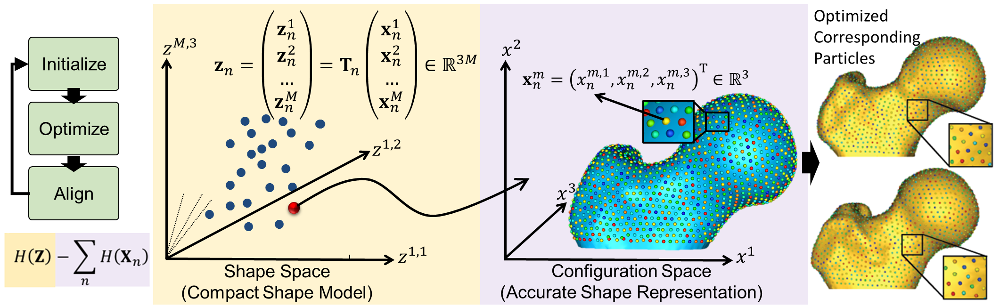
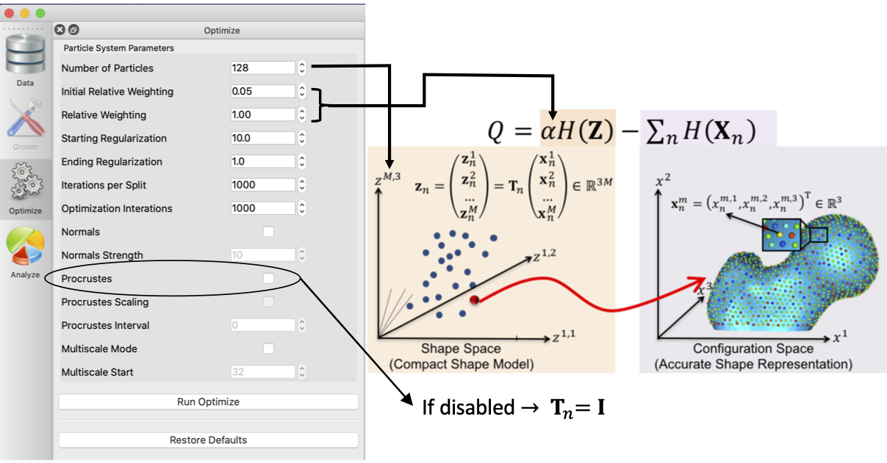
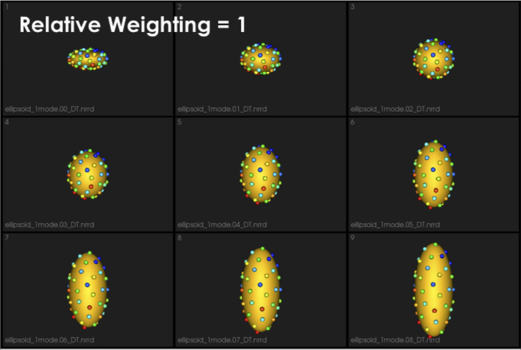
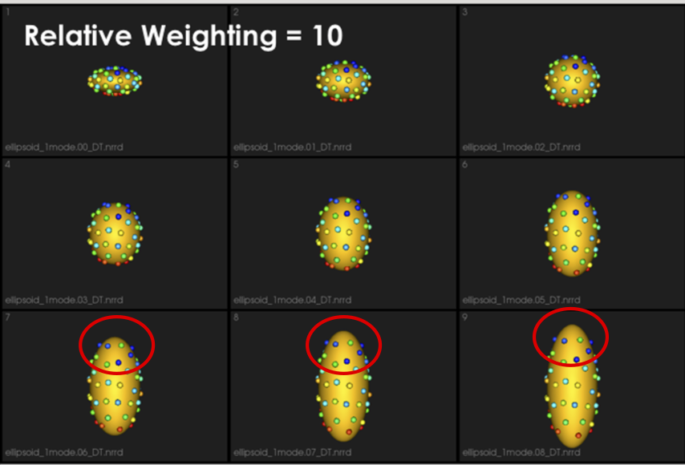
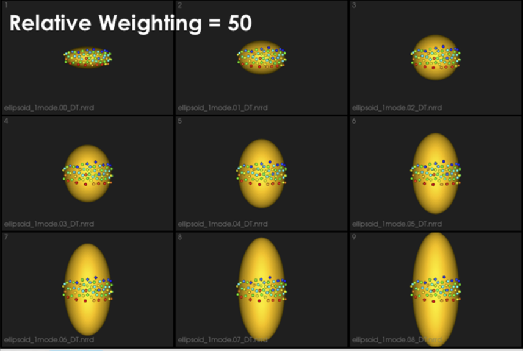
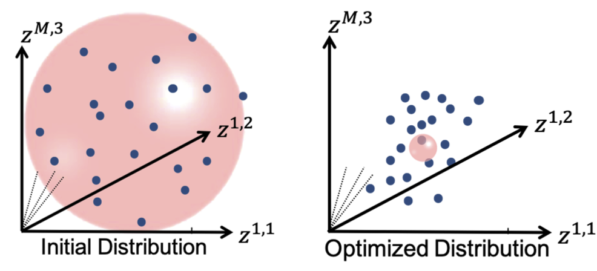
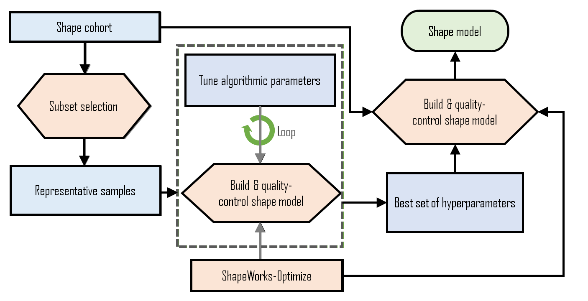

# How to Optimize Your Shape Model?

## Particle-based Shape Modeling

ShapeWorks constructs *statistically optimal anatomical mapping across different shape samples* by automatically computing a dense set of corresponding landmark positions that are geometrically consistent on a set of anatomy segmentations or surface meshes and *does not rely on any specific surface parameterization*. 


ShapeWorks uses a set of *interacting particle systems*, one for each shape, to produce optimal sets of surface correspondences in an ensemble. Particles interact with one another via mutually repelling forces to cover optimally and, therefore, describe surface geometry. Particles are positioned on surfaces automatically by optimizing the model's information content via an entropy optimization scheme. 


*ShapeWorks optimizes landmark positions to minimize the overall information content of the model (first term) while maintaining a good sampling of surface geometry (second term)*



## Particle-based Representation

More formally, consider a cohort of shapes $\mathcal{S} = \{\mathbf{z}_1, \mathbf{z}_2, ..., \mathbf{z}_N\}$ of $N$ surfaces, each with its own set of $M$ corresponding particles $\mathbf{z}_n = [\mathbf{z}_n^1, \mathbf{z}_n^2, ..., \mathbf{z}_n^M] \in \mathbb{R}^{dM}$ where each particle $\mathbf{z}_n^m \in \mathbb{R}^d$ lives in a $d-$dimensional Cartesian space (typically $d=3$ for anatomies), and whose ordering implies correspondence among shapes. Each of the particles is called a *correspondence* point, and is constrained to lie on the shape's surface. Collectively, the set of $M$ particles is known as the *configuration*.

## Shape vs. Configuration Spaces

This particle-based representation incorporates two types of random variables: a *shape space* variable $\mathbf{Z} \in \mathbb{R}^{dM}$ and a particle position variable $\mathbf{X}_n \in \mathbb{R}^d$ that encodes the distribution of particles on the $n-$th shape (*configuration space*). This particle-based representation avoids many of the problems inherent in parametric representations such as the limitation to specific topologies, processing steps necessary to construct parameterizations, and bias toward model initialization. 


## World vs. Local Coordinates

For groupwise modeling, shapes in the shape space should share the same *world* coordinate system. Hence, we use *generalized Procrustes alignment* to estimate a rigid transformation matrix $\mathbf{T}_n$ that can transform the particles in the $n-$th shape *local* coordinate $\mathbf{x}_n^m$ in the configuration space to the world common coordinate $\mathbf{z}_n^m$ in the shape space such that $\mathbf{z}_n^m = \mathbf{T}_n\mathbf{x}_n^m$. 


## Optimization Cost Function

Correspondences are established by minimizing a combined shape correspondence and surface sampling cost function $Q = \alpha H(\mathbf{Z}) - \sum_{n=1}^N H(\mathbf{X}_n)$, where $H$ is an entropy estimation of the shape distribution in the shape space, and $\alpha$ is the relative weighting of the correspondence term. 

In particular, ShapeWorks explicitly models the inherent trade-off between the statistical simplicity of the model (i.e., compactness or lowest entropy) in the *shape space* (i.e., inter-surface) and the accuracy of the shape representations (i.e., good surface samplings or highest entropy) in the *configuration space* (i.e., intra-surface). The cost function $Q$ is minimized using gradient descent with an adaptive time step.


Because correspondence points (or particles) in this formulation are not tied to a specific surface parameterization, the method operates directly on both volumetric data and triangular surface meshes. It can also be easily extended to arbitrary shapes, even nonmanifold surfaces.


## Particles Initialization & Optimization


ShapeWorks entails a nonconvex optimization problem. Hence, it is not practical to perform the optimization of the configuration space (intra-surface) and the shape space (inter-surface) with a full set of correspondence points (or particles) in one step.


We address this using a coarse-to-fine optimization scheme to speed up convergence to an acceptable local minimum. In particular, the optimization is performed as a multi-step process where particles are added via spitting each particle to produce a new, nearby particle at each step until the desired number of particles is reached. 

*ShapeWorks uses a particle splitting strategy, in which the full set of particles is optimized in a multi-scale (i.e., coarse-to-fine) fashion*
<p><video src="https://sci.utah.edu/~shapeworks/doc-resources/mp4s/studio_ellipsoid_optimize.mp4" autoplay muted loop controls style="width:100%"></p>


For these steps, the optimization of the configuration space (intra-surface) and the shape space (inter-surface) is weighted to downplay the effect of the correspondence term (default $\alpha = 0.05$), which results in an evenly spaced distribution of particles on each surface. These steps are collectively called the *initialization* steps.

At each scale, the initialization step is followed by an *optimization* step. For this step, the optimization of the configuration space (intra-surface) and the shape space (inter-surface) are weighted (equally or sometimes using $\alpha > 1$ to emphasize the correspondence term).

Thus, the initialization proceeds simultaneously with the optimization in a multi-scale fashion, generating progressively more detailed correspondence models with each split. 


For both, the initialization and optimization steps, the weighting to the shape space may be set by the user. Further, as each step of the optimization is an iterative process, the number of iterations may be set by the user.

*At each scale, the number of iterations could impact the quality of the optimized model*
<p><video src="https://sci.utah.edu/~shapeworks/doc-resources/mp4s/studio_torus_optimize.mp4" autoplay muted loop controls style="width:100%"></p>


**The first particle:** The particle system is initialized with a single particle on each shape. The first particle is found by raster-scanning the signed distance map and finding the first zero crossing. The particle system can also be initialized using user-defined sparse corresponding landmarks across all shapes.


### Registration Based Initialization

The splitting scheme described above spreads and optimizes particles on every shape at once. As an
alternative, particles can be spread over a **single reference shape** and then carried onto every
other shape by deformably registering the reference to it. Each shape then starts the optimization
already holding a full set of corresponding particles, so no splitting is needed.

**This is not a general replacement for splitting.** It exists for anatomy complex enough that
splitting fails to converge to a usable correspondence — highly convoluted surfaces, or shapes with
many separate lobes or appendages. Registering one shape to another costs far more than splitting
does, so on anatomy where splitting already works, this is slower with nothing to show for it. Reach
for it when a split-based model comes out poorly, not by default.

In Studio, tick **Registration Initialization** in the Optimize panel. Outside Studio, set
`initialization_mode` to `registration` in the project file's `optimize` parameters, alongside
`number_of_particles` and the rest:

```
"optimize": {
    "number_of_particles": "128",
    "initialization_mode": "registration",
    ...
}
```

or from Python:

```python
params = project.get_parameters("optimize")
params.set("initialization_mode", "registration")
project.set_parameters("optimize", params)
```

The reference shape is chosen automatically. If grooming already picked an alignment reference, that
choice is reused; otherwise the most representative shape (the medoid of the cohort) is found. To
pick one yourself, set `initialization_reference` to its subject index.

Registration runs the same sequence of stages as the ANTs `SyNRA` pipeline — rigid, then affine, then
symmetric normalization (SyN) — over distance transforms of the two shapes, using the same
multi-resolution schedule ANTs does. The linear stages deliberately run far longer and start coarser
than the deformable one: their coarse levels are cheap, and an unconverged linear stage leaves the
deformable stage with a starting point it cannot recover from. Transferred particles are
projected back onto the target surface, and the optimization step then refines both their spacing and
their correspondence as usual.

**Reusing registrations between runs.** A registration depends only on the pair of shapes and the
registration settings, never on the particle count, iteration counts or weightings. Computed
transforms are therefore cached in a `registration_cache` directory beside the project, so that the
optimization parameters can be changed and the model rebuilt without paying for the registrations a
second time. Regrooming an input invalidates its entries automatically. Set the `registration_cache`
parameter to `false` to turn this off. The cache holds a displacement field per pair of shapes, on the
order of tens of megabytes each, so delete the directory when finished with a cohort.

Notes and limitations:

- It cannot be combined with fixed subjects or with landmark initial particles, since those also
  supply the initial correspondence. Contour domains are not supported.
- Multiscale optimization does not apply, because every shape starts at the final particle count.
- Every shape inherits the reference's particle layout. For cohorts with large shape variation this
  can produce a worse model than splitting; compare compactness and generalization before adopting it.
- Registration dominates the run time, taking far longer than splitting the same cohort would.  The
  cost scales with the number of shapes and the size of the images, not with the particle count.
- ShapeWorks reports how far the transferred particles landed from each target surface, and warns when
  a registration looks like it failed. Very small or very coarsely sampled inputs are the usual cause.

**Tuning speed vs. detail (mesh inputs).** A mesh is rasterized to a distance transform before
registering; `registration_grid_size` sets that resolution, in voxels across the largest dimension
(default 128). Lowering it (e.g. 96 or 64) is markedly faster and coarser — useful for a quick pass
or a large cohort — while raising it is finer at cubic cost in both time and the size of each cached
transform. In practice 128 is a good default and gains above ~192 are small; this only affects mesh
inputs, since image (distance-transform) inputs already have a resolution. The `registration_band`
(the width of the surface collar the similarity metric sees) is scaled automatically from the shape
size and does not shrink as the grid is raised; set it explicitly only to widen the context for
cohorts whose shapes differ substantially.


## On Algorithmic Parameters

Optimizing the shape models entails several algorithmic parameters. Below, we highlight the most important ones that might need tuning depending on the dataset at hand. 



### Correspondence Relative Weighting

One difference between *initialization* and *optimization* steps is how important the correspondence (inter-surface) objective is compared to the surface sampling (intra-surface) term using a relative weighting factor for the correspondence term (i.e., $\alpha$ in $Q$). Hence `initial_relative_weighting` is the weight (or $\alpha$) used in initialization steps and the `relative_weighing` is the weight (or $\alpha$) used for optimization steps.

Typically `initial_relative_weighting` is selected to be small (in the order of 0.01) to enable particles to be uniformly distributed (i.e., evenly spaced) over each shape, and hence optimization starts with a good surface sampling.

It can be noted that by allowing correspondence to dominate the optimization process (using higher relative weighting), particles tend to be distributed in regions with relatively small variability across the given population. As the relative weighting tends to infinity, particles will be cluttered in one spot on each surface, which means that all shapes will be represented as a point at the shape space origin. Also, using lower relative weighting, i.e., allowing surface sampling to dominate the optimization process, results in particles becoming out-of-correspondence.


*As we increase the `relative_weighting`, i.e., the correspondence term weight, particles tend to be distributed over surface regions that have less variability across shape samples; hence the shape distribution in the shape space tends to collapse to a single point (i.e., shape)*





### Shape Statistics in Initialization and  Optimization Steps

At earlier scales, we do not have enough particles to describe the geometry of each surface. Hence, to quantify the notion of correspondence (inter-surface), we use mean energy (i.e., pushing all shapes in the shape space to the mean shape or, in other words, the covariance matrix is assumed to be identity). 

As more particles are added to the correspondence model, we use the entropy of the distribution of the shapes (assumed to be Gaussian distributed), where we have more particles that can reveal the covariance structure of the shape space.

This behavior is controlled by the `use_shape_statistics_after` parameter, which specifies the number of particles, after which shape statistics can be used in the initialization and optimization steps.


*Using shape statistics (i.e., covariance structure) results in a better correspondence over iterations, below we use `use_shape_statistics_after` after 1024 particles*
<p><video src="https://sci.utah.edu/~shapeworks/doc-resources/mp4s/femur_mesh_live.mp4" autoplay muted loop controls style="width:100%"></p>


### Starting and Ending Regularization

Particle movement during optimization (due to the correspondence term) entails computing the covariance matrix's inverse. We regularize the covariance matrix to handle degenerate covariances. 

`starting_regularization` and `ending_regularization` parameters determine the covariance matrix's regularization for the shape-space entropy estimation. This regularization exponentially decays along with optimization iterations where better covariance structure can be estimated with a better correspondence model. 

Higher regularization values would undermine the ensemble's underlying covariance structure and favors all shapes to converge to the mean shape. Hence, it is recommended to use starting regularization value as ~5% of the covariance matrix's expected highest eigenvalue while ending regularization can be taken as ten times less than the starting value.

 
*This regularization can be considered as having a Gaussian ball in the shape space. Starting regularization pushes all samples to the mean and hides the underlying “unoptimized” covariance structure. Ending regularization should be small enough to reveal the optimized covariance structure.*


## Optimizing Correspondences 

You can use either ShapeWorks Studio or `shapeworks optimize <parameters.xml>` or `shapeworks optimize <project.xlsx>` command to optimize your shape model. Both use a set of algorithmic parameters to control the optimization process.

See the  for details regarding the XML file and project file format. 

 
## Parameter Tuning 
 
### General Process
 


The general process for parameter tuning is to:

1. Select a subsample of data to tune on.
2. Start with default parameters and a small number of particles.
3. Tune parameters one at a time until particles are evenly spread over the entire geometry and in good correspondence.
4. Optimize on the entire cohort with the best set of hyper-parameters and desired number of particles to get the final shape model. 

### Qualitative Assessment

To assess the quality of an optimized shape model, consider the following:

- Are the particles evenly spaced, covering the entire geometry of each sample?
- Are the particles in good correspondence across the samples? This can be assessed by inspecting the neighboring correspondences of particles (in Studio hover over a particle and press ‘1’ to visualize).
- Does the surface reconstruction result in non-anatomical/plausible shapes?
- Do the shape modes of variation (PCA) reflect meaningful and are they smooth variations? All particles should move at similar velocities and along similar trajectories to their neighbors.  
 
### Tips and Tricks
 
- **Use a Subsample**: To reduce the time spent tuning algorithmic parameters for model optimization, tuning should be done on a representative subsample. If working with complex shapes or highly variable anatomies, start with a small subset (e.g., 5 samples) with shapes that are most similar. A clustering-based approach can be used to automate this selection e.g., k-means on segmentations, spectral clustering on meshes. Once parameters have been found which result in a good correspondence model on the subset, the subset size can be increased. It may be helpful to increase the subset size and re-assess before moving to the full cohort. 
- **Start Small**: Parameter tuning time can also be decreased by starting with a smaller number of particles and iterations than desired. In general, parameters which yield a good shape model with fewer particles will also yield a good model with increased particles. For this reason, the number of particles should be the last parameter tuned. 
- **Procrustes**: Only consider using Procrustes if the groomed cohort has left-out misalignments.
- **Unevenly Distributed**: If particles are not evenly distributed on the surface, try increasing initialization iterations or decreasing relative weighting.
- **Bad Correspondence**: If particles are not in good correspondence, try increasing relative weighting. If particles are flipping sides on thin structures, enabling normals can resolve this.

## Correspondences on New Samples


ShapeWorks supports an optimization mode, namely *fixed domains*, to place (i.e., optimize) correspondences on new shapes using a pre-existing shape model. In the fixed domains mode, particles on selected shapes that construct the pre-existing shape model are fixed, and particles on new shapes are optimized to represent them in the context of this shape model. See [Fixed Domains for Ellipsoid: Correspondences on New Shape](../use-cases/multistep/fixed-domain-ellipsoid.md) for an example.

To enable fixed domains in a project file, set the following parameters:

* `use_fixed_subjects`: Set to `1` to enable fixed domains mode.
* `fixed_subjects_column`: The column name in the project spreadsheet that marks which shapes are fixed (e.g., `"fixed"`).
* `fixed_subjects_choice`: The value in that column that identifies fixed shapes (e.g., `"yes"`).

For this mode, you can use `"use_shape_statistics_after": 0` to enable shape statistics in all the steps as the pre-existing shape model already has enough particles optimized to reflect the covariance structure in the shape space.

### PCA Projection Correspondence

By default, the correspondence term in fixed domain optimization minimizes ensemble entropy, which can pull new shapes toward the population mean. The `use_pca_projection` parameter offers an alternative: particles are projected into the PCA space of the fixed shapes, and only the **out-of-model residual** (the component not explained by any PCA mode) receives a gradient. Variation along PCA modes is left unconstrained, allowing new shapes to retain their natural deviation from the mean.

To enable, add to the optimize parameters:

```json
"use_pca_projection": true
```
 
