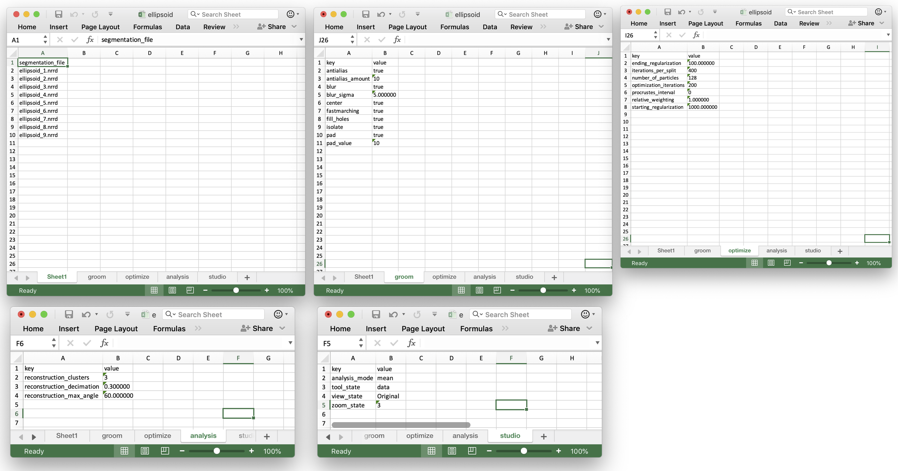

`ShapeWorks` supports two formats for handling the data for performing grooming and optimization via the python interface and `ShapeWorksStudio`:

* [XML Parameter file](parameters.md#xml-parameter-file)

* [Project excel file](parameters.md#project-excel-file)

* [Project JSON file (swproj)](parameters.md#project-json-file)

The project excel/json file formats are the current standard project file format. The older XML format is deprecated and will not have newer features added to it.  Users are encouraged to use the project excel/json file.  

### XML Parameter File (deprecated)
	
Here is the list of the parameters to be included in the `<parameters.xml>` file.

* `<inputs>`: List of surface meshes or distance transforms (i.e., groom stage output) that comprises your dataset.
* `<output_dir>`:  The directory to save the output produced by the ShapeWorks optimization.
* `<domain_type>`: (default: image) The type of the domain in `<inputs>`, `image` for signed distance transforms, and `mesh` for triangular surface meshes.
* `<domains_per_shape>`: (default: 1) The number of domains for anatomies with multiple structures (domains), e.g., joints. The list of `<inputs>` should be ordered to list a consistent order of the domains (surface mesh or distance transform) of each shape (e.g., shape1-domain1, shape1-domain2, shape2-domain1, shape2-domain2 ... etc.).
* `<narrow_band>`: (default: 4.0 of `<fixed_domains>` is not active) The off-surface distance (in voxel units, largest spacing dimension) used to truncate (zero out) distance values for signed distance transforms beyond the narrow band radius (i.e., a narrow band of 4.0 preserve distance values within +/- 4.0 voxels off the surface). This is used to reduce the memory footprint required for keeping volumetric distance transforms in memory. If you get an error that particles are shooting outside the narrow band, please consider increasing this value. Narrow banding is disabled if `<fixed_domains>` is active. This does not significantly affect the memory footprint since distance transforms of the fixed domains are not loaded in memory.
* `<number_of_particles>`: The desired number of particles to be placed. ShapeWorks will produce the smallest power-of-2 number of particles greater than or equal to the given `<number_of_particles>.`
* `<iterations_per_split>`: (default: 1000) The number of iterations in the initialization step for each split (i.e., scale). 
* `<optimization_iterations>`: (default: 2000) Number of iterations for each optimization step.
* `<save_init_splits>`: (default: 1) A flag to save the particles for each split in the initialization steps. 
* `<use_xyz>`: (default: 1) A flag to enable using the XYZ coordinates for particles as a feature for correspondence.
* `<use_normals>`: (default: 0) A flag to consider surface normals (along with particles positions, i.e., `<use_xyz> 1 </use_xyz>`) as a correspondence feature.
* `<attribute_scales>`: A vector of weights that scale each dimension considered in the correspondence entropy. For example, if only XYZ coordinates are used for particles, `<attribute_scales>` is a vector of three weights that scale the particle's x- and y- and z- coordinates (default = 1). If surface normals are also used, `<attribute_scales>` should be a vector of 6 entries, 3 for the XYZ coordinates, and 3 for the surface normal (usually on a scale of 10), assuming 3D anatomies.
* `<use_shape_statistics_after>`: (default: -1) (e.g., 32 or 64) The number of particles after which to use shape space entropy (i.e., the covariance structure) in the initialization and optimization steps. Use -1 if you want shape statistics only used when the number of particles reaches the desired `<number_of_particles>`. Hence, all initialization and optimization steps will use mean energy till the `<number_of_particles>` is reached.
* `<starting_regularization>`: (default: 1000) Sets the starting regularization value (usually high value).
* `<ending_regularization>`: (default: 1.0) Sets the ending regularization value (usually small value less than 1).
* `<initial_relative_weighting>`: (default: 0.05) The relative weight of the correspondence term in the initialization steps to make sure that optimization steps start with evenly spaced particle distributions that cover the entire surfaces (usually in the order of ~0.1 or 0.01).
* `<relative_weighting>`: (default: 1) The relative weight of the correspondence term in the optimization steps.
* `<procrustes_scaling>`: (default: 1) A flag to enable factoring out scaling in the shape space when performing the Procrustes alignment.
* `<procrustes_interval>`: (default: 3) Number of iterations (interval) between performing Procrustes alignment; use 0 to turn Procrustes off.
* `<mesh_based_attributes>`: (default: 0) A flag that should be enabled when `<use_normals>` is enabled to cache and interpolate surface normals using isosurfaces.
* `<keep_checkpoints>`: (default: 0) A flag to save the shape (correspondence) models through the initialization/optimization steps for debugging and troubleshooting.  
* `<checkpointing_interval>`: (default: 50) The interval (number of iterations) to be used to save the checkpoints.
* `<verbosity>`: (default: 0) '0' : almost zero verbosity (error messages only), '1': minimal verbosity (notification of running initialization/optimization steps), '2': additional details about parameters read from xml and files written, '3': full verbosity.
* `<adaptivity_mode>`: (default: 0) Used to change the expected behavior of the particles sampler, where the sampler is expected to distribute evenly spaced particles to cover all the surface. Currently, 0 is used to trigger the update project method of cutting planes.
* '<cutting_plane_counts>`: Number of cutting planes for each shape if constrained particle optimization is used.
* `<cutting_planes>`: A list of cutting planes for all shapes. Three points define each cutting plane in an order that indicates the plane's normal, i.e., the direction where particles are allowed to be distributed.

### Parameter Dictionary in Python
Prior to `ShapeWorks 6.3`, all the In `Examples/Python/<use-case-name.py>`,we used XML files to run optimization. A python code - `Examples/Python/OptimizeUtils.py` was used to convert a list of parameter dictionary in python to an XML file. 

Below is a list of the currently exposed algorithmic parameters. All the keys of this parameter dictionary correspond to the [XML tags](#xml-parameter-file), except for `"normals_strength"` that sets the `<attribute_scales>` of the surface normal vector.

```python
{
	"number_of_particles": 1024,
	"use_normals": 0, 
	"normals_strength": 0.0, 
	"checkpointing_interval" : 10000, 
	"keep_checkpoints" : 0, 
	"iterations_per_split" : 4000, 
	"optimization_iterations" : 500, 
	"starting_regularization" : 10, 
	"ending_regularization" : 1, 
	"relative_weighting" : 10,
	"initial_relative_weighting" : 1,
	"procrustes_interval" : 1,
	"procrustes_scaling" : 1,
	"save_init_splits" : 0,
	"verbosity" : 2,
}
```


## Project Excel File

ShapeWorks Studio and the `shapeworks` commands `groom` and `optimize` use a new project format based on XLSX. The new spreadsheet format profiles a uniform, easy to edit, easy to organize way of inputting data into shapeworks for grooming, optimizing, and analyzing data.



Users input shapes (either binary segmentations or meshes) in the first sheet (or datasheet) using unique column names to indicate type:


| Prefix | Description |
| --- | ----------- |
| shape_&lt;name&gt; | An input shape (segmentation/mesh) with a given name.<br>* Specify multiple shape_&lt;name&gt; columns to input multiple anatomies for each subject |
| group_&lt;name&gt; | An group column with categorical types |
| feature_&lt;name&gt; | A feature volume (such as an MRI or CT) |

<br/>
Many other columns will be filled in automatically by the ShapeWorks tools.

A more complete example is provided in Examples/Studio/FeatureMap/feature_map_example.xlsx :

{: width="300" }

After completing the grooming and optimization steps, this worksheet will look like this:


There will also be new worksheets with parameters from those tools and other studio settings.

## Project JSON File

ShapeWorks also supports a JSON version of the Excel project file for easier interoperability with other tools as well as text editor support.

The format is very similar to that of the Excel spreadsheet with JSON objects for each sheet and for the data sheet, one object per subject with key/values the same as spreasheet columns.

For example:

```
{
    "data": [
        {
            "name": "",
            "shape_femur": "195916_R_FM_align.nrrd",
            "shape_pelvis": "195916_R_PV_align.ply",
            "groomed_femur": "groomed/195916_R_FM_align_DT.nrrd",
            "groomed_pelvis": "groomed/195916_R_PV_align_groomed.vtk",
        },
        {
            "name": "",
            "shape_femur": "187609_R_FM_align.nrrd",
            "shape_pelvis": "187609_R_PV_align.ply",
            "groomed_femur": "groomed/187609_R_FM_align_DT.nrrd",
            "groomed_pelvis": "groomed/187609_R_PV_align_groomed.vtk",
        },
	...
	"optimize": {
        "ending_regularization": "1.000000",
        "geodesic_cache_multiplier": "0",
        "initial_relative_weighting": "0.050000",
        "iterations_per_split": "1000",
        "multiscale": "false",
        "multiscale_particles": "32",
	...
```		

### Python API for Generation Project Sheet
The `Project` class of `ShapeWorks` lets you create the project excel sheet. It comprises various functions to add the input shape names, groomed file names, optimization parameters, transform matrices, etc. A details description of the C++ class and its functions can be found [here](http://sciinstitute.github.io/ShapeWorks/6.3/api/Classes/classshapeworks_1_1Project.html#detailed-description). The C++ functions also have a python interface, the use of which is demonstrated in the use cases. 
Setting up the project sheet using the python API entails the following steps:

1. **Subjects:** Each input shape(segmentation/mesh) is called a `subject`. This represents a single row of the datasheet. Using the Python API, an object of type `Subject` can be initialized, and the following properties can be set:

	1. **Number of domains**
	2. **Original filename**: Filename (including the relative path) of the input shape
	3. **Groomed filename**: Filename (including the relative path) of the groomed shape
	4. **Groomed transform**: Transform matrix obtained after grooming( list of 16 numbers). The 4x4 matrix should follow [VTK transform matrix](https://vtk.org/doc/nightly/html/classvtkTransform.html) format. 
	5. **Constraint filename**: Filename of the JSON file containing the plane constraint. Example of JSON file containing two plane constraints

```JSON
{
    "planes": [
            {
            "points": [[ 10, 10, 0 ],
                       [-10,-10, 0 ],
                       [ 10,-10, 0 ]] 
            },
            {
            "points": [[ 10, 0, 10 ],
                       [-10, 0, 10 ],
                       [ 10, 0,-10 ]] 
            }
              ] 
}
```

Setting up the subjects
```python
# Set subjects
    subjects = []
    number_domains = 1
    transforms = np.eye(4) # 4x4 matrix
    for i in range(number_of_shapes):
	subject = sw.Subject()
	subject.set_number_of_domains(number_domains)
	subject.set_original_filenames(input_shape_name[i])
	subject.set_groomed_filenames(groomed_shape_name[i])
	transform = [ transforms.flatten() ] #flatten into a vector and convert to list
	subject.set_groomed_transforms(transform)
	subject.set_constraints_filenames(plane_name[i]) #name pf the json file of the constraint plane
	subjects.append(subject) # create a list of all subjects
```
Specify if the shape is part of fixed domain.
If the shape is marked with "fixed" = "yes" they refer to the shapes of the pre-existing model
If the shape is marked with "fixed" = "no", new correspondences will be placed on these new shapes using a pre-existing shape model. 
	
```python
	subject.set_extra_values({"fixed": "yes"}) 
```

If there are multiple domains, the subjects will contain list of string of filenames. 
```python
# Set subjects
    subjects = []
    domains_per_shape = 2
    for i in range(number_of_shapes):
        subject = sw.Subject()
        subject.set_number_of_domains(domains_per_shape)
        rel_seg_files = []
        rel_groom_files = []
        transform = []
        for d in range(domains_per_shape):
            shape_files += input_shape_name[i*domains_per_shape+d]
            groom_files += groomed_shape_name[i*domains_per_shape+d]
            transform.append(transforms[i*domains_per_shape+d].flatten())

        subject.set_groomed_transforms(transform)
        subject.set_groomed_filenames(groom_files)
        subject.set_original_filenames(shape_files)
        subjects.append(subject)
```
2. **Parameters:** Each optimization parameter can be set using `Parameter` object. The `parameter` object consists of a list of type `Variant`
```python
    parameters = sw.Parameters()

    # Create a dictionary for all the parameters required by optimization
    parameter_dictionary = {
	"number_of_particles" : 512,
	"use_normals": 0,
	"normals_strength": 10.0,
	"checkpointing_interval" : 200,
	"keep_checkpoints" : 0,
	"iterations_per_split" : 1000,
	"optimization_iterations" : 500,
	"starting_regularization" : 100,
	"ending_regularization" : 0.1,
	"recompute_regularization_interval" : 2,
	"domains_per_shape" : 1,
	"relative_weighting" : 10,
	"initial_relative_weighting" : 0.1,
	"procrustes" : 1,
	"procrustes_interval" : 1,
	"procrustes_scaling" : 1,
	"save_init_splits" : 1,
	"debug_projection" : 0,
	"verbosity" : 0,
	"use_statistics_in_init" : 0,
	"adaptivity_mode": 0
    } 

    for key in parameter_dictionary:
	parameters.set(key,sw.Variant([parameter_dictionary[key]]))
    parameters.set("domain_type",sw.Variant('mesh'))
```
3. **Project:** Once, the list of subjects and parameters, are created, they can be set in the project file using the `Project` object

```python
    # Set project
    project = sw.Project()
    project.set_subjects(subjects)
    # provide the sheet name - 'optimize' for the optimization parameter
    project.set_parameters("optimize",parameters)
    project.save(spreadsheet_file)
```
