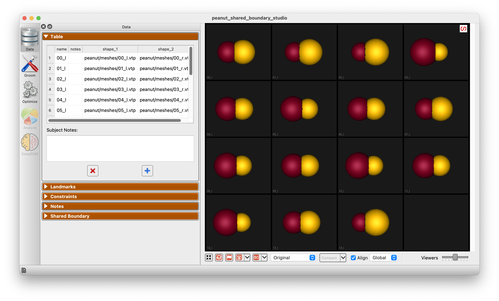
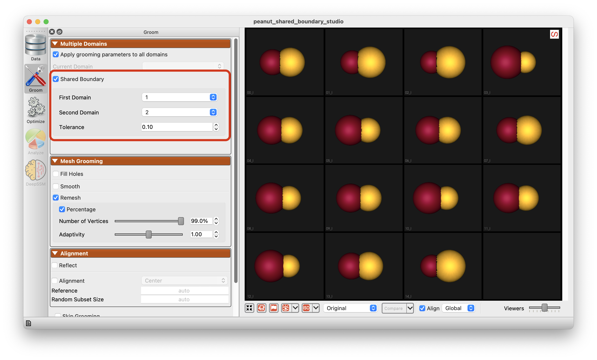
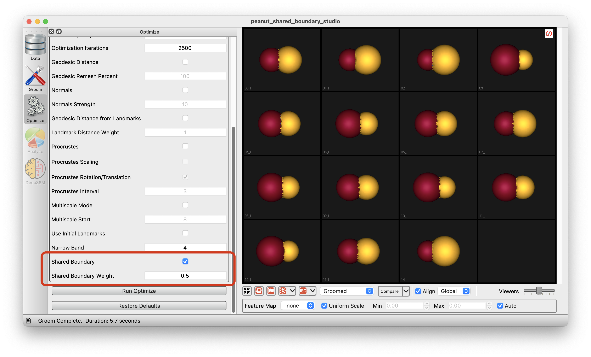
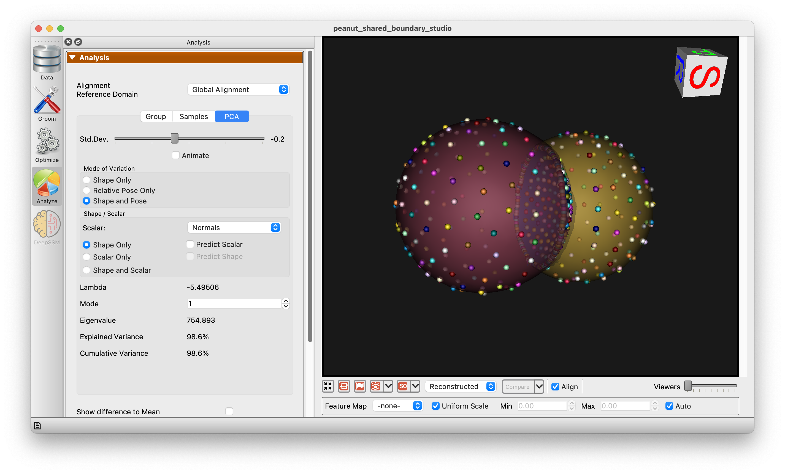

# Shared Boundaries in Studio

ShapeWorks Studio supports modeling shared boundaries to capture inter-domains correlations and interactions. This feature is useful when the shapes in the dataset have shared boundaries, such as the left and right atria in the heart.  See also the [Shared Boundary Use Case](../use-cases/shared-boundary-based/peanut.md).

## Example Data

The example data for this tutorial is provided in the ``Examples/Studio/SharedBoundary`` directory.

To open the project, start ShapeWork Studio, and open the project file ``Examples/Studio/SharedBoundary/peanut_shared_boundary_studio.xlsx``.

{: width="600" }

## Grooming

Grooming options are prepared for shared boundary modeling.  When multiple domains are present the Multiple Domains panel appears and gives options for shared boundary extraction and boundary loop generation.  This processing will generate two addition domains, one for the shared boundary and one for the boundary loop.

{: width="600" }

## Optimization

The optimization panel has options for shared boundary modeling with the ability to enable/disable shared boundary support and a weighting value for the shared boundary.

{: width="600" }

## Analysis

Analyzing shared boundary models is similar to analyzing other multi-domain models.  The shared surface and boundary loop appear as addition domains.

{: width="600" }

