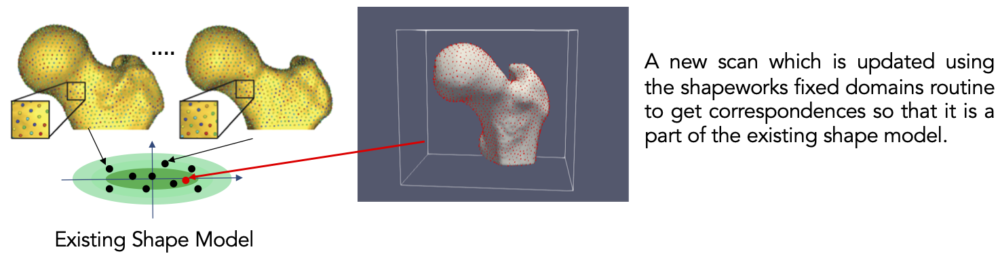
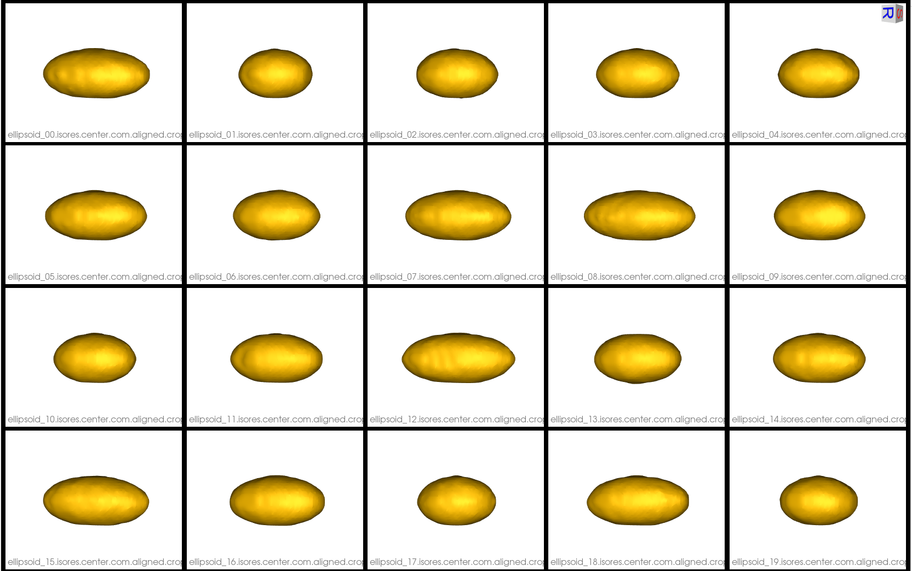
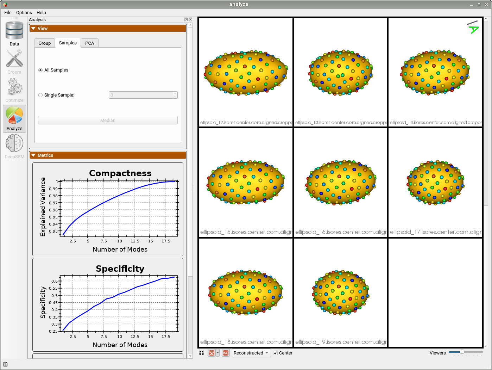

# Fixed Domains Ellipsoid: Shape Model on New Shapes

## What is the Use Case? 
The `ellipsoid_fd` use case is designed to demonstrate the functionality of the fixed domain of ShapeWorks. Fixed domains is used in cases where we need to place correspondences on new shapes using a pre-existing shape model. In this example, we use a dataset which contains a previously generated shape model on ellipsoids (see [Ellispoid Use Case](../segmentation-based/ellipsoid.md)) and prepped segmentations of five new ellipsoids.



## Grooming Steps
This use case assumes that the new samples are already aligned with the existing shape model. The only grooming step is computing the signed distance transform for each new segmentation.

Below are the pre-existing (first fifteen) and new (last five) groomed distance transforms.


## Relevant Arguments
[--tiny_test](../use-cases.md#-tiny_test)

## Optimization Parameters
The python code for the use case calls the `optimize` command of ShapeWorks which reads the project sheet with the shape filenames and optimization parameter values. See [Project excel file](../../workflow/parameters.md#project-excel-file) for details regarding creating the project sheet.
Below are the default optimization parameters for this use case.

```python
 {
        "number_of_particles": 128,
        "use_normals": 0,
        "normals_strength": 15.0,
        "checkpointing_interval": 0,
        "keep_checkpoints": 0,
        "iterations_per_split": 10,
        "optimization_iterations": 10,
        "starting_regularization": 100,
        "ending_regularization": 0.1,
        "recompute_regularization_interval": 2,
        "relative_weighting": 15,
        "initial_relative_weighting": 0.05,
        "procrustes_interval": 0,
        "procrustes_scaling": 0,
        "save_init_splits": 0,
        "verbosity": 0,
        "use_landmarks": 1,
        "use_fixed_subjects": 1,
        "narrow_band": 1e10,
        "fixed_subjects_column": "fixed",
        "fixed_subjects_choice": "yes"
    }
```

## Analyzing Shape Model

Here we can see the optimized particles for the new samples (numbers 15-19). The particles for the original samples (0-14) have remained the same.


The primary mode of variation is along the x-axis as it was before adding the new shapes.


