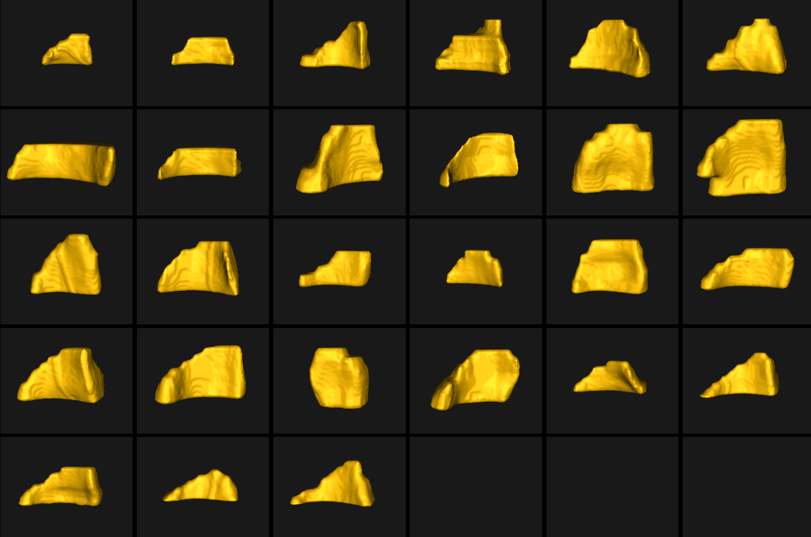

#  Right Ventricle: Highly Variable Shapes

## What is the Use Case? 

This use case demonstrates using ShapeWorks tools to perform the following.

- Model the highly variable shapes of the right ventricle
- Study the group difference of right ventricle shape between control and patients
- Build a shape model where shapes are given as binary segmentations
- Groom a dataset that only contains shapes

In this study, we have two sets of data, the control group with 6 subjects, and the patient group consists of 26 subjects. For each group, we have diastole and systole segmentations. The goal is to study the variation of the systole and diastole in the two groups. We pre-process/groom diastole and systole data and then optimize the particle system for them, independently. Then using the group difference analysis tool of ShapeWorks, we can quantify and study the difference of variation in control and patient groups from diastole to systole stage of heart.

!!! important
    This use case is not yet released!

## Grooming Steps

For a description of the grooming tools and parameters, see: [How to Groom Your Dataset?](../workflow/groom.md).

1. **Isotropic Resampling**: Binary segmentations are resampled to have an isotropic voxel spacing using a user-defined spacing. This step could also be used to produce images and segmentations with smaller voxel spacing, and thereby reduce aliasing artifacts (i.e., staircase/jagged surface) due to binarization for segmentations.
2. **Apply Padding**: Segmentations that touch the image boundary will have an artificial hole at that intersection. Segmentations are padded by adding a user-defined number of voxels along each image direction (rows, cols, and slices) to avoid introducing artificial holes.
3. **Center-of-Mass Alignment**: This translational alignment step is performed before rigidly aligning the samples to a shape reference. This factors out translations to reduce the risk of misalignment and allow for a medoid sample to be automatically selected as the reference for rigid alignment.
4. **Reference Selection**: The reference is selected by first computing the mean (average) distance transform of the segmentations, then selecting the sample closest to that mean (i.e., medoid).
5. **Rigid Alignment**: All of the segmentations are then aligned to the selected reference using rigid alignment, which factors out the rotation and remaining translation. 
6. **Cropping**: The segmentations are cropped so that all of the samples are within the same bounding box. The bounding box parameters are computed based on the biggest bounding box that encapsulates all the segmentations of the given dataset.
7. **Distance Transform**: Finally, the signed distance transform is computed, and the dataset is now ready for the optimize phase.



## Supported Tags
``` 
        --use_subsample --num_subsample --skip_grooming --tiny_test
```

## Optimizing Parameters


## Analyzing Shape Model


